SECTION 1: Upload packages


```r
library(lme4) # mixed effects models
library(lmerTest) # get results of lmer models
library(reshape2) # melting dataframes
library(plyr) # manipulating data frames
library(dplyr) # manipulating data frames
library(ggplot2) # plotting
library(cowplot) # luxury plotting
library(grid) # arranging and labelling plots
library(gridExtra)
library(emmeans) # allows extraction of bacteria-specific regression estimates.
library(ggrepel)
```

SECTION 2: Upload data for 2020 and 2019 experiments.


```r
setwd("C:/Users/jason/Dropbox/My PC (DESKTOP-IOO274E)/Desktop/Data/Lemna_singleinoculations/Lemna_single_inoculations")

df.CW<-read.table('CW_mixed_inoculation_data.txt', header=F, na.strings="", sep="\t")
names(df.CW)<-c('pop','plt','bac','id','frd0','pix0','per0','grn0','grnper0','frd1','pix1','per1','grn1','grnper1','abs')

#Fix the structure for bacterial inoculation and plant
df.CW$bac <- factor(df.CW$bac, levels = c("Control", "1", "2", "3", "4", "5","6","7","8","9","10","All10"))
df.CW$plt <- as.factor(df.CW$plt)

# Add in edge effects. So for each 24 well plate, all but 6,7,10,11,14,15,18, and 19 are edge.
edge<-c(rep("Y",5), rep("N",2), rep("Y",2),rep("N",2), rep("Y",2), rep("N",2), rep("Y",2),rep("N",2), rep("Y",5))

#Final plate has 8 samples only
edge2<-rep(edge,38)
edge2<-c(edge2, rep("Y",5), rep("N",2), "Y")
df.CW$edge<-edge2

df.CW$edge <- as.factor(df.CW$edge)

plate<-vector()
# Create vector for plate - 38 full, 39th with 8 wells
for (i in 1:38){
  plate<-c(plate, rep(i,24))
}
plate<-c(plate,rep(39,8))

df.CW$plate <- plate
df.CW$plate <- as.factor(df.CW$plate)

#Take out errors (pipetting errors, wrong bacteria)
df.CW<-df.CW[-c(453,494,798),]

# Calculate growth.
df.CW$Grt<-df.CW$pix1 - df.CW$pix0

# Let's log abs count
df.CW$logabs<-log(df.CW$abs)

#Let's create separate dataframes for each population # Going to get the label 2020
df.C.2020<-subset(df.CW, df.CW$pop== "Churchill")
df.W.2020<-subset(df.CW, df.CW$pop== "Wellspring")

# Change factor order of bacteria to reflect their effects on duckweed growth.
#First, let's change the order of bacteria, ranked by effect. 
df.C.2020$bac<- factor(df.C.2020$bac, levels = c("Control","1","8","6","3","7","10","9","4","5","2","All10"))
# Assign names from sequencing
levels(df.C.2020$bac) <- c("Control","Flavobacterium \nsuccinicans 1","Bosea \nmassiliensis","Aeromonas \nsalmonicida","Ohtaekwangia \nkoreensis","Flavobacterium \nsuccinicans 2","Falsiroseomonas \nstagni","Parasediminibacterium \npaludis","Arcicella sp.","Microbacterium \noxydans","Pseudomonas \nprotogens","All 10 bacteria")

df.W.2020$bac<- factor(df.W.2020$bac, levels = c("Control","2","8","1","9","6","3","5","4","7","10","All10"))
levels(df.W.2020$bac) <- c("Control","Sphingomonas \npituitosa 1","Flaviflagellibacter \ndeserti","Rhizobium \nrosettiformans","Rhizorhabdus \nwittichii 1","Rhizobium \ncapsici 1","Pseudomonas \nprotogens","Rhizorhabdus \nwittichii 2","Rhizobium \ncapsici 2","Sphingomonas \npituitosa 2","Fervidobacterium \nriparium","All 10 bacteria")

#####################Load 2019 data#######################

df.CKW<-read.table('July2019CKW.txt', header=F, na.strings="", sep="\t")
names(df.CKW)<-c('pop','bac','id','frd0','pix0','per0','grn0','grnper0','frd1','pix1','per1','grn1','grnper1','notes','algae_lvl')

#Fix the structure
df.CKW$pop<-as.factor(df.CKW$pop)
df.CKW$bac<-as.factor(df.CKW$bac)

# Add in edge (15 plates)
edge3<-rep(edge,15)
df.CKW$edge<-edge3

df.CKW$edge <- as.factor(df.CKW$edge)
df.CKW$algae_lvl<-as.factor(df.CKW$algae_lvl)

plate2<-vector()
# Create vector for plate
for (i in 1:15){
  plate2<-c(plate2, rep(i,24))
}

df.CKW$plate <- plate2
df.CKW$plate <- as.factor(df.CKW$plate)

df.CKW$Grt<-df.CKW$pix1 - df.CKW$pix0

# We want to include algal level as an ordinal variable.
df.CKW$alg.ord<- factor(df.CKW$algae_lvl, order = TRUE, levels = c("None","Low", "Med", "High"))

# Let's break this down by population.
df.C.2019<-subset(df.CKW, df.CKW$pop== "Churchill")
df.K.2019<-subset(df.CKW, df.CKW$pop== "Kelso")
df.W.2019<-subset(df.CKW, df.CKW$pop== "Wellspring ")

# Change factor order of bacteria to reflect their effects on duckweed growth.
#First, let's change the order of bacteria, ranked by effect. 
df.C.2019$bac<- factor(df.C.2019$bac, levels = c("0","7","8","5","6","10","4","9","2","1","3","All"))
# Assign names from sequencing
levels(df.C.2019$bac) <- c("Control","Aeromonas \nsalmonicida 1","Aeromonas \nsalmonicida 2","Microbacterium sp.","Parasediminibacterium \npaludis","Flavibacterium \nsuccinicans 1","Arcicella sp.","Falsiroseomonas \nstagni","Pseudomonas \nprotogens","Flavibacterium \nsuccinicans 2","Ohtaekwangia \nkoreensis","All 10 bacteria")

df.K.2019$bac<- factor(df.K.2019$bac, levels = c("0","8","6","7","3","9","2","5","1","4","10","All"))
levels(df.K.2019$bac) <- c("Control","Pseudomonas \nprotogens","Flavobacterium \nbranchiicola","Pseudomonas \nbaetica","Rhizobium sp.","Pseudacidovorax \nintermedius","Rhizobium \nrosettiformans","Flavobacterium \npanici 1","Flavobacterium \npanici 2","Flavobacterium \npanici 3","Pseudomonas \nsesami","All 10 bacteria")

df.W.2019$bac<- factor(df.W.2019$bac, levels = c("0","8","5","3","2","4","6","9","7","1","10","All"))
levels(df.W.2019$bac) <- c("Control","Rhizobium sp.","Agrobacterium sp.","Rhizobium \nrosettiformans 1","Rhizobium \nrhizophilum","Rhizobium \nrosettiformans 2","Rhizobium \nhelianthi","Sphingomonas \npituitosa","Rhizorhabdus \nwittichii","Rhizobium \nglycinendophyticum","Phenylobacterium \npanacis","All 10 bacteria")
```

SECTION 3: Plant growth models and figures


```r
#Churchill 2019

lmer.grt.C2019<-lmer(pix1 ~ pix0 + bac + alg.ord + (1|edge) + (1|plate), data=df.C.2019)
```

```
## Warning: Some predictor variables are on very different scales: consider
## rescaling

## Warning: Some predictor variables are on very different scales: consider
## rescaling
```

```r
anova(lmer.grt.C2019)
```

```
## Type III Analysis of Variance Table with Satterthwaite's method
##             Sum Sq    Mean Sq NumDF   DenDF F value   Pr(>F)    
## pix0    1080020412 1080020412     1 103.388 80.8212 1.26e-14 ***
## bac      100512555    9137505    11  93.169  0.6838   0.7506    
## alg.ord      58434      58434     1 104.601  0.0044   0.9474    
## ---
## Signif. codes:  0 '***' 0.001 '**' 0.01 '*' 0.05 '.' 0.1 ' ' 1
```

```r
ranova(lmer.grt.C2019)
```

```
## Warning: Some predictor variables are on very different scales: consider
## rescaling

## Warning: Some predictor variables are on very different scales: consider
## rescaling

## Warning: Some predictor variables are on very different scales: consider
## rescaling

## Warning: Some predictor variables are on very different scales: consider
## rescaling
```

```
## ANOVA-like table for random-effects: Single term deletions
## 
## Model:
## pix1 ~ pix0 + bac + alg.ord + (1 | edge) + (1 | plate)
##             npar  logLik    AIC    LRT Df Pr(>Chisq)    
## <none>        17 -1047.0 2127.9                         
## (1 | edge)    16 -1052.1 2136.2 10.288  1  0.0013388 ** 
## (1 | plate)   16 -1053.2 2138.3 12.378  1  0.0004343 ***
## ---
## Signif. codes:  0 '***' 0.001 '**' 0.01 '*' 0.05 '.' 0.1 ' ' 1
```

```r
summary(lmer.grt.C2019)
```

```
## Linear mixed model fit by REML. t-tests use Satterthwaite's method [
## lmerModLmerTest]
## Formula: pix1 ~ pix0 + bac + alg.ord + (1 | edge) + (1 | plate)
##    Data: df.C.2019
## 
## REML criterion at convergence: 2093.9
## 
## Scaled residuals: 
##     Min      1Q  Median      3Q     Max 
## -2.5423 -0.5087 -0.1239  0.4692  2.8763 
## 
## Random effects:
##  Groups   Name        Variance Std.Dev.
##  plate    (Intercept)  6439616 2538    
##  edge     (Intercept)  4286331 2070    
##  Residual             13363079 3656    
## Number of obs: 119, groups:  plate, 15; edge, 2
## 
## Fixed effects:
##                                      Estimate Std. Error         df t value
## (Intercept)                         3476.3537  2200.3682     4.3688   1.580
## pix0                                   2.3243     0.2585   103.3878   8.990
## bacAeromonas \nsalmonicida 1       -1171.2306  1772.6294    96.1508  -0.661
## bacAeromonas \nsalmonicida 2        1045.0554  1698.0783    92.2427   0.615
## bacMicrobacterium sp.               -253.5136  1793.0124    97.4365  -0.141
## bacParasediminibacterium \npaludis   -83.2679  1696.7590    92.1917  -0.049
## bacFlavibacterium \nsuccinicans 1    396.5644  1714.7060    93.4988   0.231
## bacArcicella sp.                    -410.7178  1797.0384    97.8940  -0.229
## bacFalsiroseomonas \nstagni          384.4008  1752.6485    92.6260   0.219
## bacPseudomonas \nprotogens          1168.3567  1710.2152    93.1562   0.683
## bacFlavibacterium \nsuccinicans 2   1561.2487  1710.6465    93.0179   0.913
## bacOhtaekwangia \nkoreensis         2570.7462  1738.1356    94.1128   1.479
## bacAll 10 bacteria                   557.9978  1731.8132    93.5047   0.322
## alg.ord.L                            -54.1890   819.4658   104.6014  -0.066
##                                    Pr(>|t|)    
## (Intercept)                           0.183    
## pix0                               1.26e-14 ***
## bacAeromonas \nsalmonicida 1          0.510    
## bacAeromonas \nsalmonicida 2          0.540    
## bacMicrobacterium sp.                 0.888    
## bacParasediminibacterium \npaludis    0.961    
## bacFlavibacterium \nsuccinicans 1     0.818    
## bacArcicella sp.                      0.820    
## bacFalsiroseomonas \nstagni           0.827    
## bacPseudomonas \nprotogens            0.496    
## bacFlavibacterium \nsuccinicans 2     0.364    
## bacOhtaekwangia \nkoreensis           0.142    
## bacAll 10 bacteria                    0.748    
## alg.ord.L                             0.947    
## ---
## Signif. codes:  0 '***' 0.001 '**' 0.01 '*' 0.05 '.' 0.1 ' ' 1
```

```
## 
## Correlation matrix not shown by default, as p = 14 > 12.
## Use print(x, correlation=TRUE)  or
##     vcov(x)        if you need it
```

```
## fit warnings:
## Some predictor variables are on very different scales: consider rescaling
```

```r
plot(lmer.grt.C2019)
```

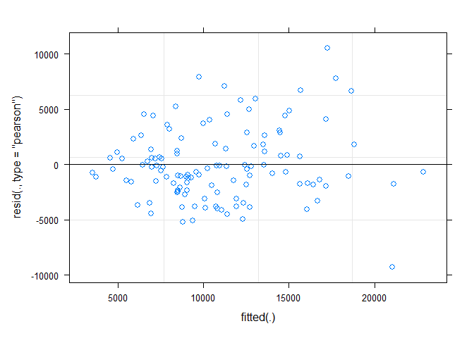<!-- -->

```r
#Kelso 2019

lmer.grt.K2019<-lmer(pix1 ~ pix0 + bac + alg.ord + (1|edge) + (1|plate), data=df.K.2019)
```

```
## Warning: Some predictor variables are on very different scales: consider
## rescaling

## Warning: Some predictor variables are on very different scales: consider
## rescaling
```

```r
anova(lmer.grt.K2019)
```

```
## Type III Analysis of Variance Table with Satterthwaite's method
##             Sum Sq    Mean Sq NumDF  DenDF  F value    Pr(>F)    
## pix0    1.0097e+10 1.0097e+10     1 94.637 142.7558 < 2.2e-16 ***
## bac     3.0854e+09 2.8049e+08    11 96.376   3.9659 9.153e-05 ***
## alg.ord 5.7150e+08 2.8575e+08     2 31.719   4.0402   0.02735 *  
## ---
## Signif. codes:  0 '***' 0.001 '**' 0.01 '*' 0.05 '.' 0.1 ' ' 1
```

```r
ranova(lmer.grt.K2019)
```

```
## Warning: Some predictor variables are on very different scales: consider
## rescaling

## Warning: Some predictor variables are on very different scales: consider
## rescaling

## Warning: Some predictor variables are on very different scales: consider
## rescaling

## Warning: Some predictor variables are on very different scales: consider
## rescaling
```

```
## ANOVA-like table for random-effects: Single term deletions
## 
## Model:
## pix1 ~ pix0 + bac + alg.ord + (1 | edge) + (1 | plate)
##             npar  logLik    AIC     LRT Df Pr(>Chisq)    
## <none>        18 -1123.0 2282.0                          
## (1 | edge)    17 -1129.5 2293.0 13.0512  1  0.0003031 ***
## (1 | plate)   17 -1127.3 2288.7  8.7322  1  0.0031264 ** 
## ---
## Signif. codes:  0 '***' 0.001 '**' 0.01 '*' 0.05 '.' 0.1 ' ' 1
```

```r
summary(lmer.grt.K2019)
```

```
## Linear mixed model fit by REML. t-tests use Satterthwaite's method [
## lmerModLmerTest]
## Formula: pix1 ~ pix0 + bac + alg.ord + (1 | edge) + (1 | plate)
##    Data: df.K.2019
## 
## REML criterion at convergence: 2246
## 
## Scaled residuals: 
##     Min      1Q  Median      3Q     Max 
## -1.9699 -0.5435 -0.1227  0.5151  3.1955 
## 
## Random effects:
##  Groups   Name        Variance Std.Dev.
##  plate    (Intercept) 19969112 4469    
##  edge     (Intercept) 32541858 5705    
##  Residual             70726136 8410    
## Number of obs: 119, groups:  plate, 15; edge, 2
## 
## Fixed effects:
##                                    Estimate Std. Error         df t value
## (Intercept)                      -2564.5016  5262.4292     2.5671  -0.487
## pix0                                 3.5913     0.3006    94.6371  11.948
## bacPseudomonas \nprotogens       -9601.0938  3852.7820    93.8857  -2.492
## bacFlavobacterium \nbranchiicola -5598.8452  4149.9362    96.3171  -1.349
## bacPseudomonas \nbaetica          -667.3929  4088.1363    99.6765  -0.163
## bacRhizobium sp.                  -972.8493  3898.6045    94.7027  -0.250
## bacPseudacidovorax \nintermedius   111.8076  3946.3039    95.6852   0.028
## bacRhizobium \nrosettiformans     4340.8384  3899.6645    96.6285   1.113
## bacFlavobacterium \npanici 1      2348.3006  3985.6075    97.2631   0.589
## bacFlavobacterium \npanici 2      8036.7134  3956.5186    96.1191   2.031
## bacFlavobacterium \npanici 3      6689.4291  4042.2255    99.1663   1.655
## bacPseudomonas \nsesami           7443.1209  4005.0536    95.4206   1.858
## bacAll 10 bacteria               -6051.1349  3954.0627    98.9111  -1.530
## alg.ord.L                        -7617.2140  2693.3396    30.3342  -2.828
## alg.ord.Q                          409.4715  2235.5896    95.4503   0.183
##                                  Pr(>|t|)    
## (Intercept)                       0.66455    
## pix0                              < 2e-16 ***
## bacPseudomonas \nprotogens        0.01446 *  
## bacFlavobacterium \nbranchiicola  0.18046    
## bacPseudomonas \nbaetica          0.87065    
## bacRhizobium sp.                  0.80349    
## bacPseudacidovorax \nintermedius  0.97746    
## bacRhizobium \nrosettiformans     0.26841    
## bacFlavobacterium \npanici 1      0.55710    
## bacFlavobacterium \npanici 2      0.04499 *  
## bacFlavobacterium \npanici 3      0.10111    
## bacPseudomonas \nsesami           0.06619 .  
## bacAll 10 bacteria                0.12912    
## alg.ord.L                         0.00822 ** 
## alg.ord.Q                         0.85506    
## ---
## Signif. codes:  0 '***' 0.001 '**' 0.01 '*' 0.05 '.' 0.1 ' ' 1
```

```
## 
## Correlation matrix not shown by default, as p = 15 > 12.
## Use print(x, correlation=TRUE)  or
##     vcov(x)        if you need it
```

```
## fit warnings:
## Some predictor variables are on very different scales: consider rescaling
```

```r
plot(lmer.grt.K2019)
```

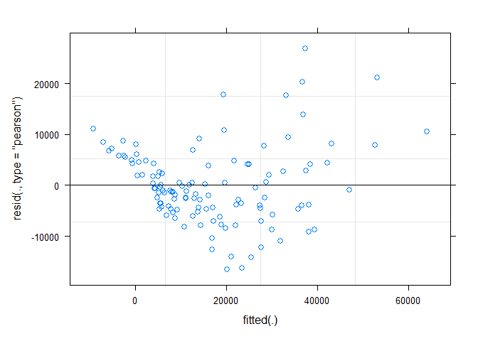<!-- -->

```r
#Wellspring 2019

lmer.grt.W2019<-lmer(pix1 ~ pix0 + bac + alg.ord + (1|edge) + (1|plate), data=df.W.2019)
```

```
## Warning: Some predictor variables are on very different scales: consider
## rescaling

## Warning: Some predictor variables are on very different scales: consider
## rescaling
```

```r
anova(lmer.grt.W2019)
```

```
## Type III Analysis of Variance Table with Satterthwaite's method
##            Sum Sq   Mean Sq NumDF  DenDF  F value Pr(>F)    
## pix0    616242532 616242532     1 84.200 141.8587 <2e-16 ***
## bac      75414969   6855906    11 95.486   1.5782 0.1176    
## alg.ord  12621366   4207122     3 84.247   0.9685 0.4116    
## ---
## Signif. codes:  0 '***' 0.001 '**' 0.01 '*' 0.05 '.' 0.1 ' ' 1
```

```r
ranova(lmer.grt.W2019)
```

```
## Warning: Some predictor variables are on very different scales: consider
## rescaling

## Warning: Some predictor variables are on very different scales: consider
## rescaling

## Warning: Some predictor variables are on very different scales: consider
## rescaling

## Warning: Some predictor variables are on very different scales: consider
## rescaling
```

```
## ANOVA-like table for random-effects: Single term deletions
## 
## Model:
## pix1 ~ pix0 + bac + alg.ord + (1 | edge) + (1 | plate)
##             npar  logLik    AIC     LRT Df Pr(>Chisq)
## <none>        19 -935.11 1908.2                      
## (1 | edge)    18 -935.43 1906.9 0.64679  1     0.4213
## (1 | plate)   18 -935.51 1907.0 0.80646  1     0.3692
```

```r
summary(lmer.grt.W2019)
```

```
## Linear mixed model fit by REML. t-tests use Satterthwaite's method [
## lmerModLmerTest]
## Formula: pix1 ~ pix0 + bac + alg.ord + (1 | edge) + (1 | plate)
##    Data: df.W.2019
## 
## REML criterion at convergence: 1870.2
## 
## Scaled residuals: 
##     Min      1Q  Median      3Q     Max 
## -2.0295 -0.4799 -0.0527  0.4288  4.1734 
## 
## Random effects:
##  Groups   Name        Variance Std.Dev.
##  plate    (Intercept)  290497   539    
##  edge     (Intercept)  187497   433    
##  Residual             4344058  2084    
## Number of obs: 116, groups:  plate, 15; edge, 2
## 
## Fixed effects:
##                                     Estimate Std. Error         df t value
## (Intercept)                        2535.2167  1083.7966    40.6148   2.339
## pix0                                  1.8151     0.1524    84.2005  11.910
## bacRhizobium sp.                  -1439.2679  1023.6353    99.9616  -1.406
## bacAgrobacterium sp.              -1243.0270  1018.0656    95.0318  -1.221
## bacRhizobium \nrosettiformans 1   -1484.7596  1021.8051    95.4852  -1.453
## bacRhizobium \nrhizophilum         -742.6109   988.1205    96.3971  -0.752
## bacRhizobium \nrosettiformans 2    -747.2002   998.8351    99.6628  -0.748
## bacRhizobium \nhelianthi           -611.5977  1011.5788    96.9725  -0.605
## bacSphingomonas \npituitosa          19.7042   982.0143    96.9734   0.020
## bacRhizorhabdus \nwittichii        -158.6976  1003.8651    99.3694  -0.158
## bacRhizobium \nglycinendophyticum  1101.4995  1014.9069    99.3208   1.085
## bacPhenylobacterium \npanacis      1208.1404   979.6191    95.2702   1.233
## bacAll 10 bacteria                 -199.9646  1045.6015    95.4664  -0.191
## alg.ord.L                          1112.7184  1686.5472    96.1303   0.660
## alg.ord.Q                           785.6508  1325.3524    99.7440   0.593
## alg.ord.C                           -30.4586   647.9390    96.4855  -0.047
##                                   Pr(>|t|)    
## (Intercept)                         0.0243 *  
## pix0                                <2e-16 ***
## bacRhizobium sp.                    0.1628    
## bacAgrobacterium sp.                0.2251    
## bacRhizobium \nrosettiformans 1     0.1495    
## bacRhizobium \nrhizophilum          0.4542    
## bacRhizobium \nrosettiformans 2     0.4562    
## bacRhizobium \nhelianthi            0.5469    
## bacSphingomonas \npituitosa         0.9840    
## bacRhizorhabdus \nwittichii         0.8747    
## bacRhizobium \nglycinendophyticum   0.2804    
## bacPhenylobacterium \npanacis       0.2205    
## bacAll 10 bacteria                  0.8487    
## alg.ord.L                           0.5110    
## alg.ord.Q                           0.5547    
## alg.ord.C                           0.9626    
## ---
## Signif. codes:  0 '***' 0.001 '**' 0.01 '*' 0.05 '.' 0.1 ' ' 1
```

```
## 
## Correlation matrix not shown by default, as p = 16 > 12.
## Use print(x, correlation=TRUE)  or
##     vcov(x)        if you need it
```

```
## fit warnings:
## Some predictor variables are on very different scales: consider rescaling
```

```r
plot(lmer.grt.W2019)
```

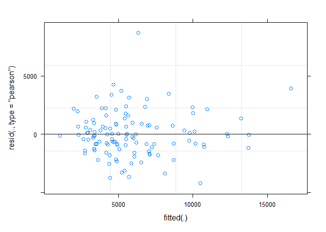<!-- -->

```r
#Churchill 2020

lmer.grt.C2020<-lmer(pix1 ~ pix0 + bac + (1|edge) + (1|plate), data=df.C.2020)
anova(lmer.grt.C2020)
```

```
## Type III Analysis of Variance Table with Satterthwaite's method
##          Sum Sq    Mean Sq NumDF  DenDF F value    Pr(>F)    
## pix0 4295384852 4295384852     1 220.01 86.4526 < 2.2e-16 ***
## bac  1353542373  123049307    11 207.76  2.4766  0.006176 ** 
## ---
## Signif. codes:  0 '***' 0.001 '**' 0.01 '*' 0.05 '.' 0.1 ' ' 1
```

```r
ranova(lmer.grt.C2020)
```

```
## ANOVA-like table for random-effects: Single term deletions
## 
## Model:
## pix1 ~ pix0 + bac + (1 | edge) + (1 | plate)
##             npar  logLik    AIC     LRT Df Pr(>Chisq)    
## <none>        16 -2345.2 4722.4                          
## (1 | edge)    15 -2350.9 4731.8 11.4585  1  0.0007117 ***
## (1 | plate)   15 -2349.6 4729.1  8.7383  1  0.0031159 ** 
## ---
## Signif. codes:  0 '***' 0.001 '**' 0.01 '*' 0.05 '.' 0.1 ' ' 1
```

```r
summary(lmer.grt.C2020)
```

```
## Linear mixed model fit by REML. t-tests use Satterthwaite's method [
## lmerModLmerTest]
## Formula: pix1 ~ pix0 + bac + (1 | edge) + (1 | plate)
##    Data: df.C.2020
## 
## REML criterion at convergence: 4690.4
## 
## Scaled residuals: 
##      Min       1Q   Median       3Q      Max 
## -2.56199 -0.61502  0.02175  0.69973  3.09833 
## 
## Random effects:
##  Groups   Name        Variance Std.Dev.
##  plate    (Intercept)  9462790 3076    
##  edge     (Intercept)  7800174 2793    
##  Residual             49684859 7049    
## Number of obs: 237, groups:  plate, 39; edge, 2
## 
## Fixed effects:
##                                     Estimate Std. Error        df t value
## (Intercept)                        3878.8193  3030.8194    4.8295   1.280
## pix0                                  4.9076     0.5278  220.0131   9.298
## bacFlavobacterium \nsuccinicans 1  -313.0947  2380.2982  211.3749  -0.132
## bacBosea \nmassiliensis            1614.9724  2355.4880  216.7209   0.686
## bacAeromonas \nsalmonicida         -182.9379  2352.5254  217.5792  -0.078
## bacOhtaekwangia \nkoreensis        -558.6037  2337.8576  213.4642  -0.239
## bacFlavobacterium \nsuccinicans 2  1814.4222  2357.8891  216.2553   0.770
## bacFalsiroseomonas \nstagni         707.6477  2310.0205  207.2307   0.306
## bacParasediminibacterium \npaludis 2265.6999  2314.7662  206.6954   0.979
## bacArcicella sp.                   2258.5016  2364.4514  212.8589   0.955
## bacMicrobacterium \noxydans        1791.5725  2333.9711  214.0507   0.768
## bacPseudomonas \nprotogens         6424.0758  2344.7823  213.4976   2.740
## bacAll 10 bacteria                 7874.6934  2406.2248  214.3893   3.273
##                                    Pr(>|t|)    
## (Intercept)                         0.25865    
## pix0                                < 2e-16 ***
## bacFlavobacterium \nsuccinicans 1   0.89548    
## bacBosea \nmassiliensis             0.49368    
## bacAeromonas \nsalmonicida          0.93809    
## bacOhtaekwangia \nkoreensis         0.81138    
## bacFlavobacterium \nsuccinicans 2   0.44243    
## bacFalsiroseomonas \nstagni         0.75965    
## bacParasediminibacterium \npaludis  0.32882    
## bacArcicella sp.                    0.34056    
## bacMicrobacterium \noxydans         0.44357    
## bacPseudomonas \nprotogens          0.00667 ** 
## bacAll 10 bacteria                  0.00124 ** 
## ---
## Signif. codes:  0 '***' 0.001 '**' 0.01 '*' 0.05 '.' 0.1 ' ' 1
```

```
## 
## Correlation matrix not shown by default, as p = 13 > 12.
## Use print(x, correlation=TRUE)  or
##     vcov(x)        if you need it
```

```r
plot(lmer.grt.C2020)
```

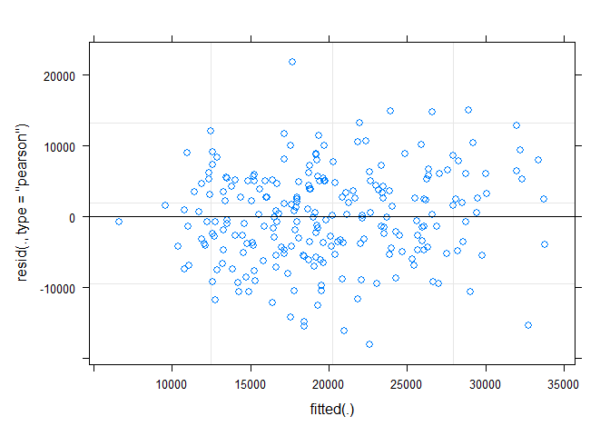<!-- -->

```r
#Wellspring 2020

lmer.grt.W2020<-lmer(pix1 ~ pix0 + bac + (1|edge) + (1|plate), data=df.W.2020)
```

```
## Warning: Some predictor variables are on very different scales: consider
## rescaling

## Warning: Some predictor variables are on very different scales: consider
## rescaling
```

```r
anova(lmer.grt.W2020)
```

```
## Type III Analysis of Variance Table with Satterthwaite's method
##          Sum Sq    Mean Sq NumDF  DenDF  F value Pr(>F)    
## pix0 1.4664e+10 1.4664e+10     1 223.28 125.3584 <2e-16 ***
## bac  1.0798e+09 9.8160e+07    11 218.84   0.8392 0.6011    
## ---
## Signif. codes:  0 '***' 0.001 '**' 0.01 '*' 0.05 '.' 0.1 ' ' 1
```

```r
ranova(lmer.grt.W2020)
```

```
## Warning: Some predictor variables are on very different scales: consider
## rescaling

## Warning: Some predictor variables are on very different scales: consider
## rescaling

## Warning: Some predictor variables are on very different scales: consider
## rescaling

## Warning: Some predictor variables are on very different scales: consider
## rescaling
```

```
## ANOVA-like table for random-effects: Single term deletions
## 
## Model:
## pix1 ~ pix0 + bac + (1 | edge) + (1 | plate)
##             npar  logLik    AIC    LRT Df Pr(>Chisq)  
## <none>        16 -2444.1 4920.2                       
## (1 | edge)    15 -2445.9 4921.8 3.5107  1    0.06097 .
## (1 | plate)   15 -2445.2 4920.3 2.1062  1    0.14671  
## ---
## Signif. codes:  0 '***' 0.001 '**' 0.01 '*' 0.05 '.' 0.1 ' ' 1
```

```r
summary(lmer.grt.W2020)
```

```
## Linear mixed model fit by REML. t-tests use Satterthwaite's method [
## lmerModLmerTest]
## Formula: pix1 ~ pix0 + bac + (1 | edge) + (1 | plate)
##    Data: df.W.2020
## 
## REML criterion at convergence: 4888.2
## 
## Scaled residuals: 
##      Min       1Q   Median       3Q      Max 
## -2.37937 -0.57901  0.08272  0.58502  2.42911 
## 
## Random effects:
##  Groups   Name        Variance  Std.Dev.
##  plate    (Intercept)   8054169  2838   
##  edge     (Intercept)   6735032  2595   
##  Residual             116974114 10815   
## Number of obs: 238, groups:  plate, 39; edge, 2
## 
## Fixed effects:
##                                    Estimate Std. Error         df t value
## (Intercept)                       5044.0552  3623.6227    10.5412   1.392
## pix0                                 7.2913     0.6512   223.2801  11.196
## bacSphingomonas \npituitosa 1     1484.5091  3560.5816   220.9672   0.417
## bacFlaviflagellibacter \ndeserti -1077.4527  3553.0940   221.5627  -0.303
## bacRhizobium \nrosettiformans      659.1365  3497.7890   219.4910   0.188
## bacRhizorhabdus \nwittichii 1     -581.6311  3490.8712   217.3165  -0.167
## bacRhizobium \ncapsici 1          1307.6764  3518.4586   223.0462   0.372
## bacPseudomonas \nprotogens        4856.7650  3527.2609   223.3201   1.377
## bacRhizorhabdus \nwittichii 2     3747.2298  3502.0644   220.2646   1.070
## bacRhizobium \ncapsici 2          4053.7219  3500.9568   219.8402   1.158
## bacSphingomonas \npituitosa 2     5636.4924  3502.5996   220.2029   1.609
## bacFervidobacterium \nriparium    1449.3299  3580.4124   224.0491   0.405
## bacAll 10 bacteria                4497.5803  3521.5576   222.8469   1.277
##                                  Pr(>|t|)    
## (Intercept)                         0.193    
## pix0                               <2e-16 ***
## bacSphingomonas \npituitosa 1       0.677    
## bacFlaviflagellibacter \ndeserti    0.762    
## bacRhizobium \nrosettiformans       0.851    
## bacRhizorhabdus \nwittichii 1       0.868    
## bacRhizobium \ncapsici 1            0.710    
## bacPseudomonas \nprotogens          0.170    
## bacRhizorhabdus \nwittichii 2       0.286    
## bacRhizobium \ncapsici 2            0.248    
## bacSphingomonas \npituitosa 2       0.109    
## bacFervidobacterium \nriparium      0.686    
## bacAll 10 bacteria                  0.203    
## ---
## Signif. codes:  0 '***' 0.001 '**' 0.01 '*' 0.05 '.' 0.1 ' ' 1
```

```
## 
## Correlation matrix not shown by default, as p = 13 > 12.
## Use print(x, correlation=TRUE)  or
##     vcov(x)        if you need it
```

```
## fit warnings:
## Some predictor variables are on very different scales: consider rescaling
```

```r
plot(lmer.grt.W2020)
```

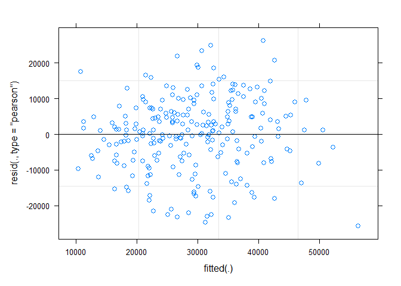<!-- -->

```r
##########################################################################################

# Onto figure generation - plotting Log Response Ratios of bacterial effects on plant growth

# Churchill 2019

# Reference for calculating LRR's: Hedges, L. V., Gurevitch, J., & Curtis, P. S. (1999). The meta-analysis of response ratios in experimental ecology. Ecology, 80(4), 1150-1156. Equation 1

# Let's do this more straightforwardly. For each bacterial treatment, we need count, mean, and SD.

melt.C.2019<-melt(df.C.2019, id.vars=c("bac"), measure.vars= "Grt", na.rm = T)
Sum.C.2019<- ddply(melt.C.2019, c("bac","variable"), summarise, mean = mean(value), sd = sd(value), count=n(),  sem = sd(value)/sqrt(length(value)))

lrr.C.2019<-Sum.C.2019[2:12,]
lrr.C.2019$LRR<-log(lrr.C.2019$mean) - log(Sum.C.2019$mean[1])
lrr.C.2019$var<-lrr.C.2019$sd^2/(lrr.C.2019$count*lrr.C.2019$mean^2) + Sum.C.2019$sd[1]^2/(Sum.C.2019$count[1]*Sum.C.2019$mean[1]^2)
lrr.C.2019$CI<-qnorm(0.975)*sqrt(lrr.C.2019$var)

# Kelso 2019

melt.K.2019<-melt(df.K.2019, id.vars=c("bac"), measure.vars= "Grt", na.rm = T)
Sum.K.2019<- ddply(melt.K.2019, c("bac","variable"), summarise, mean = mean(value), sd = sd(value), count=n(), sem = sd(value)/sqrt(length(value)))

lrr.K.2019<-Sum.K.2019[2:12,]
lrr.K.2019$LRR<-log(lrr.K.2019$mean) - log(Sum.K.2019$mean[1])
lrr.K.2019$var<-lrr.K.2019$sd^2/(lrr.K.2019$count*lrr.K.2019$mean^2) + Sum.K.2019$sd[1]^2/(Sum.K.2019$count[1]*Sum.K.2019$mean[1]^2)
lrr.K.2019$CI<-qnorm(0.975)*sqrt(lrr.K.2019$var)
# Wellspring 2019

melt.W.2019<-melt(df.W.2019, id.vars=c("bac"), measure.vars= "Grt", na.rm = T)
Sum.W.2019<- ddply(melt.W.2019, c("bac","variable"), summarise, mean = mean(value), sd = sd(value), count=n(), sem = sd(value)/sqrt(length(value)))

lrr.W.2019<-Sum.W.2019[2:12,]
lrr.W.2019$LRR<-log(lrr.W.2019$mean) - log(Sum.W.2019$mean[1])
lrr.W.2019$var<-lrr.W.2019$sd^2/(lrr.W.2019$count*lrr.W.2019$mean^2) + Sum.W.2019$sd[1]^2/(Sum.W.2019$count[1]*Sum.W.2019$mean[1]^2)
lrr.W.2019$CI<-qnorm(0.975)*sqrt(lrr.W.2019$var)

# Churchill 2020

melt.C.2020<-melt(df.C.2020, id.vars=c("bac"), measure.vars= "Grt", na.rm = T)
Sum.C.2020<- ddply(melt.C.2020, c("bac","variable"), summarise, mean = mean(value), sd = sd(value), count=n(), sem = sd(value)/sqrt(length(value)))

lrr.C.2020<-Sum.C.2020[2:12,]
lrr.C.2020$LRR<-log(lrr.C.2020$mean) - log(Sum.C.2020$mean[1])
lrr.C.2020$var<-lrr.C.2020$sd^2/(lrr.C.2020$count*lrr.C.2020$mean^2) + Sum.C.2020$sd[1]^2/(Sum.C.2020$count[1]*Sum.C.2020$mean[1]^2)
lrr.C.2020$CI<-qnorm(0.975)*sqrt(lrr.C.2020$var)

#Wellspring
melt.W.2020<-melt(df.W.2020, id.vars=c("bac"), measure.vars= "Grt", na.rm = T)
Sum.W.2020<- ddply(melt.W.2020, c("bac","variable"), summarise, mean = mean(value), sd = sd(value), count=n(), sem = sd(value)/sqrt(length(value)))

lrr.W.2020<-Sum.W.2020[2:12,]
lrr.W.2020$LRR<-log(lrr.W.2020$mean) - log(Sum.W.2020$mean[1])
lrr.W.2020$var<-lrr.W.2020$sd^2/(lrr.W.2020$count*lrr.W.2020$mean^2) + Sum.W.2020$sd[1]^2/(Sum.W.2020$count[1]*Sum.W.2020$mean[1]^2)
lrr.W.2020$CI<-qnorm(0.975)*sqrt(lrr.W.2020$var)

#OK, let's get to plotting!

pred.C.2019<-mean(lrr.C.2019$LRR[1:10])

plot1.C1 <- ggplot(lrr.C.2019,aes(y=LRR,x=bac,colour=bac))+geom_errorbar(aes(ymin=LRR-CI,ymax=LRR+CI),width=0.5)+geom_point(size=3)
plot1.C1 <- plot1.C1 + geom_hline(yintercept=pred.C.2019, linetype="dashed", color = "blue3",size=1)
plot1.C1 <- plot1.C1 + theme_classic() + ggtitle("Churchill, 2019") + theme(plot.title = element_text(size=14, face='bold', hjust = 0.5))
plot1.C1 <- plot1.C1 + scale_colour_manual(values=c("#000000","#000000","#000000","#000000","#000000","#000000","#000000","#000000","#000000","#000000","blue3"))
plot1.C1 <- plot1.C1 + theme(legend.position = "none")
plot1.C1 <- plot1.C1 + labs(x= element_blank()) 
plot1.C1 <- plot1.C1 + labs(y= element_blank())
plot1.C1 <- plot1.C1 + theme(axis.text.x = element_text(face="italic",angle = 90,vjust=0.5,hjust=1))
plot1.C1 <- plot1.C1 + geom_hline(yintercept=0, linetype="dashed", color = "red3",size=1)

#Kelso 2019

pred.K.2019<-mean(lrr.K.2019$LRR[1:10])

plot1.K1 <- ggplot(lrr.K.2019,aes(y=LRR,x=bac,colour=bac))+geom_errorbar(aes(ymin=LRR-CI,ymax=LRR+CI),width=0.5)+geom_point(size=3)
plot1.K1 <- plot1.K1 + geom_hline(yintercept=pred.K.2019, linetype="dashed", color = "blue3",size=1)
plot1.K1 <- plot1.K1 + theme_classic() + ggtitle("Kelso, 2019") + theme(plot.title = element_text(size=14, face='bold', hjust = 0.5))
plot1.K1 <- plot1.K1 + scale_colour_manual(values=c("#000000","#000000","#000000","#000000","#000000","#000000","#000000","#000000","#000000","#000000","blue3"))
plot1.K1 <- plot1.K1 + theme(legend.position = "none")
plot1.K1 <- plot1.K1 + labs(x= element_blank()) 
plot1.K1 <- plot1.K1 + labs(y= element_blank())
plot1.K1 <- plot1.K1 + theme(axis.text.x = element_text(face="italic",angle = 90,vjust=0.5,hjust=1))
plot1.K1 <- plot1.K1 + geom_hline(yintercept=0, linetype="dashed", color = "red3",size=1)

#Wellspring 2019

pred.W.2019<-mean(lrr.W.2019$LRR[1:10])

plot1.W1 <- ggplot(lrr.W.2019,aes(y=LRR,x=bac,colour=bac))+geom_errorbar(aes(ymin=LRR-CI,ymax=LRR+CI),width=0.5)+geom_point(size=3)
plot1.W1 <- plot1.W1 + geom_hline(yintercept=pred.W.2019, linetype="dashed", color = "blue3",size=1)
plot1.W1 <- plot1.W1 + theme_classic() + ggtitle("Wellspring, 2019") + theme(plot.title = element_text(size=14, face='bold', hjust = 0.5))
plot1.W1 <- plot1.W1 + scale_colour_manual(values=c("#000000","#000000","#000000","#000000","#000000","#000000","#000000","#000000","#000000","#000000","blue3"))
plot1.W1 <- plot1.W1 + theme(legend.position = "none")
plot1.W1 <- plot1.W1 + labs(x= element_blank()) 
plot1.W1 <- plot1.W1 + labs(y= element_blank())
plot1.W1 <- plot1.W1 + theme(axis.text.x = element_text(face="italic",angle = 90,vjust=0.5,hjust=1))
plot1.W1 <- plot1.W1 + geom_hline(yintercept=0, linetype="dashed", color = "red3",size=1)

# Churchill 2020

pred.C.2020<-mean(lrr.C.2020$LRR[1:10])

plot1.C2 <- ggplot(lrr.C.2020,aes(y=LRR,x=bac,colour=bac))+geom_errorbar(aes(ymin=LRR-CI,ymax=LRR+CI),width=0.5)+geom_point(size=3)
plot1.C2 <- plot1.C2 + geom_hline(yintercept=pred.C.2020, linetype="dashed", color = "blue3",size=1)
plot1.C2 <- plot1.C2 + theme_classic() + ggtitle("Churchill, 2020") + theme(plot.title = element_text(size=14, face='bold', hjust = 0.5))
plot1.C2 <- plot1.C2 + scale_colour_manual(values=c("#000000","#000000","#000000","#000000","#000000","#000000","#000000","#000000","#000000","#000000","blue3"))
plot1.C2 <- plot1.C2 + theme(legend.position = "none")
plot1.C2 <- plot1.C2 + labs(x= element_blank()) 
plot1.C2 <- plot1.C2 + labs(y= element_blank())
plot1.C2 <- plot1.C2 + theme(axis.text.x = element_text(face="italic",angle = 90,vjust=0.5,hjust=1))
plot1.C2 <- plot1.C2 + geom_hline(yintercept=0, linetype="dashed", color = "red3",size=1)

# Wellspring 2020

pred.W.2020<-mean(lrr.W.2020$LRR[1:10])

plot1.W2 <- ggplot(lrr.W.2020,aes(y=LRR,x=bac,colour=bac))+geom_errorbar(aes(ymin=LRR-CI,ymax=LRR+CI),width=0.5)+geom_point(size=3)
plot1.W2 <- plot1.W2 + geom_hline(yintercept=pred.W.2020, linetype="dashed", color = "blue3",size=1)
plot1.W2 <- plot1.W2 + theme_classic() + ggtitle("Wellspring, 2020") + theme(plot.title = element_text(size=14, face='bold', hjust = 0.5))
plot1.W2 <- plot1.W2 + scale_colour_manual(values=c("#000000","#000000","#000000","#000000","#000000","#000000","#000000","#000000","#000000","#000000","blue3"))
plot1.W2 <- plot1.W2 + theme(legend.position = "none")
plot1.W2 <- plot1.W2 + labs(x= element_blank()) 
plot1.W2 <- plot1.W2 + labs(y= element_blank())
plot1.W2 <- plot1.W2 + theme(axis.text.x = element_text(face="italic",angle = 90,vjust=0.5,hjust=1))
plot1.W2 <- plot1.W2 + geom_hline(yintercept=0, linetype="dashed", color = "red3",size=1)

#Legend plot
#Create dead column for individual bacteria
lrr.C.2019$legend.bac<-c(rep('Individual bacteria',10),'All 10 bacteria')
lrr.C.2019$legend.bac<-as.factor(lrr.C.2019$legend.bac)
factor(lrr.C.2019$legend.bac, levels = c("Individual bacteria","All 10 bacteria"))
```

```
##  [1] Individual bacteria Individual bacteria Individual bacteria
##  [4] Individual bacteria Individual bacteria Individual bacteria
##  [7] Individual bacteria Individual bacteria Individual bacteria
## [10] Individual bacteria All 10 bacteria    
## Levels: Individual bacteria All 10 bacteria
```

```r
lrr.C.2019$legend.line<-c(rep('No effect of inoculation',6),rep('Mean effect of individual bacteria',5))
lrr.C.2019$legend.line<-as.factor(lrr.C.2019$legend.line)

leg.plot <- ggplot(lrr.C.2019, aes(x = LRR, y = var, colour = legend.bac)) + geom_point(size=3)
leg.plot <- leg.plot + scale_colour_manual(name="Bacterial inocula",values=c("blue3","#000000"))
leg.plot <- leg.plot + theme_classic()
leg.plot <- leg.plot + theme(
  legend.title=element_text(size=14, face='bold'),
  legend.text=element_text(size=12, face='bold')
)

leg.1 <- get_legend(leg.plot)  

leg.plot.2 <- ggplot(lrr.C.2019, aes(x = LRR, y = var, colour = legend.line)) + geom_point(size=3) + geom_line(linetype="dashed",size=1)
leg.plot.2 <- leg.plot.2 + scale_colour_manual(name="Line",values=c("blue3","red3"))
leg.plot.2 <- leg.plot.2 + theme_classic() 
leg.plot.2 <- leg.plot.2 + theme(
  legend.title=element_text(size=14, face='bold'),
  legend.text=element_text(size=12, face='bold')
)

leg.2 <- get_legend(leg.plot.2)  

plot.leg<-plot_grid(leg.1, leg.2, ncol=1,nrow=2, align='v')

# Generate figure 1

x.grob_bac <- textGrob(expression(bold("Bacterial strain")), gp=gpar(fontsize=12))
y.grob_lrrdw <- textGrob(expression(bold("                     Duckweed growth (LRR)")), gp=gpar(fontsize=12), rot=90)

# Re-scale y axes
plot1.C1 <- plot1.C1 + ylim(-3,1.5)
plot1.K1 <- plot1.K1 + ylim(-3,1.5)
plot1.W1 <- plot1.W1 + ylim(-3,1.5)

plot1.C2 <- plot1.C2 + ylim(-0.5,0.7)
plot1.W2 <- plot1.W2 + ylim(-0.5,0.7)

plot1.2019<-plot_grid(plot1.C1, plot1.K1, plot1.W1, ncol=3,nrow=1, align='h', labels=c('A','B','C'))
plot1.2020<-plot_grid(plot1.C2, plot1.W2, plot.leg, ncol=3,nrow=1, align='h', labels=c('D','E'))

plot1<-plot_grid(plot1.2019,plot1.2020, ncol=1, nrow=2, align='v')
grid.arrange(arrangeGrob(plot1, bottom = x.grob_bac, left = y.grob_lrrdw))
```

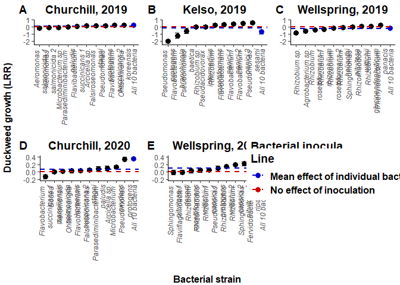<!-- -->

```r
# PDF , 10 x 12.5 " works well
```


SECTION 4: Microbial growth models and figures


```r
#Churchill 2020

# Model 1 : we will exclude control plants, and use All10_pltN as our reference treatment.
df.C.2020$bac2<-df.C.2020$bac
df.C.2020 <- within(df.C.2020, bac2 <- relevel(bac2, ref = 12))

lmer.abs.C<-lmer(logabs~bac2*plt + (1|edge) + (1|plate), data=df.C.2020)
```

```
## fixed-effect model matrix is rank deficient so dropping 1 column / coefficient
```

```
## boundary (singular) fit: see help('isSingular')
```

```r
anova(lmer.abs.C)
```

```
## Missing cells for: bac2Control:pltN.  
## Interpret type III hypotheses with care.
```

```
## Type III Analysis of Variance Table with Satterthwaite's method
##           Sum Sq Mean Sq NumDF  DenDF F value    Pr(>F)    
## bac2     182.795  16.618    11 207.94  18.657 < 2.2e-16 ***
## plt      168.266 168.266     1 211.50 188.910 < 2.2e-16 ***
## bac2:plt  42.318   4.232    10 206.19   4.751 3.938e-06 ***
## ---
## Signif. codes:  0 '***' 0.001 '**' 0.01 '*' 0.05 '.' 0.1 ' ' 1
```

```r
ranova(lmer.abs.C)
```

```
## fixed-effect model matrix is rank deficient so dropping 1 column / coefficient
```

```
## fixed-effect model matrix is rank deficient so dropping 1 column / coefficient
```

```
## boundary (singular) fit: see help('isSingular')
```

```
## ANOVA-like table for random-effects: Single term deletions
## 
## Model:
## logabs ~ bac2 + plt + (1 | edge) + (1 | plate) + bac2:plt
##             npar  logLik    AIC    LRT Df Pr(>Chisq)  
## <none>        26 -321.44 694.89                       
## (1 | edge)    25 -321.44 692.89 0.0000  1    1.00000  
## (1 | plate)   25 -324.30 698.60 5.7138  1    0.01683 *
## ---
## Signif. codes:  0 '***' 0.001 '**' 0.01 '*' 0.05 '.' 0.1 ' ' 1
```

```r
plot(lmer.abs.C)
```

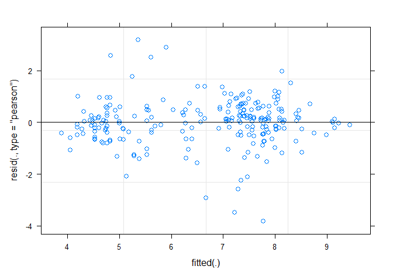<!-- -->

```r
summary(lmer.abs.C)
```

```
## Linear mixed model fit by REML. t-tests use Satterthwaite's method [
## lmerModLmerTest]
## Formula: logabs ~ bac2 * plt + (1 | edge) + (1 | plate)
##    Data: df.C.2020
## 
## REML criterion at convergence: 642.9
## 
## Scaled residuals: 
##     Min      1Q  Median      3Q     Max 
## -4.0544 -0.4200  0.0686  0.5012  3.3798 
## 
## Random effects:
##  Groups   Name        Variance Std.Dev.
##  plate    (Intercept) 0.08433  0.2904  
##  edge     (Intercept) 0.00000  0.0000  
##  Residual             0.89072  0.9438  
## Number of obs: 235, groups:  plate, 19; edge, 2
## 
## Fixed effects:
##                                          Estimate Std. Error       df t value
## (Intercept)                                7.8529     0.3119 207.3425  25.180
## bac2Control                               -1.1012     0.4505 209.4154  -2.444
## bac2Flavobacterium \nsuccinicans 1        -3.1387     0.4250 210.4944  -7.385
## bac2Bosea \nmassiliensis                  -3.1418     0.4581 208.1761  -6.858
## bac2Aeromonas \nsalmonicida               -1.5574     0.4164 210.3544  -3.741
## bac2Ohtaekwangia \nkoreensis              -2.5924     0.4341 209.6444  -5.972
## bac2Flavobacterium \nsuccinicans 2        -2.8365     0.4127 207.1377  -6.873
## bac2Falsiroseomonas \nstagni              -3.2959     0.4003 208.2845  -8.235
## bac2Parasediminibacterium \npaludis       -0.1782     0.4979 207.4435  -0.358
## bac2Arcicella sp.                         -2.2163     0.4141 208.4927  -5.352
## bac2Microbacterium \noxydans              -3.4730     0.4152 209.3080  -8.364
## bac2Pseudomonas \nprotogens                0.1757     0.4419 206.4491   0.398
## pltY                                       0.6347     0.4534 203.1265   1.400
## bac2Flavobacterium \nsuccinicans 1:pltY    2.0591     0.6518 206.8515   3.159
## bac2Bosea \nmassiliensis:pltY              1.7793     0.6365 208.3730   2.795
## bac2Aeromonas \nsalmonicida:pltY           0.4964     0.5865 204.0302   0.846
## bac2Ohtaekwangia \nkoreensis:pltY          0.4037     0.6481 208.0255   0.623
## bac2Flavobacterium \nsuccinicans 2:pltY    2.1655     0.6197 203.9089   3.494
## bac2Falsiroseomonas \nstagni:pltY          2.3367     0.5877 206.0861   3.976
## bac2Parasediminibacterium \npaludis:pltY  -0.1190     0.6884 204.2244  -0.173
## bac2Arcicella sp.:pltY                     1.5378     0.6050 204.0039   2.542
## bac2Microbacterium \noxydans:pltY          2.1594     0.6188 202.9168   3.490
## bac2Pseudomonas \nprotogens:pltY           0.5143     0.6521 205.8084   0.789
##                                          Pr(>|t|)    
## (Intercept)                               < 2e-16 ***
## bac2Control                              0.015335 *  
## bac2Flavobacterium \nsuccinicans 1       3.51e-12 ***
## bac2Bosea \nmassiliensis                 7.79e-11 ***
## bac2Aeromonas \nsalmonicida              0.000237 ***
## bac2Ohtaekwangia \nkoreensis             9.89e-09 ***
## bac2Flavobacterium \nsuccinicans 2       7.24e-11 ***
## bac2Falsiroseomonas \nstagni             1.97e-14 ***
## bac2Parasediminibacterium \npaludis      0.720820    
## bac2Arcicella sp.                        2.29e-07 ***
## bac2Microbacterium \noxydans             8.51e-15 ***
## bac2Pseudomonas \nprotogens              0.691288    
## pltY                                     0.163076    
## bac2Flavobacterium \nsuccinicans 1:pltY  0.001819 ** 
## bac2Bosea \nmassiliensis:pltY            0.005667 ** 
## bac2Aeromonas \nsalmonicida:pltY         0.398293    
## bac2Ohtaekwangia \nkoreensis:pltY        0.534020    
## bac2Flavobacterium \nsuccinicans 2:pltY  0.000583 ***
## bac2Falsiroseomonas \nstagni:pltY        9.70e-05 ***
## bac2Parasediminibacterium \npaludis:pltY 0.862932    
## bac2Arcicella sp.:pltY                   0.011777 *  
## bac2Microbacterium \noxydans:pltY        0.000593 ***
## bac2Pseudomonas \nprotogens:pltY         0.431223    
## ---
## Signif. codes:  0 '***' 0.001 '**' 0.01 '*' 0.05 '.' 0.1 ' ' 1
```

```
## 
## Correlation matrix not shown by default, as p = 23 > 12.
## Use print(x, correlation=TRUE)  or
##     vcov(x)        if you need it
```

```
## fit warnings:
## fixed-effect model matrix is rank deficient so dropping 1 column / coefficient
## optimizer (nloptwrap) convergence code: 0 (OK)
## boundary (singular) fit: see help('isSingular')
```

```r
#Model 2 : we will exclude wells without plants to estimate variation in bacterial cell density when co-cultured with plants.
df.C.2020.plt<-subset(df.C.2020,df.C.2020$plt=="Y")
lmer.abs.C.2<-lmer(logabs~bac2 + (1|edge) + (1|plate), data=df.C.2020.plt)
```

```
## boundary (singular) fit: see help('isSingular')
```

```r
summary(lmer.abs.C.2)
```

```
## Linear mixed model fit by REML. t-tests use Satterthwaite's method [
## lmerModLmerTest]
## Formula: logabs ~ bac2 + (1 | edge) + (1 | plate)
##    Data: df.C.2020.plt
## 
## REML criterion at convergence: 300.5
## 
## Scaled residuals: 
##     Min      1Q  Median      3Q     Max 
## -4.3001 -0.2930  0.1813  0.4878  1.7692 
## 
## Random effects:
##  Groups   Name        Variance Std.Dev.
##  plate    (Intercept) 0.000000 0.00000 
##  edge     (Intercept) 0.005539 0.07443 
##  Residual             0.750792 0.86648 
## Number of obs: 119, groups:  plate, 19; edge, 2
## 
## Fixed effects:
##                                     Estimate Std. Error       df t value
## (Intercept)                           8.4247     0.3127  36.0592  26.943
## bac2Control                          -1.0829     0.4028 106.5647  -2.688
## bac2Flavobacterium \nsuccinicans 1   -0.9925     0.4485 106.0080  -2.213
## bac2Bosea \nmassiliensis             -1.2532     0.3964 106.8569  -3.162
## bac2Aeromonas \nsalmonicida          -0.9646     0.3798 106.9443  -2.540
## bac2Ohtaekwangia \nkoreensis         -2.0882     0.4338 106.9756  -4.813
## bac2Flavobacterium \nsuccinicans 2   -0.5413     0.4215 106.8555  -1.284
## bac2Falsiroseomonas \nstagni         -0.9094     0.3897 106.8039  -2.333
## bac2Parasediminibacterium \npaludis  -0.2400     0.4338 106.9756  -0.553
## bac2Arcicella sp.                    -0.6406     0.4026 106.0358  -1.591
## bac2Microbacterium \noxydans         -1.3277     0.4215 106.8555  -3.150
## bac2Pseudomonas \nprotogens           0.6764     0.4338 106.9756   1.559
##                                     Pr(>|t|)    
## (Intercept)                          < 2e-16 ***
## bac2Control                          0.00834 ** 
## bac2Flavobacterium \nsuccinicans 1   0.02902 *  
## bac2Bosea \nmassiliensis             0.00204 ** 
## bac2Aeromonas \nsalmonicida          0.01253 *  
## bac2Ohtaekwangia \nkoreensis         4.9e-06 ***
## bac2Flavobacterium \nsuccinicans 2   0.20176    
## bac2Falsiroseomonas \nstagni         0.02150 *  
## bac2Parasediminibacterium \npaludis  0.58121    
## bac2Arcicella sp.                    0.11460    
## bac2Microbacterium \noxydans         0.00212 ** 
## bac2Pseudomonas \nprotogens          0.12194    
## ---
## Signif. codes:  0 '***' 0.001 '**' 0.01 '*' 0.05 '.' 0.1 ' ' 1
## 
## Correlation of Fixed Effects:
##             (Intr) bc2Cnt bc2Fs1 bc2Bsm bc2Ars bc2Ohk bc2Fs2 bc2Fls bc2Prp
## bac2Control -0.749                                                        
## bc2Flvbcts1 -0.670  0.520                                                 
## bc2Bsmsslns -0.764  0.590  0.528                                          
## bc2Armnsslm -0.796  0.615  0.551  0.627                                   
## bc2Ohtkwngk -0.698  0.539  0.483  0.549  0.572                            
## bc2Flvbcts2 -0.717  0.554  0.497  0.565  0.589  0.516                     
## bc2Flsrsmns -0.775  0.599  0.537  0.610  0.636  0.557  0.573              
## bc2Prsdmnbp -0.698  0.539  0.483  0.549  0.572  0.501  0.516  0.557       
## bc2Arcclsp. -0.745  0.578  0.520  0.588  0.613  0.537  0.553  0.598  0.537
## bc2Mcrbctro -0.717  0.554  0.497  0.565  0.589  0.516  0.530  0.573  0.516
## bc2Psdmnspr -0.698  0.539  0.483  0.549  0.572  0.501  0.516  0.557  0.501
##             bc2As. bc2Mco
## bac2Control              
## bc2Flvbcts1              
## bc2Bsmsslns              
## bc2Armnsslm              
## bc2Ohtkwngk              
## bc2Flvbcts2              
## bc2Flsrsmns              
## bc2Prsdmnbp              
## bc2Arcclsp.              
## bc2Mcrbctro  0.553       
## bc2Psdmnspr  0.537  0.516
## optimizer (nloptwrap) convergence code: 0 (OK)
## boundary (singular) fit: see help('isSingular')
```

```r
#Wellspring 2020

df.W.2020$bac2<-df.W.2020$bac
df.W.2020 <- within(df.W.2020, bac2 <- relevel(bac2, ref = 12))

lmer.abs.W<-lmer(logabs~bac2*plt + (1|edge) + (1|plate), data=df.W.2020)
```

```
## fixed-effect model matrix is rank deficient so dropping 1 column / coefficient
```

```r
anova(lmer.abs.W, type=3)
```

```
## Missing cells for: bac2Control:pltN.  
## Interpret type III hypotheses with care.
```

```
## Type III Analysis of Variance Table with Satterthwaite's method
##           Sum Sq Mean Sq NumDF  DenDF  F value    Pr(>F)    
## bac2     132.509  12.046    11 190.99  15.1603 < 2.2e-16 ***
## plt      220.099 220.099     1 193.00 276.9952 < 2.2e-16 ***
## bac2:plt  35.861   3.586    10 191.28   4.5131 9.792e-06 ***
## ---
## Signif. codes:  0 '***' 0.001 '**' 0.01 '*' 0.05 '.' 0.1 ' ' 1
```

```r
ranova(lmer.abs.W)
```

```
## fixed-effect model matrix is rank deficient so dropping 1 column / coefficient
```

```
## fixed-effect model matrix is rank deficient so dropping 1 column / coefficient
```

```
## ANOVA-like table for random-effects: Single term deletions
## 
## Model:
## logabs ~ bac2 + plt + (1 | edge) + (1 | plate) + bac2:plt
##             npar  logLik    AIC    LRT Df Pr(>Chisq)  
## <none>        26 -288.66 629.31                       
## (1 | edge)    25 -290.93 631.85 4.5377  1    0.03316 *
## (1 | plate)   25 -289.86 629.73 2.4112  1    0.12047  
## ---
## Signif. codes:  0 '***' 0.001 '**' 0.01 '*' 0.05 '.' 0.1 ' ' 1
```

```r
plot(lmer.abs.W)
```

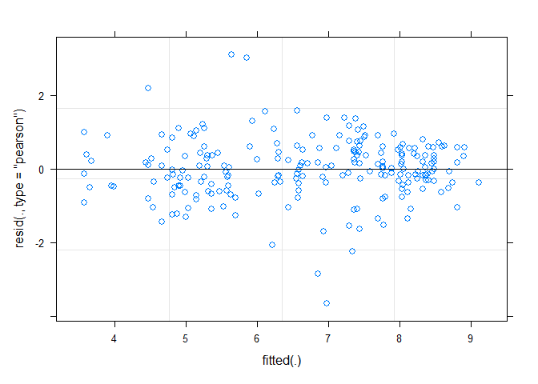<!-- -->

```r
summary(lmer.abs.W)
```

```
## Linear mixed model fit by REML. t-tests use Satterthwaite's method [
## lmerModLmerTest]
## Formula: logabs ~ bac2 * plt + (1 | edge) + (1 | plate)
##    Data: df.W.2020
## 
## REML criterion at convergence: 577.3
## 
## Scaled residuals: 
##     Min      1Q  Median      3Q     Max 
## -4.1033 -0.4839  0.0301  0.5717  3.4841 
## 
## Random effects:
##  Groups   Name        Variance Std.Dev.
##  plate    (Intercept) 0.05782  0.2405  
##  edge     (Intercept) 0.06233  0.2497  
##  Residual             0.79460  0.8914  
## Number of obs: 220, groups:  plate, 19; edge, 2
## 
## Fixed effects:
##                                        Estimate Std. Error       df t value
## (Intercept)                              8.2385     0.3292   8.9595  25.024
## bac2Control                             -1.2316     0.4960 188.0840  -2.483
## bac2Sphingomonas \npituitosa 1          -1.7858     0.4141 196.0457  -4.312
## bac2Flaviflagellibacter \ndeserti       -4.4645     0.4123 194.6515 -10.828
## bac2Rhizobium \nrosettiformans          -2.8909     0.3951 186.4410  -7.318
## bac2Rhizorhabdus \nwittichii 1          -3.5581     0.3654 189.9517  -9.738
## bac2Rhizobium \ncapsici 1               -2.8390     0.4200 188.2331  -6.759
## bac2Pseudomonas \nprotogens             -1.0604     0.4395 190.3181  -2.413
## bac2Rhizorhabdus \nwittichii 2          -3.5998     0.4261 194.5314  -8.447
## bac2Rhizobium \ncapsici 2               -3.1476     0.4096 192.9921  -7.685
## bac2Sphingomonas \npituitosa 2          -2.4406     0.3957 188.9233  -6.168
## bac2Fervidobacterium \nriparium         -2.7748     0.3972 188.7894  -6.986
## pltY                                     0.5586     0.4917 188.4010   1.136
## bac2Sphingomonas \npituitosa 1:pltY      0.6294     0.6510 195.0919   0.967
## bac2Flaviflagellibacter \ndeserti:pltY   2.0737     0.6742 189.3303   3.076
## bac2Rhizobium \nrosettiformans:pltY      1.9954     0.6577 192.8808   3.034
## bac2Rhizorhabdus \nwittichii 1:pltY      2.0797     0.6222 188.4762   3.342
## bac2Rhizobium \ncapsici 1:pltY           0.7970     0.6317 184.3681   1.262
## bac2Pseudomonas \nprotogens:pltY         0.4657     0.6655 193.4255   0.700
## bac2Rhizorhabdus \nwittichii 2:pltY      2.2963     0.6707 192.6101   3.424
## bac2Rhizobium \ncapsici 2:pltY           2.6764     0.6315 187.7431   4.238
## bac2Sphingomonas \npituitosa 2:pltY      2.3314     0.6338 189.7456   3.678
## bac2Fervidobacterium \nriparium:pltY     2.2067     0.6318 190.7527   3.493
##                                        Pr(>|t|)    
## (Intercept)                            1.34e-09 ***
## bac2Control                            0.013904 *  
## bac2Sphingomonas \npituitosa 1         2.56e-05 ***
## bac2Flaviflagellibacter \ndeserti       < 2e-16 ***
## bac2Rhizobium \nrosettiformans         7.29e-12 ***
## bac2Rhizorhabdus \nwittichii 1          < 2e-16 ***
## bac2Rhizobium \ncapsici 1              1.69e-10 ***
## bac2Pseudomonas \nprotogens            0.016777 *  
## bac2Rhizorhabdus \nwittichii 2         6.87e-15 ***
## bac2Rhizobium \ncapsici 2              7.54e-13 ***
## bac2Sphingomonas \npituitosa 2         4.12e-09 ***
## bac2Fervidobacterium \nriparium        4.70e-11 ***
## pltY                                   0.257368    
## bac2Sphingomonas \npituitosa 1:pltY    0.334874    
## bac2Flaviflagellibacter \ndeserti:pltY 0.002411 ** 
## bac2Rhizobium \nrosettiformans:pltY    0.002748 ** 
## bac2Rhizorhabdus \nwittichii 1:pltY    0.001002 ** 
## bac2Rhizobium \ncapsici 1:pltY         0.208665    
## bac2Pseudomonas \nprotogens:pltY       0.484921    
## bac2Rhizorhabdus \nwittichii 2:pltY    0.000754 ***
## bac2Rhizobium \ncapsici 2:pltY         3.53e-05 ***
## bac2Sphingomonas \npituitosa 2:pltY    0.000306 ***
## bac2Fervidobacterium \nriparium:pltY   0.000593 ***
## ---
## Signif. codes:  0 '***' 0.001 '**' 0.01 '*' 0.05 '.' 0.1 ' ' 1
```

```
## 
## Correlation matrix not shown by default, as p = 23 > 12.
## Use print(x, correlation=TRUE)  or
##     vcov(x)        if you need it
```

```
## fit warnings:
## fixed-effect model matrix is rank deficient so dropping 1 column / coefficient
```

```r
df.W.2020.plt<-subset(df.W.2020,df.W.2020$plt=="Y")
lmer.abs.W.2<-lmer(logabs~bac2 + (1|edge) + (1|plate), data=df.W.2020.plt)
```

```
## boundary (singular) fit: see help('isSingular')
```

```r
summary(lmer.abs.W.2)
```

```
## Linear mixed model fit by REML. t-tests use Satterthwaite's method [
## lmerModLmerTest]
## Formula: logabs ~ bac2 + (1 | edge) + (1 | plate)
##    Data: df.W.2020.plt
## 
## REML criterion at convergence: 304.3
## 
## Scaled residuals: 
##     Min      1Q  Median      3Q     Max 
## -4.1444 -0.3810  0.1059  0.5948  1.6410 
## 
## Random effects:
##  Groups   Name        Variance Std.Dev.
##  plate    (Intercept) 0.00000  0.0000  
##  edge     (Intercept) 0.09692  0.3113  
##  Residual             0.85191  0.9230  
## Number of obs: 115, groups:  plate, 19; edge, 2
## 
## Fixed effects:
##                                   Estimate Std. Error       df t value Pr(>|t|)
## (Intercept)                         8.8390     0.4764  13.3850  18.555 6.14e-11
## bac2Control                        -1.2660     0.5084 102.4079  -2.490  0.01438
## bac2Sphingomonas \npituitosa 1     -1.2266     0.5135 102.8634  -2.389  0.01873
## bac2Flaviflagellibacter \ndeserti  -2.4078     0.5459 102.6506  -4.411 2.55e-05
## bac2Rhizobium \nrosettiformans     -0.9623     0.5305 102.5527  -1.814  0.07259
## bac2Rhizorhabdus \nwittichii 1     -1.4986     0.5164 102.2299  -2.902  0.00454
## bac2Rhizobium \ncapsici 1          -1.9966     0.4875 102.2745  -4.096 8.43e-05
## bac2Pseudomonas \nprotogens        -0.6988     0.5045 102.7877  -1.385  0.16898
## bac2Rhizorhabdus \nwittichii 2     -1.3609     0.5267 102.0730  -2.584  0.01118
## bac2Rhizobium \ncapsici 2          -0.5299     0.4949 102.5108  -1.071  0.28680
## bac2Sphingomonas \npituitosa 2     -0.1717     0.5074 102.9467  -0.338  0.73577
## bac2Fervidobacterium \nriparium    -0.4298     0.4981 102.0435  -0.863  0.39020
##                                      
## (Intercept)                       ***
## bac2Control                       *  
## bac2Sphingomonas \npituitosa 1    *  
## bac2Flaviflagellibacter \ndeserti ***
## bac2Rhizobium \nrosettiformans    .  
## bac2Rhizorhabdus \nwittichii 1    ** 
## bac2Rhizobium \ncapsici 1         ***
## bac2Pseudomonas \nprotogens          
## bac2Rhizorhabdus \nwittichii 2    *  
## bac2Rhizobium \ncapsici 2            
## bac2Sphingomonas \npituitosa 2       
## bac2Fervidobacterium \nriparium      
## ---
## Signif. codes:  0 '***' 0.001 '**' 0.01 '*' 0.05 '.' 0.1 ' ' 1
## 
## Correlation of Fixed Effects:
##             (Intr) bc2Cnt bc2Sp1 bc2Fld bc2Rhr bc2Rw1 bc2Rc1 bc2Psp bc2Rw2
## bac2Control -0.724                                                        
## bc2Sphngmp1 -0.730  0.671                                                 
## bc2Flvflgld -0.682  0.629  0.633                                          
## bc2Rhzbmrst -0.698  0.645  0.648  0.606                                   
## bc2Rhzrhbw1 -0.707  0.657  0.656  0.615  0.632                            
## bc2Rhzbmcp1 -0.750  0.696  0.696  0.652  0.670  0.683                     
## bc2Psdmnspr -0.740  0.681  0.686  0.642  0.657  0.667  0.707              
## bc2Rhzrhbw2 -0.687  0.641  0.638  0.599  0.615  0.630  0.667  0.648       
## bc2Rhzbmcp2 -0.746  0.690  0.692  0.648  0.664  0.676  0.716  0.702  0.659
## bc2Sphngmp2 -0.741  0.681  0.688  0.642  0.658  0.665  0.705  0.697  0.646
## bc2Frvdbctr -0.724  0.676  0.672  0.631  0.649  0.665  0.705  0.683  0.651
##             bc2Rc2 bc2Sp2
## bac2Control              
## bc2Sphngmp1              
## bc2Flvflgld              
## bc2Rhzbmrst              
## bc2Rhzrhbw1              
## bc2Rhzbmcp1              
## bc2Psdmnspr              
## bc2Rhzrhbw2              
## bc2Rhzbmcp2              
## bc2Sphngmp2  0.702       
## bc2Frvdbctr  0.695  0.681
## optimizer (nloptwrap) convergence code: 0 (OK)
## boundary (singular) fit: see help('isSingular')
```

```r
# Generate Figure 2

melt.C.abs<-melt(df.C.2020, id.vars=c("bac","plt"), measure.vars= "abs", na.rm = T)
Sum.C.abs<- ddply(melt.C.abs, c("bac","plt","variable"), summarise, mean = mean(value), sd = sd(value), count=n(), sem = sd(value)/sqrt(length(value)))

# Re-order by bacterial population size

Sum.C.abs$bac <- factor(Sum.C.abs$bac, levels = c("Control","Microbacterium \noxydans","Bosea \nmassiliensis","Flavobacterium \nsuccinicans 1","Falsiroseomonas \nstagni","Ohtaekwangia \nkoreensis","Flavobacterium \nsuccinicans 2","Aeromonas \nsalmonicida","Arcicella sp.","Parasediminibacterium \npaludis","Pseudomonas \nprotogens","All 10 bacteria"))
Sum.C.abs$CI<-qnorm(0.975)*Sum.C.abs$sd/sqrt(Sum.C.abs$count)

Sum.C.plt<-subset(Sum.C.abs, Sum.C.abs$plt=="Y")
Sum.C.plt<-Sum.C.plt[2:12,]
Sum.C.plt$CI<-qnorm(0.975)*Sum.C.plt$sd/sqrt(Sum.C.plt$count)

Sum.C.bac<-subset(Sum.C.abs, Sum.C.abs$plt=="N")
Sum.C.bac$CI<-qnorm(0.975)*Sum.C.bac$sd/sqrt(Sum.C.bac$count)

pred.C.plt<-mean(Sum.C.plt$mean[1:10])
pred.C.bac<-mean(Sum.C.bac$mean[1:10])

plot2.C1 <- ggplot(Sum.C.bac,aes(y=mean,x=bac,colour=bac))+geom_errorbar(aes(ymin=mean-CI,ymax=mean+CI),width=0.5)+geom_point(size=3)
plot2.C1 <- plot2.C1 + geom_hline(yintercept=pred.C.bac, linetype="dashed", color = "blue3",size=1)
plot2.C1 <- plot2.C1 + theme_classic() + ggtitle("Churchill, 2020") + theme(plot.title = element_text(size=14, face='bold', hjust = 0.5))
plot2.C1 <- plot2.C1 + scale_colour_manual(values=c("#000000","#000000","#000000","#000000","#000000","#000000","#000000","#000000","#000000","#000000","blue3"))
plot2.C1 <- plot2.C1 + theme(legend.position = "none")
plot2.C1 <- plot2.C1 + labs(x= element_blank()) 
plot2.C1 <- plot2.C1 + labs(y= element_blank())
plot2.C1 <- plot2.C1 + theme(axis.text.x = element_text(face="italic",angle = 90,vjust=0.5,hjust=1))

plot2.C2 <- ggplot(Sum.C.plt,aes(y=mean,x=bac,colour=bac))+geom_errorbar(aes(ymin=mean-CI,ymax=mean+CI),width=0.5)+geom_point(size=3)
plot2.C2 <- plot2.C2 + geom_hline(yintercept=pred.C.plt, linetype="dashed", color = "blue3",size=1)
plot2.C2 <- plot2.C2 + theme_classic() + ggtitle("Churchill, 2020") + theme(plot.title = element_text(size=14, face='bold', hjust = 0.5))
plot2.C2 <- plot2.C2 + scale_colour_manual(values=c("#000000","#000000","#000000","#000000","#000000","#000000","#000000","#000000","#000000","#000000","blue3"))
plot2.C2 <- plot2.C2 + theme(legend.position = "none")
plot2.C2 <- plot2.C2 + labs(x= element_blank()) 
plot2.C2 <- plot2.C2 + labs(y= element_blank())
plot2.C2 <- plot2.C2 + theme(axis.text.x = element_text(face="italic",angle = 90,vjust=0.5,hjust=1))

#Wellspring

melt.W.abs<-melt(df.W.2020, id.vars=c("bac","plt"), measure.vars= "abs", na.rm = T)
Sum.W.abs<- ddply(melt.W.abs, c("bac","plt","variable"), summarise,
                mean = mean(value), sd = sd(value), count=n(),
                sem = sd(value)/sqrt(length(value)))

Sum.W.abs$bac <- factor(Sum.W.abs$bac, levels = c("Control","Flaviflagellibacter \ndeserti","Rhizorhabdus \nwittichii 2","Rhizorhabdus \nwittichii 1","Rhizobium \ncapsici 2","Rhizobium \ncapsici 1","Sphingomonas \npituitosa 2","Sphingomonas \npituitosa 1","Fervidobacterium \nriparium","Rhizobium \nrosettiformans","Pseudomonas \nprotogens","All 10 bacteria"))
Sum.W.abs$CI<-qnorm(0.975)*Sum.W.abs$sd/sqrt(Sum.W.abs$count)

Sum.W.plt<-subset(Sum.W.abs, Sum.W.abs$plt=="Y")
Sum.W.plt<-Sum.W.plt[2:12,]
Sum.W.plt$CI<-qnorm(0.975)*Sum.W.plt$sd/sqrt(Sum.W.plt$count)

Sum.W.bac<-subset(Sum.W.abs, Sum.W.abs$plt=="N")
Sum.W.bac$CI<-qnorm(0.975)*Sum.W.bac$sd/sqrt(Sum.W.bac$count)

pred.W.plt<-mean(Sum.W.plt$mean[1:10])
pred.W.bac<-mean(Sum.W.bac$mean[1:10])

plot2.W1 <- ggplot(Sum.W.bac,aes(y=mean,x=bac,colour=bac))+geom_errorbar(aes(ymin=mean-CI,ymax=mean+CI),width=0.5)+geom_point(size=3)
plot2.W1 <- plot2.W1 + geom_hline(yintercept=pred.W.bac, linetype="dashed", color = "blue3",size=1)
plot2.W1 <- plot2.W1 + theme_classic() + ggtitle("Wellspring, 2020") + theme(plot.title = element_text(size=14, face='bold', hjust = 0.5))
plot2.W1 <- plot2.W1 + scale_colour_manual(values=c("#000000","#000000","#000000","#000000","#000000","#000000","#000000","#000000","#000000","#000000","blue3"))
plot2.W1 <- plot2.W1 + theme(legend.position = "none")
plot2.W1 <- plot2.W1 + labs(x= element_blank()) 
plot2.W1 <- plot2.W1 + labs(y= element_blank())
plot2.W1 <- plot2.W1 + theme(axis.text.x = element_text(face="italic",angle = 90,vjust=0.5,hjust=1))

plot2.W2 <- ggplot(Sum.W.plt,aes(y=mean,x=bac,colour=bac))+geom_errorbar(aes(ymin=mean-CI,ymax=mean+CI),width=0.5)+geom_point(size=3)
plot2.W2 <- plot2.W2 + geom_hline(yintercept=pred.W.plt, linetype="dashed", color = "blue3",size=1)
plot2.W2 <- plot2.W2 + theme_classic() + ggtitle("Wellspring, 2020") + theme(plot.title = element_text(size=14, face='bold', hjust = 0.5))
plot2.W2 <- plot2.W2 + scale_colour_manual(values=c("#000000","#000000","#000000","#000000","#000000","#000000","#000000","#000000","#000000","#000000","blue3"))
plot2.W2 <- plot2.W2 + theme(legend.position = "none")
plot2.W2 <- plot2.W2 + labs(x= element_blank()) 
plot2.W2 <- plot2.W2 + labs(y= element_blank())
plot2.W2 <- plot2.W2 + theme(axis.text.x = element_text(face="italic",angle = 90,vjust=0.5,hjust=1))

# Re-scale y axes
plot2.C1 <- plot2.C1 + ylim(-500,15000)
plot2.W1 <- plot2.W1 + ylim(-500,15000)

plot2.C2 <- plot2.C2 + ylim(0,12000)
plot2.W2 <- plot2.W2 + ylim(0,12000)

#OK, now we need to combine them both and make a reaction norm plot.

Sum.C.abs2 <- Sum.C.abs[2:23,]

plot2.C3 <- ggplot(Sum.C.abs2, aes(x = plt, y = mean, colour=bac)) +  stat_summary(aes(group = bac), fun = mean, geom = "path") +geom_point(size=3)
plot2.C3 <- plot2.C3 + theme_classic() + ggtitle("Churchill, 2020") + theme(plot.title = element_text(size=14, face='bold', hjust = 0.5))
plot2.C3 <- plot2.C3 + labs(x= element_blank())
plot2.C3 <- plot2.C3 + labs(y= element_blank())
plot2.C3 <- plot2.C3 + theme(axis.title = element_text(face="bold", size=12))
plot2.C3 <- plot2.C3 + scale_x_discrete(labels=c("N" = "No duckweed", "Y" = "Duckweed"))
plot2.C3 <- plot2.C3 + theme(axis.text.x = element_text(face="bold",size = 12, colour="black"))
plot2.C3 <- plot2.C3 + scale_colour_manual(values=c("#000000","#000000","#000000","#000000","#000000","#000000","#000000","#000000","#000000","#000000","blue3"))
plot2.C3 <- plot2.C3 + theme(legend.position = "none")

Sum.W.abs2 <- Sum.W.abs[2:23,]

plot2.W3 <- ggplot(Sum.W.abs2, aes(x = plt, y = mean, colour=bac)) +  stat_summary(aes(group = bac), fun = mean, geom = "path") +geom_point(size=3)
plot2.W3 <- plot2.W3 + theme_classic() + ggtitle("Wellspring, 2020") + theme(plot.title = element_text(size=14, face='bold', hjust = 0.5))
plot2.W3 <- plot2.W3 + labs(x= element_blank())
plot2.W3 <- plot2.W3 + labs(y= element_blank())
plot2.W3 <- plot2.W3 + theme(axis.title = element_text(face="bold", size=12))
plot2.W3 <- plot2.W3 + scale_x_discrete(labels=c("N" = "No duckweed", "Y" = "Duckweed"))
plot2.W3 <- plot2.W3 + theme(axis.text.x = element_text(face="bold",size = 12, colour="black"))
plot2.W3 <- plot2.W3 + scale_colour_manual(values=c("#000000","#000000","#000000","#000000","#000000","#000000","#000000","#000000","#000000","#000000","blue3"))
plot2.W3 <- plot2.W3 + theme(legend.position = "none")

plot2.bac1<-plot_grid(plot2.C1, plot2.C2, plot2.C3, ncol=3,nrow=1, align='h', labels = c('A','B','C'))
plot2.bac2<-plot_grid(plot2.W1, plot2.W2, plot2.W3, ncol=3,nrow=1, align='h', labels = c('D','E','F'))

plot2.1<-plot_grid(plot2.bac1,plot2.bac2, nrow = 2, ncol=1, align='v')

y.grob_abs <- textGrob(expression(bold("                       Microbial density (cells/µL)")), gp=gpar(fontsize=12), rot=90)

x.grob_bac2 <- textGrob(expression(bold("Bacteria                                                                     ")), gp=gpar(fontsize=12))

x.grob.plt <- textGrob(expression(bold("No plants                                                                      Plants                                                                           ")), gp=gpar(fontsize=12))

grid.arrange(arrangeGrob(plot2.1, left = y.grob_abs, bottom = x.grob_bac2, top=x.grob.plt))
```

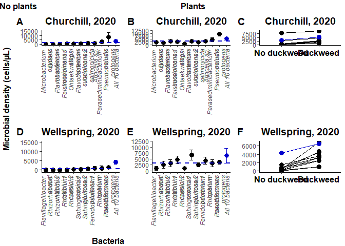<!-- -->

```r
#Let's arrange it the other way too.

plot2.C1b <- plot2.C1 + labs(y= "No plants") 
plot2.C1b <- plot2.C1b + theme(axis.title = element_text(size=12, face='bold'))

plot2.C2b <- plot2.C2 + labs(y= "Plants") 
plot2.C2b <- plot2.C2b + theme(axis.title = element_text(size=12, face='bold'))

plot2.bac1b<-plot_grid(plot2.C1b, plot2.W1, plot2.C3, ncol=3,nrow=1, align='h', labels = c('A','B','E'))
plot2.bac2b<-plot_grid(plot2.C2b, plot2.W2, plot2.W3, ncol=3,nrow=1, align='h', labels = c('C','D','F'))

plot2.2<-plot_grid(plot2.bac1b,plot2.bac2b, nrow = 2, ncol=1, align='v')

grid.arrange(arrangeGrob(plot2.2, left = y.grob_abs, bottom = x.grob_bac2))
```

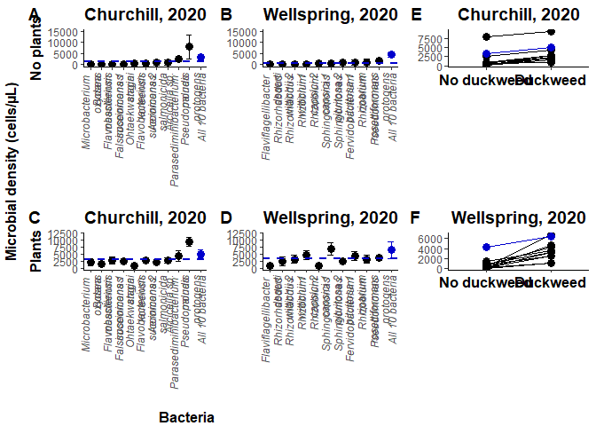<!-- -->

SECTION 5: Fitness regression


```r
# We will fit models (with full random effect structure) from which we can extract 'genotype' (i.e. bacterial inocula) means for their (1) effects on duckweed growth, and (2) microbial density when grown with plants.
# We will use scaled data so that we can center fitness proxy data around 0.

df.C.fit<-subset(df.C.2020, df.C.2020$bac!="Control" & df.C.2020$plt=="Y")
df.C.fit$Grt.scaled<-(df.C.fit$Grt-mean(df.C.fit$Grt,na.rm=T))/sd(df.C.fit$Grt,na.rm=T)
df.C.fit$pix0.scaled<-(df.C.fit$pix0-mean(df.C.fit$pix0,na.rm=T))/sd(df.C.fit$pix0,na.rm=T)
df.C.fit$abs.scaled<-(df.C.fit$abs-mean(df.C.fit$abs,na.rm=T))/sd(df.C.fit$abs,na.rm=T)

# Now we create models that we can extract strain/genotype means from
modC.grt<-lmer(Grt.scaled ~ bac + pix0.scaled + (1|edge) +(1|plate), data=df.C.fit)
em.C.grt<-as.data.frame(emmeans(modC.grt, "bac", var="Grt.scaled"))
em.C.grt$CI<-em.C.grt$SE*qnorm(0.975)

modC.abs<-lmer(abs.scaled ~ bac + (1|edge) +(1|plate), data=df.C.fit)
```

```
## boundary (singular) fit: see help('isSingular')
```

```r
em.C.abs<-as.data.frame(emmeans(modC.abs, "bac", var="abs.scaled"))
em.C.abs$CI<-em.C.abs$SE*qnorm(0.975)

em.C.grt$abs<-em.C.abs$emmean
em.C.grt$abs.CI<-em.C.abs$CI
em.C.grt$abs.SE<-em.C.abs$SE

em.C.grt$num<-1:11

# Is there a significant correlation between bacterial cell density and duckweed growth?
regC<-lm(emmean~abs,data=em.C.grt)
summary(regC)
```

```
## 
## Call:
## lm(formula = emmean ~ abs, data = em.C.grt)
## 
## Residuals:
##      Min       1Q   Median       3Q      Max 
## -0.24481 -0.11200 -0.05293  0.06383  0.46403 
## 
## Coefficients:
##             Estimate Std. Error t value Pr(>|t|)   
## (Intercept) -0.07871    0.06023  -1.307  0.22367   
## abs          0.26343    0.06942   3.795  0.00425 **
## ---
## Signif. codes:  0 '***' 0.001 '**' 0.01 '*' 0.05 '.' 0.1 ' ' 1
## 
## Residual standard error: 0.1988 on 9 degrees of freedom
## Multiple R-squared:  0.6154,	Adjusted R-squared:  0.5726 
## F-statistic:  14.4 on 1 and 9 DF,  p-value: 0.004252
```

```r
plot3.C1 <- ggplot(em.C.grt, aes(x = abs, y = emmean, colour = bac, fill=bac)) + geom_point(size=3,key_glyph=draw_key_blank) + geom_pointrange(aes(ymin=emmean-SE,ymax=emmean+SE),key_glyph=draw_key_blank) + geom_pointrange(aes(xmin=abs-abs.SE, xmax=abs+abs.SE),key_glyph=draw_key_blank)
plot3.C1 <- plot3.C1 + theme_classic() + ggtitle("Churchill, 2020") + theme(plot.title = element_text(size=14, face='bold', hjust = 0.5))
plot3.C1 <- plot3.C1 + scale_colour_manual(values=c("#000000","#000000","#000000","#000000","#000000","#000000","#000000","#000000","#000000","#000000","blue3"))
plot3.C1 <- plot3.C1 + labs(x= element_blank())
plot3.C1 <- plot3.C1 + labs(y= "Duckweed growth")
plot3.C1 <- plot3.C1 + theme(axis.title = element_text(face="bold", size=12))
plot3.C1 <- plot3.C1 + geom_text_repel(aes(label = num), point.padding = 0.25, box.padding =0.25, fontface="bold", show.legend = FALSE)
plot3.C1 <- plot3.C1 + theme(legend.title=element_blank())
plot3.C1 <- plot3.C1 + scale_fill_discrete(labels = c(
  substitute(paste(bold("1 "), bolditalic("Flavobacterium succinicans "),bold("1"))), 
  substitute(paste(bold("2 "), bolditalic("Bosea massiliensis"))),
  substitute(paste(bold("3 "), bolditalic("Aeromonas salmonicida"))), 
  substitute(paste(bold("4 "), bolditalic("Ohtaekwangia koreensis"))), 
  substitute(paste(bold("5 "), bolditalic("Flavobacterium succinicans "),bold("2"))),
  substitute(paste(bold("6 "), bolditalic("Falsiroseomonas stagni"))), 
  substitute(paste(bold("7 "), bolditalic("Parasediminibacterium paludis"))), 
  substitute(paste(bold("8 "), bolditalic("Arcicella "), bold("sp."))), 
  substitute(paste(bold("9 "), bolditalic("Microbacterium oxydans"))), 
  substitute(paste(bold("10 "), bolditalic("Pseudomonas protogens"))),
  substitute(paste(bold("11 "), bold("All 10 bacteria")))
))
plot3.C1 <- plot3.C1 + guides(colour = FALSE)
```

```
## Warning: `guides(<scale> = FALSE)` is deprecated. Please use `guides(<scale> =
## "none")` instead.
```

```r
df.W.fit<-subset(df.W.2020, df.W.2020$bac!="Control" & df.W.2020$plt=="Y")
df.W.fit$Grt.scaled<-(df.W.fit$Grt-mean(df.W.fit$Grt,na.rm=T))/sd(df.W.fit$Grt,na.rm=T)
df.W.fit$pix0.scaled<-(df.W.fit$pix0-mean(df.W.fit$pix0,na.rm=T))/sd(df.W.fit$pix0,na.rm=T)
df.W.fit$abs.scaled<-(df.W.fit$abs-mean(df.W.fit$abs,na.rm=T))/sd(df.W.fit$abs,na.rm=T)

modW.grt<-lmer(Grt.scaled ~ bac + pix0.scaled + (1|edge) +(1|plate), data=df.W.fit)
em.W.grt<-as.data.frame(emmeans(modW.grt, "bac", var="Grt.scaled"))
em.W.grt$CI<-em.W.grt$SE*qnorm(0.975)

modW.abs<-lmer(abs.scaled ~ bac + (1|edge) +(1|plate), data=df.W.fit)
em.W.abs<-as.data.frame(emmeans(modW.abs, "bac", var="abs.scaled"))
em.W.abs$CI<-em.W.abs$SE*qnorm(0.975)

em.W.grt$abs<-em.W.abs$emmean
em.W.grt$abs.CI<-em.W.abs$CI
em.W.grt$abs.SE<-em.W.abs$SE
em.W.grt$num<-1:11

# Is there a significant correlation between bacterial cell density and duckweed growth?
regW<-lm(emmean~abs,data=em.W.grt)
summary(regW)
```

```
## 
## Call:
## lm(formula = emmean ~ abs, data = em.W.grt)
## 
## Residuals:
##      Min       1Q   Median       3Q      Max 
## -0.19245 -0.10656  0.01918  0.07309  0.19960 
## 
## Coefficients:
##             Estimate Std. Error t value Pr(>|t|)  
## (Intercept) -0.05355    0.04099  -1.306   0.2238  
## abs          0.16355    0.06141   2.663   0.0259 *
## ---
## Signif. codes:  0 '***' 0.001 '**' 0.01 '*' 0.05 '.' 0.1 ' ' 1
## 
## Residual standard error: 0.1347 on 9 degrees of freedom
## Multiple R-squared:  0.4408,	Adjusted R-squared:  0.3786 
## F-statistic: 7.093 on 1 and 9 DF,  p-value: 0.0259
```

```r
plot3.W1 <- ggplot(em.W.grt, aes(x = abs, y = emmean, colour = bac, fill=bac)) + geom_point(size=3,key_glyph=draw_key_blank) + geom_pointrange(aes(ymin=emmean-SE,ymax=emmean+SE),key_glyph=draw_key_blank) + geom_pointrange(aes(xmin=abs-abs.SE, xmax=abs+abs.SE),key_glyph=draw_key_blank)
plot3.W1 <- plot3.W1 + theme_classic() + ggtitle("Wellspring, 2020") + theme(plot.title = element_text(size=14, face='bold', hjust = 0.5))
plot3.W1 <- plot3.W1 + scale_colour_manual(values=c("#000000","#000000","#000000","#000000","#000000","#000000","#000000","#000000","#000000","#000000","blue3"))
plot3.W1 <- plot3.W1 + labs(x= element_blank())
plot3.W1 <- plot3.W1 + labs(y= element_blank())
plot3.W1 <- plot3.W1 + theme(axis.title = element_text(face="bold", size=12))
plot3.W1 <- plot3.W1 + geom_text_repel(aes(label = num), point.padding = 0.25, box.padding =0.25, fontface="bold", show.legend = FALSE)
plot3.W1 <- plot3.W1 + theme(legend.title=element_blank())
plot3.W1 <- plot3.W1 + scale_fill_discrete(labels = c(
  substitute(paste(bold("1 "), bolditalic("Sphingomonas pituitosa "), bold("1"))), 
  substitute(paste(bold("2 "), bolditalic("Flaviflagellibacter deserti"))),
  substitute(paste(bold("3 "), bolditalic("Rhizobium rosettiformans"))), 
  substitute(paste(bold("4 "), bolditalic("Rhizorhabdus wittichii "), bold("1"))), 
  substitute(paste(bold("5 "), bolditalic("Rhizobium capsici "), bold("1"))),
  substitute(paste(bold("6 "), bolditalic("Pseudomonas protogens"))), 
  substitute(paste(bold("7 "), bolditalic("Rhizorhabdus wittichii "), bold("2"))), 
  substitute(paste(bold("8 "), bolditalic("Rhizobium capsici "), bold("2"))),
  substitute(paste(bold("9 "), bolditalic("Sphingomonas pituitosa "), bold("2"))),
  substitute(paste(bold("10 "), bolditalic("Fervidobacterium riparium"))),
  substitute(paste(bold("11 "), bold("All 10 bacteria")))
))
plot3.W1 <- plot3.W1 + guides(colour = FALSE)
```

```
## Warning: `guides(<scale> = FALSE)` is deprecated. Please use `guides(<scale> =
## "none")` instead.
```

```r
# Re-scale axes?
#plot3.C1 <- plot3.C1 + ylim(-0.75,1)
#plot3.W1 <- plot3.W1 + ylim(-0.75,1)
#plot3.C1 <- plot3.C1 + xlim(-1.5,3)
#plot3.W1 <- plot3.W1 + xlim(-1.5,3)

plot3<-plot_grid(plot3.C1, plot3.W1, ncol=2,nrow=1, align='h', labels = c('A','B'))

x.grob_abs <- textGrob(expression(bold("Microbial density")), gp=gpar(fontsize=12))
grid.arrange(arrangeGrob(plot3, bottom = x.grob_abs))
```

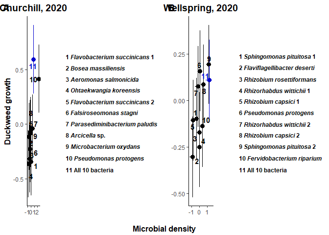<!-- -->

```r
# 15 x 5?
```
