This file will analyse data pertaining to all Lemna minor single and mixed inoculation trials. We will generate figures and do some modelling.

SECTION 1: Upload packages


```r
library(ggplot2) # we need this for plotting
library(reshape2) # melting and stuff
library(plyr) # manipulating data frames
library(dplyr)
library(car) # type 3 anovas
library(lme4) # mixed effects models
library(emmeans) # allows extraction of bacteria-specific regression estimates.
library(RLRsim) # test significance of random effects
```

SECTION 2: Upload data for the latest round of experiments


```r
setwd("C:/Users/jason/Dropbox/My PC (DESKTOP-IOO274E)/Desktop/Data/Lemna_singleinoculations/Lemna_single_inoculations")

df<-read.table('CW_mixed_inoculation_data.txt', header=F, na.strings="", sep="\t")
names(df)<-c('pop','plt','bac','id','frd0','pix0','per0','grn0','grnper0','frd1','pix1','per1','grn1','grnper1','abs')
str(df)
```

```
## 'data.frame':	920 obs. of  15 variables:
##  $ pop    : chr  "Wellspring" "Wellspring" "Wellspring" "Churchill" ...
##  $ plt    : chr  "N" "Y" "Y" "Y" ...
##  $ bac    : chr  "5" "6" "10" "5" ...
##  $ id     : int  1 2 3 4 5 6 7 8 9 10 ...
##  $ frd0   : int  NA 2 2 1 NA 2 NA 3 3 1 ...
##  $ pix0   : int  NA 2904 3641 3819 NA 2760 NA 4632 5966 1547 ...
##  $ per0   : num  NA 789 818 662 NA ...
##  $ grn0   : int  NA 2467 3059 3374 NA 2354 NA 4072 3088 1078 ...
##  $ grnper0: num  NA 771 712 820 NA ...
##  $ frd1   : int  NA 14 13 11 NA 9 NA 14 15 9 ...
##  $ pix1   : int  NA 39060 41268 25077 NA 17425 NA 25035 41636 21250 ...
##  $ per1   : num  NA 1370 1366 1124 NA ...
##  $ grn1   : int  NA 34927 38105 24338 NA 14626 NA 22234 36642 20642 ...
##  $ grnper1: num  NA 1357 1442 1043 NA ...
##  $ abs    : num  89.1 1119 2408 4750 7678 ...
```

```r
#Fix the structure for bacterial inoculation and plant
df$bac <- factor(df$bac, levels = c("Control", "1", "2", "3", "4", "5","6","7","8","9","10","All10"))
df$plt <- as.factor(df$plt)

# Need to add in edge effects. So for each 24 well plate, all but 6,7,10,11,14,15,18, and 19 are edge.
edge<-c(rep("Y",5), rep("N",2), rep("Y",2),rep("N",2), rep("Y",2), rep("N",2), rep("Y",2),rep("N",2), rep("Y",5))

edge2<-rep(edge,38)
edge2<-c(edge2, rep("Y",5), rep("N",2), "Y")
df$edge<-edge2

df$edge <- as.factor(df$edge)

#Take out errors (pipetting errors, wrong bacteria)
df<-df[-c(453,494,798),]

#Let's generate some summary statistics. Things like greenness (health), growth (fitness), and aggregation.

df$Grt<-df$pix1 - df$pix0
df$Agg<-df$pix1/df$per1
df$Hlth<-df$grn1/df$pix1

#Let's check the normality of our data
ggplot(data=df, aes(x = Grt)) + geom_histogram(fill = "white", colour = "black")
```

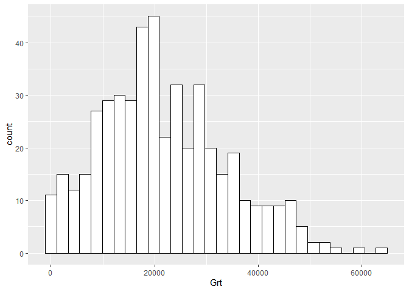<!-- -->

```r
# Looks pretty good

ggplot(data=df, aes(x = Agg)) + geom_histogram(fill = "white", colour = "black")
```

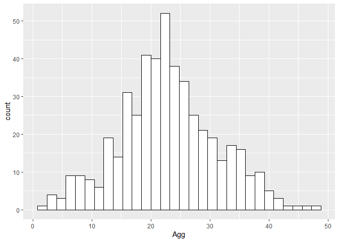<!-- -->

```r
# Looks pretty good

ggplot(data=df, aes(x = Hlth)) + geom_histogram(fill = "white", colour = "black")
```

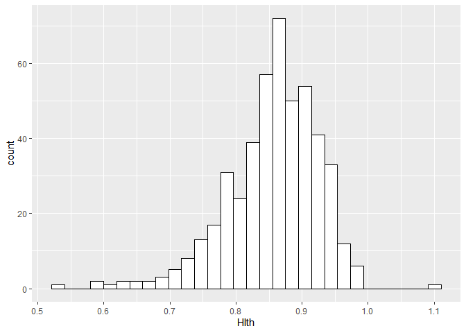<!-- -->

```r
# Looks pretty good

#What about bacterial fitness data? Let's look at absolute count.
ggplot(data=df, aes(x = abs)) + geom_histogram(fill = "white", colour = "black")
```

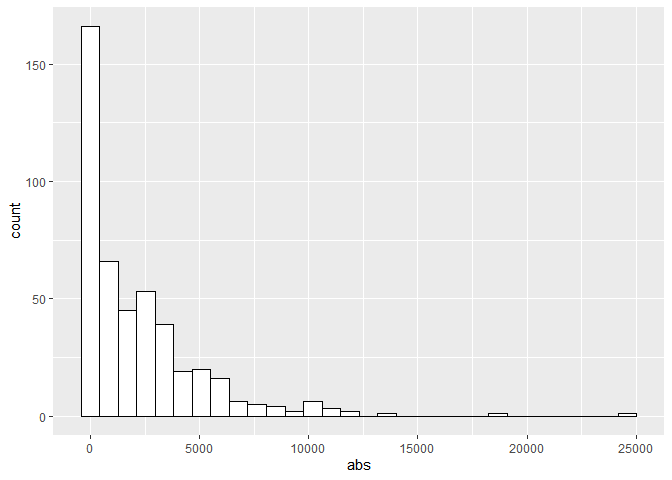<!-- -->

```r
# Right-tailed, heavily.
ggplot(data=df, aes(x = abs)) + geom_histogram(fill = "white", colour = "black") +  facet_grid(pop ~ plt, scales = "free")
```

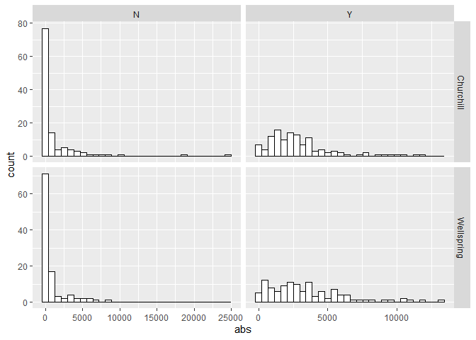<!-- -->

```r
# That looks better — most of the low values come from wells lacking plants. 

# Let's create a logged absolute count column anyway
df$logabs<-log(df$abs)

ggplot(data=df, aes(x = logabs)) + geom_histogram(fill = "white", colour = "black") +  facet_grid(pop ~ plt, scales = "free")
```

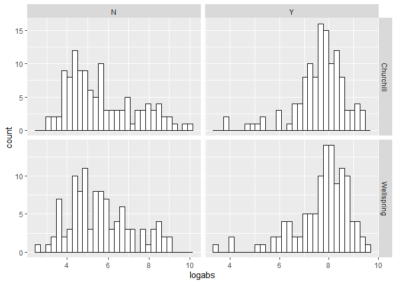<!-- -->

```r
# That looks better still!

#OK, one last thing. We want to generate LogRR's for each of these bacterial inoculation treatments, because we want to compare across experiments.

#Generate summary statistics.
melt_LRR<-melt(df, id.vars=c("pop", "bac"), measure.vars= "Grt", na.rm = T)
Sum_LRR<- ddply(melt_LRR, c("pop", "bac","variable"), summarise,
      mean = mean(value), sd = sd(value), count=n(),
      sem = sd(value)/sqrt(length(value)))

LRR_grt<-data.frame(matrix(ncol=5, nrow=2*11))
names(LRR_grt)<-c('pop','bac','LRR','var','SE')

LRR_grt$pop<-c(rep('C', 11), rep('W', 11))
LRR_grt$bac<-rep(c("1", "2", "3", "4", "5","6","7","8","9","10","All10"), 2)

#Reference for calculating LRR's: Hedges, L. V., Gurevitch, J., & Curtis, P. S. (1999). The meta-analysis of response ratios in experimental ecology. Ecology, 80(4), 1150-1156. Equation 1

for (i in 1:11){
  LRR_grt[i,3]<-log(Sum_LRR[i+1,4]/Sum_LRR[1,4])
  LRR_grt[i,4]<-Sum_LRR[i+1,5]^2/(Sum_LRR[i+1,6]*Sum_LRR[i+1,4]^2) + Sum_LRR[1,5]^2/(Sum_LRR[1,6]*Sum_LRR[1,4]^2)
}

for (i in 12:22){
  LRR_grt[i,3]<-log(Sum_LRR[i+2,4]/Sum_LRR[13,4])
  LRR_grt[i,4]<-Sum_LRR[i+2,5]^2/(Sum_LRR[i+2,6]*Sum_LRR[i+2,4]^2) + Sum_LRR[13,5]^2/(Sum_LRR[13,6]*Sum_LRR[13,4]^2)
}

LRR_grt$SE<-sqrt(LRR_grt$var)

#Let's create separate dataframes for each population
dfC<-subset(df, df$pop== "Churchill")
dfW<-subset(df, df$pop== "Wellspring")

# Change factor order of bacteria to reflect their effects on duckweed growth.
#First, let's change the order of bacteria, ranked by effect. 
dfC$bac<- factor(dfC$bac, levels = c("Control","1","8","6","3","7","10","9","4","5","2","All10"))
# Assign names from sequencing
levels(dfC$bac) <- c("Control","Uncultured bacterium","Bosea sp.","Aeromonas salmonicida","Unknown1","Unknown2","Roseomonas sp.","Unknown3","Unknown4","Microbacterium sp.","Pseudomonas protogens","All 10 bacteria")

dfW$bac<- factor(dfW$bac, levels = c("Control","2","8","1","9","6","3","5","4","7","10","All10"))
levels(dfW$bac) <- c("Control","Sphingomonas sp. 1","Rhizobiales sp.","Rhizobium sp. 1","Rhizorhabdus phycospaerae","Unknown1","Pseudomonas protogens","Rhizorhabdus phycosphaerae","Rhizobium sp. 2","Sphingomonas sp. 2","Pseudomonas aeruginosa","All 10 bacteria")

logC<-subset(LRR_grt, LRR_grt$pop== "C")
logC$bac<- as.factor(logC$bac)
logC$bac<- factor(logC$bac, levels = c("1","8","6","3","7","10","9","4","5","2","All10"))
levels(logC$bac) <- c("Uncultured bacterium","Bosea sp.","Aeromonas salmonicida","Unknown1","Unknown2","Roseomonas sp.","Unknown3","Unknown4","Microbacterium sp.","Pseudomonas protogens","All 10 bacteria")

logW<-subset(LRR_grt, LRR_grt$pop== "W")
logW$bac<- as.factor(logW$bac)
logW$bac<- factor(logW$bac, levels = c("Control","2","8","1","9","6","3","5","4","7","10","All10"))
levels(logW$bac) <- c("Control","Sphingomonas sp. 1","Rhizobiales sp.","Rhizobium sp. 1","Rhizorhabdus phycospaerae","Unknown1","Pseudomonas protogens","Rhizorhabdus phycosphaerae","Rhizobium sp. 2","Sphingomonas sp. 2","Pseudomonas aeruginosa","All 10 bacteria")
```

SECTION 3: Churchill: Modelling.


```r
#How does bacterial inoculation affect growth?
modC_Grt<-lm(Grt~bac,data=dfC)
anova(modC_Grt)
```

```
## Analysis of Variance Table
## 
## Response: Grt
##            Df     Sum Sq   Mean Sq F value Pr(>F)
## bac        11 1.2833e+09 116667219  1.5837 0.1046
## Residuals 225 1.6575e+10  73665508
```

```r
summary(modC_Grt)
```

```
## 
## Call:
## lm(formula = Grt ~ bac, data = dfC)
## 
## Residuals:
##      Min       1Q   Median       3Q      Max 
## -22728.1  -6018.1   -213.9   5423.9  22607.2 
## 
## Coefficients:
##                          Estimate Std. Error t value Pr(>|t|)    
## (Intercept)               15560.8     1919.2   8.108  3.3e-14 ***
## bacUncultured bacterium   -1826.9     2749.6  -0.664   0.5071    
## bacBosea sp.                102.9     2714.1   0.038   0.9698    
## bacAeromonas salmonicida    470.4     2714.1   0.173   0.8626    
## bacUnknown1                 531.0     2714.1   0.196   0.8451    
## bacUnknown2                 610.3     2714.1   0.225   0.8223    
## bacRoseomonas sp.           967.0     2714.1   0.356   0.7220    
## bacUnknown3                1487.1     2714.1   0.548   0.5843    
## bacUnknown4                1635.6     2749.6   0.595   0.5525    
## bacMicrobacterium sp.      2168.1     2714.1   0.799   0.4252    
## bacPseudomonas protogens   6258.3     2714.1   2.306   0.0220 *  
## bacAll 10 bacteria         6454.5     2749.6   2.347   0.0198 *  
## ---
## Signif. codes:  0 '***' 0.001 '**' 0.01 '*' 0.05 '.' 0.1 ' ' 1
## 
## Residual standard error: 8583 on 225 degrees of freedom
##   (221 observations deleted due to missingness)
## Multiple R-squared:  0.07186,	Adjusted R-squared:  0.02649 
## F-statistic: 1.584 on 11 and 225 DF,  p-value: 0.1046
```

```r
#not quite significant, but all 10 bacteria and P. protogens are significantly different from the mean. 

#What if we look at initial and final pixel count variation?
modC_pix<-lm(pix1~bac+pix0,data=dfC)
Anova(modC_pix, type=3)
```

```
## Anova Table (Type III tests)
## 
## Response: pix1
##                 Sum Sq  Df F value    Pr(>F)    
## (Intercept) 2.3723e+08   1  3.8675  0.050465 .  
## bac         1.6590e+09  11  2.4587  0.006403 ** 
## pix0        4.5548e+09   1 74.2553 1.249e-15 ***
## Residuals   1.3740e+10 224                      
## ---
## Signif. codes:  0 '***' 0.001 '**' 0.01 '*' 0.05 '.' 0.1 ' ' 1
```

```r
summary(modC_pix)
```

```
## 
## Call:
## lm(formula = pix1 ~ bac + pix0, data = dfC)
## 
## Residuals:
##      Min       1Q   Median       3Q      Max 
## -21917.2  -5247.7    354.6   5387.2  24661.7 
## 
## Coefficients:
##                           Estimate Std. Error t value Pr(>|t|)    
## (Intercept)              4668.1623  2373.7275   1.967 0.050465 .  
## bacUncultured bacterium   411.4141  2530.5821   0.163 0.870998    
## bacBosea sp.              775.8432  2478.6702   0.313 0.754566    
## bacAeromonas salmonicida  466.4267  2476.6927   0.188 0.850791    
## bacUnknown1               -21.1175  2478.0237  -0.009 0.993208    
## bacUnknown2              1854.5537  2483.4469   0.747 0.455988    
## bacRoseomonas sp.         754.7169  2476.8894   0.305 0.760875    
## bacUnknown3              2361.0168  2480.0273   0.952 0.342117    
## bacUnknown4              1573.0446  2509.0859   0.627 0.531337    
## bacMicrobacterium sp.    1965.5818  2476.8718   0.794 0.428283    
## bacPseudomonas protogens 6886.7789  2478.4176   2.779 0.005921 ** 
## bacAll 10 bacteria       8850.7513  2533.7094   3.493 0.000575 ***
## pix0                        4.7365     0.5497   8.617 1.25e-15 ***
## ---
## Signif. codes:  0 '***' 0.001 '**' 0.01 '*' 0.05 '.' 0.1 ' ' 1
## 
## Residual standard error: 7832 on 224 degrees of freedom
##   (221 observations deleted due to missingness)
## Multiple R-squared:  0.2967,	Adjusted R-squared:  0.259 
## F-statistic: 7.875 on 12 and 224 DF,  p-value: 3.253e-12
```

```r
#So it seems like the starting pixel count has a highly significant effect on eventual biomass. If you account for this, bacteria comes out as significant.
#All 10 and P.p still sig

# Let's add in edge effects.
modC_pixgrt<-lm(pix1~bac+pix0+edge,data=dfC)
Anova(modC_pixgrt, type=3)
```

```
## Anova Table (Type III tests)
## 
## Response: pix1
##                 Sum Sq  Df F value    Pr(>F)    
## (Intercept) 4.0633e+07   1  0.6949 0.4054001    
## bac         1.4341e+09  11  2.2296 0.0139116 *  
## pix0        4.6881e+09   1 80.1747 < 2.2e-16 ***
## edge        7.0045e+08   1 11.9788 0.0006447 ***
## Residuals   1.3040e+10 223                      
## ---
## Signif. codes:  0 '***' 0.001 '**' 0.01 '*' 0.05 '.' 0.1 ' ' 1
```

```r
summary(modC_pixgrt)
```

```
## 
## Call:
## lm(formula = pix1 ~ bac + pix0 + edge, data = dfC)
## 
## Residuals:
##      Min       1Q   Median       3Q      Max 
## -20900.0  -4944.5     23.8   4745.8  23431.2 
## 
## Coefficients:
##                           Estimate Std. Error t value Pr(>|t|)    
## (Intercept)              2033.4979  2439.4256   0.834 0.405400    
## bacUncultured bacterium   -65.1684  2474.5913  -0.026 0.979014    
## bacBosea sp.             1161.7246  2422.6395   0.480 0.632033    
## bacAeromonas salmonicida  279.9362  2418.7421   0.116 0.907966    
## bacUnknown1               341.0030  2421.7026   0.141 0.888146    
## bacUnknown2              2065.1021  2425.4994   0.851 0.395453    
## bacRoseomonas sp.         750.6004  2418.3342   0.310 0.756563    
## bacUnknown3              2377.9686  2421.4025   0.982 0.327133    
## bacUnknown4              1248.0585  2451.5681   0.509 0.611195    
## bacMicrobacterium sp.    2148.0680  2418.8914   0.888 0.375477    
## bacPseudomonas protogens 6526.1405  2422.0684   2.694 0.007587 ** 
## bacAll 10 bacteria       8181.0062  2481.3675   3.297 0.001137 ** 
## pix0                        4.8090     0.5371   8.954  < 2e-16 ***
## edgeY                    3728.2867  1077.2146   3.461 0.000645 ***
## ---
## Signif. codes:  0 '***' 0.001 '**' 0.01 '*' 0.05 '.' 0.1 ' ' 1
## 
## Residual standard error: 7647 on 223 degrees of freedom
##   (221 observations deleted due to missingness)
## Multiple R-squared:  0.3326,	Adjusted R-squared:  0.2936 
## F-statistic: 8.547 on 13 and 223 DF,  p-value: 5.078e-14
```

```r
#So edge is significant, and its inclusion retains all other results.

#Let's try that as a random effect
lmer.grt<-lmer(pix1~pix0 + bac +(1|edge),data=dfC)
summary(lmer.grt)
```

```
## Linear mixed model fit by REML ['lmerMod']
## Formula: pix1 ~ pix0 + bac + (1 | edge)
##    Data: dfC
## 
## REML criterion at convergence: 4699.1
## 
## Scaled residuals: 
##      Min       1Q   Median       3Q      Max 
## -2.71628 -0.65827 -0.01727  0.63168  3.07760 
## 
## Random effects:
##  Groups   Name        Variance Std.Dev.
##  edge     (Intercept)  6369865 2524    
##  Residual             58474095 7647    
## Number of obs: 237, groups:  edge, 2
## 
## Fixed effects:
##                          Estimate Std. Error t value
## (Intercept)              3961.965   2932.862   1.351
## pix0                        4.803      0.537   8.943
## bacUncultured bacterium   -25.383   2474.271  -0.010
## bacBosea sp.             1129.511   2422.425   0.466
## bacAeromonas salmonicida  295.505   2418.692   0.122
## bacUnknown1               310.773   2421.514   0.128
## bacUnknown2              2047.525   2425.436   0.844
## bacRoseomonas sp.         750.944   2418.334   0.311
## bacUnknown3              2376.553   2421.402   0.981
## bacUnknown4              1275.189   2451.418   0.520
## bacMicrobacterium sp.    2132.834   2418.843   0.882
## bacPseudomonas protogens 6556.247   2421.881   2.707
## bacAll 10 bacteria       8236.917   2480.738   3.320
```

```
## 
## Correlation matrix not shown by default, as p = 13 > 12.
## Use print(x, correlation=TRUE)  or
##     vcov(x)        if you need it
```

```r
Anova(lmer.grt, type=3)
```

```
## Analysis of Deviance Table (Type III Wald chisquare tests)
## 
## Response: pix1
##               Chisq Df Pr(>Chisq)    
## (Intercept)  1.8249  1   0.176732    
## pix0        79.9832  1  < 2.2e-16 ***
## bac         24.8074 11   0.009727 ** 
## ---
## Signif. codes:  0 '***' 0.001 '**' 0.01 '*' 0.05 '.' 0.1 ' ' 1
```

```r
exactRLRT(lmer.grt)
```

```
## 
## 	simulated finite sample distribution of RLRT.
## 	
## 	(p-value based on 10000 simulated values)
## 
## data:  
## RLRT = 8.2351, p-value = 6e-04
```

```r
#So, yeah...

#How does bacterial identity and the presence of plants affect cell density?
modC_abs<-lm(logabs~bac*plt+edge,data=dfC)
anova(modC_abs)
```

```
## Analysis of Variance Table
## 
## Response: logabs
##            Df  Sum Sq Mean Sq  F value    Pr(>F)    
## bac        11 209.356  19.032  19.4951 < 2.2e-16 ***
## plt         1 207.059 207.059 212.0944 < 2.2e-16 ***
## edge        1   0.373   0.373   0.3816    0.5374    
## bac:plt    10  46.809   4.681   4.7947 3.283e-06 ***
## Residuals 211 205.991   0.976                       
## ---
## Signif. codes:  0 '***' 0.001 '**' 0.01 '*' 0.05 '.' 0.1 ' ' 1
```

```r
summary(modC_abs)
```

```
## 
## Call:
## lm(formula = logabs ~ bac * plt + edge, data = dfC)
## 
## Residuals:
##     Min      1Q  Median      3Q     Max 
## -4.0714 -0.4392  0.0838  0.4514  3.4407 
## 
## Coefficients: (1 not defined because of singularities)
##                               Estimate Std. Error t value Pr(>|t|)    
## (Intercept)                    6.71069    0.56348  11.909  < 2e-16 ***
## bacUncultured bacterium       -2.03584    0.63040  -3.229 0.001439 ** 
## bacBosea sp.                  -2.09823    0.65646  -3.196 0.001606 ** 
## bacAeromonas salmonicida      -0.40637    0.62487  -0.650 0.516185    
## bacUnknown1                   -1.52597    0.63725  -2.395 0.017512 *  
## bacUnknown2                   -1.66488    0.62471  -2.665 0.008293 ** 
## bacRoseomonas sp.             -2.24324    0.61566  -3.644 0.000338 ***
## bacUnknown3                    1.06579    0.68796   1.549 0.122834    
## bacUnknown4                   -1.18192    0.62439  -1.893 0.059739 .  
## bacMicrobacterium sp.         -2.44352    0.62447  -3.913 0.000123 ***
## bacPseudomonas protogens       1.24028    0.64659   1.918 0.056438 .  
## bacAll 10 bacteria             1.08103    0.45962   2.352 0.019594 *  
## pltY                           0.59540    0.46881   1.270 0.205473    
## edgeY                          0.06588    0.14622   0.451 0.652759    
## bacUncultured bacterium:pltY   2.12455    0.67013   3.170 0.001749 ** 
## bacBosea sp.:pltY              1.92970    0.65042   2.967 0.003356 ** 
## bacAeromonas salmonicida:pltY  0.52540    0.60609   0.867 0.387004    
## bacUnknown1:pltY               0.52191    0.66317   0.787 0.432173    
## bacUnknown2:pltY               2.20716    0.64005   3.448 0.000681 ***
## bacRoseomonas sp.:pltY         2.41719    0.60475   3.997 8.87e-05 ***
## bacUnknown3:pltY              -0.22168    0.71092  -0.312 0.755482    
## bacUnknown4:pltY               1.62196    0.62539   2.594 0.010165 *  
## bacMicrobacterium sp.:pltY     2.19942    0.64033   3.435 0.000714 ***
## bacPseudomonas protogens:pltY  0.52023    0.67277   0.773 0.440232    
## bacAll 10 bacteria:pltY             NA         NA      NA       NA    
## ---
## Signif. codes:  0 '***' 0.001 '**' 0.01 '*' 0.05 '.' 0.1 ' ' 1
## 
## Residual standard error: 0.9881 on 211 degrees of freedom
##   (223 observations deleted due to missingness)
## Multiple R-squared:  0.6924,	Adjusted R-squared:  0.6588 
## F-statistic: 20.65 on 23 and 211 DF,  p-value: < 2.2e-16
```

```r
#so bacterial identity, plant presence, and the interaction between them all matter here.

#What do the models say?
regC<-lm(Grt~logabs+bac+edge,data=dfC)
Anova(regC, type = 3)
```

```
## Anova Table (Type III tests)
## 
## Response: Grt
##                 Sum Sq  Df F value    Pr(>F)    
## (Intercept)  312162248   1  6.0498   0.01556 *  
## logabs      1183486144   1 22.9363 5.575e-06 ***
## bac          924176626  11  1.6283   0.10142    
## edge         143288877   1  2.7770   0.09864 .  
## Residuals   5366272956 104                      
## ---
## Signif. codes:  0 '***' 0.001 '**' 0.01 '*' 0.05 '.' 0.1 ' ' 1
```

```r
summary(regC)
```

```
## 
## Call:
## lm(formula = Grt ~ logabs + bac + edge, data = dfC)
## 
## Residuals:
##      Min       1Q   Median       3Q      Max 
## -19977.1  -4882.0    -23.9   3515.8  20367.3 
## 
## Coefficients:
##                          Estimate Std. Error t value Pr(>|t|)    
## (Intercept)              -15459.1     6285.1  -2.460   0.0156 *  
## logabs                     3856.5      805.3   4.789 5.57e-06 ***
## bacUncultured bacterium   -6831.0     3649.3  -1.872   0.0640 .  
## bacBosea sp.               1242.9     3008.4   0.413   0.6804    
## bacAeromonas salmonicida   -407.7     2854.7  -0.143   0.8867    
## bacUnknown1                -689.4     3434.9  -0.201   0.8413    
## bacUnknown2                -364.1     3260.2  -0.112   0.9113    
## bacRoseomonas sp.          -411.6     2946.8  -0.140   0.8892    
## bacUnknown3               -5620.0     3412.0  -1.647   0.1025    
## bacUnknown4                 698.6     3092.8   0.226   0.8218    
## bacMicrobacterium sp.      4195.3     3235.4   1.297   0.1976    
## bacPseudomonas protogens  -1696.6     3634.1  -0.467   0.6416    
## bacAll 10 bacteria         4823.6     3452.2   1.397   0.1653    
## edgeY                      2487.8     1492.9   1.666   0.0986 .  
## ---
## Signif. codes:  0 '***' 0.001 '**' 0.01 '*' 0.05 '.' 0.1 ' ' 1
## 
## Residual standard error: 7183 on 104 degrees of freedom
##   (340 observations deleted due to missingness)
## Multiple R-squared:  0.3536,	Adjusted R-squared:  0.2728 
## F-statistic: 4.377 on 13 and 104 DF,  p-value: 7.448e-06
```

```r
regC2<-lm(pix1~logabs+pix0+bac+edge,data=dfC)
Anova(regC2, type = 3)
```

```
## Anova Table (Type III tests)
## 
## Response: pix1
##                 Sum Sq  Df F value    Pr(>F)    
## (Intercept)  590755283   1 13.5523 0.0003714 ***
## logabs       919089088   1 21.0845 1.247e-05 ***
## pix0        1589996836   1 36.4756 2.478e-08 ***
## bac          823980505  11  1.7184 0.0794063 .  
## edge         262466561   1  6.0212 0.0158131 *  
## Residuals   4489838440 103                      
## ---
## Signif. codes:  0 '***' 0.001 '**' 0.01 '*' 0.05 '.' 0.1 ' ' 1
```

```r
summary(regC2)
```

```
## 
## Call:
## lm(formula = pix1 ~ logabs + pix0 + bac + edge, data = dfC)
## 
## Residuals:
##      Min       1Q   Median       3Q      Max 
## -15999.3  -3969.5     25.2   4037.4  17629.9 
## 
## Coefficients:
##                            Estimate Std. Error t value Pr(>|t|)    
## (Intercept)              -2.192e+04  5.954e+03  -3.681 0.000371 ***
## logabs                    3.427e+03  7.463e+02   4.592 1.25e-05 ***
## pix0                      3.883e+00  6.429e-01   6.040 2.48e-08 ***
## bacUncultured bacterium  -3.978e+03  3.414e+03  -1.165 0.246674    
## bacBosea sp.              2.070e+03  2.771e+03   0.747 0.456752    
## bacAeromonas salmonicida  1.384e+02  2.627e+03   0.053 0.958086    
## bacUnknown1              -6.650e+02  3.157e+03  -0.211 0.833598    
## bacUnknown2               1.095e+03  3.014e+03   0.363 0.717055    
## bacRoseomonas sp.         8.749e+01  2.711e+03   0.032 0.974316    
## bacUnknown3              -4.669e+03  3.143e+03  -1.486 0.140459    
## bacUnknown4               6.905e+02  2.843e+03   0.243 0.808564    
## bacMicrobacterium sp.     3.445e+03  2.978e+03   1.157 0.250120    
## bacPseudomonas protogens -6.055e+02  3.349e+03  -0.181 0.856872    
## bacAll 10 bacteria        7.149e+03  3.215e+03   2.224 0.028354 *  
## edgeY                     3.404e+03  1.387e+03   2.454 0.015813 *  
## ---
## Signif. codes:  0 '***' 0.001 '**' 0.01 '*' 0.05 '.' 0.1 ' ' 1
## 
## Residual standard error: 6602 on 103 degrees of freedom
##   (340 observations deleted due to missingness)
## Multiple R-squared:  0.5064,	Adjusted R-squared:  0.4393 
## F-statistic: 7.549 on 14 and 103 DF,  p-value: 1.17e-10
```

```r
#So regardless of how we measure growth rate, bacterial identity (fixed effect) and logged absolute count are correlated with duckweed fitness. Edge too. 

#What about an interaction term? This will set up emmeans analysis too. 
regC3<-lm(Grt~logabs*bac+edge,data=dfC)
Anova(regC3, type = 3)
```

```
## Anova Table (Type III tests)
## 
## Response: Grt
##                 Sum Sq Df F value  Pr(>F)  
## (Intercept)   32835858  1  0.6824 0.41089  
## logabs       114963528  1  2.3891 0.12558  
## bac          860553771 11  1.6258 0.10415  
## edge         254312807  1  5.2849 0.02375 *
## logabs:bac   891090757 11  1.6835 0.08923 .
## Residuals   4475182199 93                  
## ---
## Signif. codes:  0 '***' 0.001 '**' 0.01 '*' 0.05 '.' 0.1 ' ' 1
```

```r
summary(regC3)
```

```
## 
## Call:
## lm(formula = Grt ~ logabs * bac + edge, data = dfC)
## 
## Residuals:
##    Min     1Q Median     3Q    Max 
## -20002  -3344     88   3175  19926 
## 
## Coefficients:
##                                 Estimate Std. Error t value Pr(>|t|)  
## (Intercept)                     -13961.7    16901.6  -0.826   0.4109  
## logabs                            3555.5     2300.3   1.546   0.1256  
## bacUncultured bacterium           6808.1    21457.6   0.317   0.7517  
## bacBosea sp.                      5206.6    28743.5   0.181   0.8567  
## bacAeromonas salmonicida        -42830.6    28060.3  -1.526   0.1303  
## bacUnknown1                      39191.0    24335.3   1.610   0.1107  
## bacUnknown2                     -18445.2    52005.4  -0.355   0.7236  
## bacRoseomonas sp.               -18780.2    24146.6  -0.778   0.4387  
## bacUnknown3                     -57559.2    35704.6  -1.612   0.1103  
## bacUnknown4                     -18554.9    34795.3  -0.533   0.5951  
## bacMicrobacterium sp.            -4620.7    20687.5  -0.223   0.8237  
## bacPseudomonas protogens        -24265.7    84952.1  -0.286   0.7758  
## bacAll 10 bacteria               87777.1    46905.3   1.871   0.0644 .
## edgeY                             3472.8     1510.7   2.299   0.0237 *
## logabs:bacUncultured bacterium   -1846.2     2864.1  -0.645   0.5208  
## logabs:bacBosea sp.               -540.1     3952.4  -0.137   0.8916  
## logabs:bacAeromonas salmonicida   5692.5     3762.3   1.513   0.1337  
## logabs:bacUnknown1               -6319.2     3563.5  -1.773   0.0794 .
## logabs:bacUnknown2                2319.1     6627.8   0.350   0.7272  
## logabs:bacRoseomonas sp.          2452.2     3225.1   0.760   0.4490  
## logabs:bacUnknown3                6383.8     4462.3   1.431   0.1559  
## logabs:bacUnknown4                2461.0     4505.7   0.546   0.5862  
## logabs:bacMicrobacterium sp.      1238.6     2813.7   0.440   0.6608  
## logabs:bacPseudomonas protogens   2547.0     9417.2   0.270   0.7874  
## logabs:bacAll 10 bacteria        -9801.4     5653.2  -1.734   0.0863 .
## ---
## Signif. codes:  0 '***' 0.001 '**' 0.01 '*' 0.05 '.' 0.1 ' ' 1
## 
## Residual standard error: 6937 on 93 degrees of freedom
##   (340 observations deleted due to missingness)
## Multiple R-squared:  0.461,	Adjusted R-squared:  0.3218 
## F-statistic: 3.314 on 24 and 93 DF,  p-value: 1.836e-05
```

```r
#Only interaction term comes out as NEARLY significant. Power?

regC4<-lm(pix1~logabs*bac + pix0+edge,data=dfC)
Anova(regC4, type = 3)
```

```
## Anova Table (Type III tests)
## 
## Response: pix1
##                 Sum Sq Df F value    Pr(>F)    
## (Intercept)   76595302  1  1.8190  0.180740    
## logabs       109778102  1  2.6071  0.109813    
## bac          585870087 11  1.2649  0.257350    
## pix0        1179442843  1 28.0100 8.147e-07 ***
## edge         332123553  1  7.8874  0.006079 ** 
## logabs:bac   615910847 11  1.3297  0.220912    
## Residuals   3873927594 92                      
## ---
## Signif. codes:  0 '***' 0.001 '**' 0.01 '*' 0.05 '.' 0.1 ' ' 1
```

```r
summary(regC4)
```

```
## 
## Call:
## lm(formula = pix1 ~ logabs * bac + pix0 + edge, data = dfC)
## 
## Residuals:
##      Min       1Q   Median       3Q      Max 
## -17275.6  -2956.3     21.3   3590.1  17598.1 
## 
## Coefficients:
##                                   Estimate Std. Error t value Pr(>|t|)    
## (Intercept)                     -2.149e+04  1.594e+04  -1.349  0.18074    
## logabs                           3.475e+03  2.152e+03   1.615  0.10981    
## bacUncultured bacterium          1.271e+04  2.013e+04   0.631  0.52949    
## bacBosea sp.                     1.132e+04  2.694e+04   0.420  0.67529    
## bacAeromonas salmonicida        -3.733e+04  2.629e+04  -1.420  0.15896    
## bacUnknown1                      3.024e+04  2.289e+04   1.321  0.18966    
## bacUnknown2                     -1.989e+04  4.865e+04  -0.409  0.68356    
## bacRoseomonas sp.               -1.198e+04  2.266e+04  -0.529  0.59827    
## bacUnknown3                     -3.778e+04  3.381e+04  -1.118  0.26667    
## bacUnknown4                     -4.474e+03  3.276e+04  -0.137  0.89167    
## bacMicrobacterium sp.           -5.811e+03  1.935e+04  -0.300  0.76466    
## bacPseudomonas protogens        -3.858e+04  7.956e+04  -0.485  0.62887    
## bacAll 10 bacteria               7.713e+04  4.397e+04   1.754  0.08272 .  
## pix0                             3.496e+00  6.606e-01   5.292 8.15e-07 ***
## edgeY                            3.987e+03  1.420e+03   2.808  0.00608 ** 
## logabs:bacUncultured bacterium  -2.307e+03  2.682e+03  -0.860  0.39201    
## logabs:bacBosea sp.             -1.290e+03  3.703e+03  -0.349  0.72823    
## logabs:bacAeromonas salmonicida  5.013e+03  3.524e+03   1.423  0.15825    
## logabs:bacUnknown1              -4.863e+03  3.356e+03  -1.449  0.15066    
## logabs:bacUnknown2               2.641e+03  6.201e+03   0.426  0.67119    
## logabs:bacRoseomonas sp.         1.598e+03  3.025e+03   0.528  0.59859    
## logabs:bacUnknown3               4.037e+03  4.220e+03   0.956  0.34133    
## logabs:bacUnknown4               6.459e+02  4.242e+03   0.152  0.87932    
## logabs:bacMicrobacterium sp.     1.322e+03  2.632e+03   0.502  0.61659    
## logabs:bacPseudomonas protogens  4.163e+03  8.820e+03   0.472  0.63800    
## logabs:bacAll 10 bacteria       -8.335e+03  5.302e+03  -1.572  0.11942    
## ---
## Signif. codes:  0 '***' 0.001 '**' 0.01 '*' 0.05 '.' 0.1 ' ' 1
## 
## Residual standard error: 6489 on 92 degrees of freedom
##   (340 observations deleted due to missingness)
## Multiple R-squared:  0.5741,	Adjusted R-squared:  0.4584 
## F-statistic: 4.961 on 25 and 92 DF,  p-value: 7.439e-09
```

```r
#hmm... not much

# So we know (1) there is a relationship between bacterial and DW fitness that is positive and (2) bacterial identity affect duckweed fitness AND bacterial fitness, BUT (3) no interaction between b/w bacterial ID and absolute count can be pulled out here.
```

SECTION 4: Churchill: Plotting.


```r
# Let's plot!
SumC<-subset(Sum_LRR,Sum_LRR$pop=="Churchill")

#First, let's change the order of bacteria, ranked by effect. 
SumC$bac<- as.factor(SumC$bac)
SumC$bac<- factor(SumC$bac, levels = c("Control","1","8","6","3","7","10","9","4","5","2","All10"))
levels(SumC$bac) <- c("Control","Uncultured bacterium","Bosea sp.","Aeromonas salmonicida","Unknown1","Unknown2","Roseomonas sp.","Unknown3","Unknown4","Microbacterium sp.","Pseudomonas protogens","All 10 bacteria")

dwC <- ggplot(SumC,aes(y=mean,x=bac,colour=bac))+geom_errorbar(aes(ymin=mean-sem,ymax=mean+sem),width=0.5)+geom_point(size=4.5)
dwC <- dwC + theme_classic() + ggtitle("Churchill") + theme(plot.title = element_text(size=14, face='bold', hjust = 0.5))
dwC <- dwC + scale_colour_manual(values=c("red3","#000000","#000000","#000000","#000000","#000000","#000000","#000000","#000000","#000000","#000000","blue3"))
dwC <- dwC + theme(legend.title=element_blank())
dwC <- dwC + theme(legend.position = "none")
dwC <- dwC + labs(x= element_blank()) 
dwC <- dwC + labs(y= "Duckweed growth (change in pixel count)")
dwC <- dwC + geom_hline(yintercept=15560.8, linetype="dashed", color = "red3",size=1)
dwC <- dwC + theme(axis.text.x = element_text(angle = 90, hjust=1,vjust=0.5))
#dwC <- dwC + ylim(12000,40000)
dwC <- dwC + theme(axis.text = element_text(face="bold", size=12))
dwC <- dwC + theme(axis.title = element_text(face="bold", size=13))
dwC
```

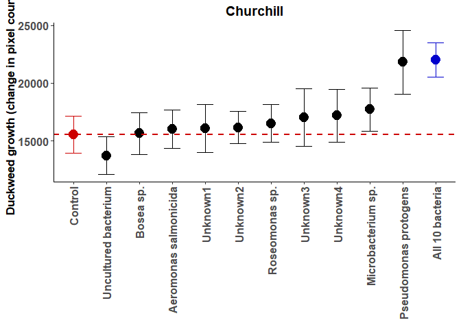<!-- -->

```r
#OK, we want to add a line based on additive interactive effects among bacteria
#Calculate the effect of each microbe on plant growth
base_grtC<-SumC[1,4]
SumC$bac_eff<-(SumC$mean - base_grtC)/10
add_predC<-sum(SumC$bac_eff[2:12]) +base_grtC

dwC <- dwC + geom_hline(yintercept=add_predC, linetype="dashed", color = "blue3",size=1)
dwC
```

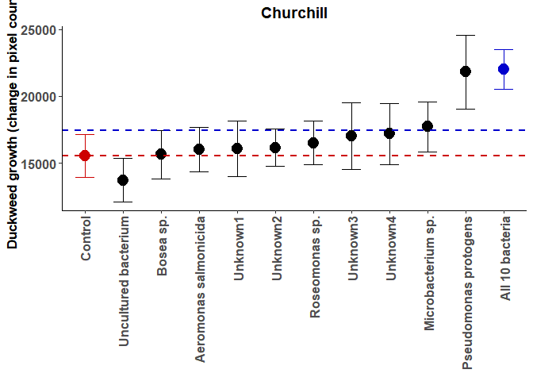<!-- -->

```r
#Alright, let's plot LogRRs.

logC_plt <- ggplot(logC,aes(y=LRR,x=bac,colour=bac))+geom_errorbar(aes(ymin=LRR-SE,ymax=LRR+SE),width=0.5)+geom_point(size=4.5)
logC_plt <- logC_plt + theme_classic() + ggtitle("Churchill") + theme(plot.title = element_text(size=14, face='bold', hjust = 0.5))
logC_plt <- logC_plt + scale_colour_manual(values=c("#000000","#000000","#000000","#000000","#000000","#000000","#000000","#000000","#000000","#000000","blue3"))
logC_plt <- logC_plt + theme(legend.title=element_blank())
logC_plt <- logC_plt + theme(legend.position = "none")
logC_plt <- logC_plt + labs(x= element_blank()) 
logC_plt <- logC_plt + labs(y= "Effect size of bacterial inoculation (Log Response Ratio)")
logC_plt <- logC_plt + theme(axis.text.x = element_text(angle = 90, hjust=1,vjust=0.5))
#dwC <- dwC + ylim(12000,40000)
logC_plt <- logC_plt + theme(axis.text = element_text(face="bold", size=12))
logC_plt <- logC_plt + theme(axis.title = element_text(face="bold", size=13))
logC_plt
```

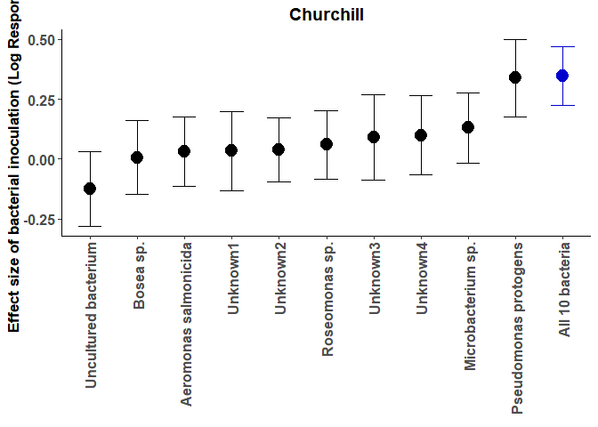<!-- -->

```r
# OK, let's look at bacteria.

# We need to generate some log rrs here too.
# We can add this to the logC dataframe

#Generate summary statistics.
melt_Cabs<-melt(dfC, id.vars=c("pop", "bac"), measure.vars= "logabs", na.rm = T)
Sum_Cabs<- ddply(melt_Cabs, c("bac","variable"), summarise,
      mean = mean(value), sd = sd(value), count=n(),
      sem = sd(value)/sqrt(length(value)))

for (i in 1:11){
  logC[i,6]<-log(Sum_Cabs[i+1,3]/Sum_Cabs[1,3])
  logC[i,7]<-Sum_Cabs[i+1,4]^2/(Sum_Cabs[i+1,5]*Sum_Cabs[i+1,3]^2) + Sum_Cabs[1,4]^2/(Sum_Cabs[1,5]*Sum_Cabs[1,3]^2)
}

names(logC)<-c('pop','bac','LRR','var','SE','absLRR','absvar')
logC$absSE<-sqrt(logC$absvar)

melt_C_abs<-melt(dfC, id.vars=c("bac","plt"), measure.vars= "logabs", na.rm = T)
Sum_C_abs<- ddply(melt_C_abs, c("bac","plt","variable"), summarise,
                mean = mean(value), sd = sd(value),
                sem = sd(value)/sqrt(length(value)))

absC <- ggplot(Sum_C_abs,aes(y=mean,x=bac,colour=bac,shape=plt))+geom_errorbar(aes(ymin=mean-sem,ymax=mean+sem),width=0.5, position=position_dodge(width=0.4)) +geom_point(position=position_dodge(width=0.4), size=4.5)
absC <- absC + theme_classic() + ggtitle("Churchill") + theme(plot.title = element_text(size=14, face='bold', hjust = 0.5))
absC <- absC + scale_colour_manual(values=c("red3","#000000","#000000","#000000","#000000","#000000","#000000","#000000","#000000","#000000","#000000","blue3"))
absC <- absC + theme(legend.title=element_blank())
absC <- absC + guides(colour=FALSE)
```

```
## Warning: `guides(<scale> = FALSE)` is deprecated. Please use `guides(<scale> =
## "none")` instead.
```

```r
absC <- absC + scale_shape_discrete(name = "Treatment", labels = c("Bacteria only", "Plants & Bacteria"))
absC <- absC + theme(legend.position = c(0.7,0.9))
absC <- absC + labs(x= element_blank()) 
absC <- absC + labs(y= "Logged bacterial cell density (cells/µL)")
absC <- absC + theme(axis.text.x = element_text(angle = 90, hjust=1,vjust=0.5))
absC <- absC + ylim(3,9.5)
absC <- absC + theme(axis.text = element_text(face="bold", size=12))
absC <- absC + theme(axis.title = element_text(face="bold", size=13))
absC
```

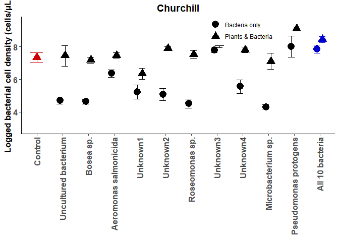<!-- -->

```r
#Let's collapse this to LogRR's? This plot would show the importance of plant presence to each bacteria

LRR_absC <- ggplot(logC,aes(y=absLRR,x=bac,colour=bac))+geom_errorbar(aes(ymin=absLRR-absSE,ymax=absLRR+absSE),width=0.5, position=position_dodge(width=0.4)) +geom_point(position=position_dodge(width=0.4), size=4.5)
LRR_absC <- LRR_absC + theme_classic() + ggtitle("Churchill") + theme(plot.title = element_text(size=14, face='bold', hjust = 0.5))
LRR_absC <- LRR_absC + scale_colour_manual(values=c("#000000","#000000","#000000","#000000","#000000","#000000","#000000","#000000","#000000","#000000","blue3"))
LRR_absC <- LRR_absC + theme(legend.title=element_blank())
LRR_absC <- LRR_absC + guides(colour=FALSE)
```

```
## Warning: `guides(<scale> = FALSE)` is deprecated. Please use `guides(<scale> =
## "none")` instead.
```

```r
LRR_absC <- LRR_absC + theme(legend.title=element_blank())
LRR_absC <- LRR_absC + theme(legend.position = c(0.7,0.9))
LRR_absC <- LRR_absC + labs(x= element_blank()) 
LRR_absC <- LRR_absC + labs(y= "Effect of plant presence (Log Response Ratio)")
LRR_absC <- LRR_absC + theme(axis.text.x = element_text(angle = 90, hjust=1,vjust=0.5))
#LRR_absC <- LRR_absC + ylim(3,9.5)
LRR_absC <- LRR_absC + theme(axis.text = element_text(face="bold", size=12))
LRR_absC <- LRR_absC + theme(axis.title = element_text(face="bold", size=13))
LRR_absC <- LRR_absC + scale_x_discrete(labels=c("Uncultured bacterium","Bosea sp.","Aeromonas salmonicida","Unknown","Unknown","Roseomonas sp.","Unknown","Unknown","Microbacterium sp.","Pseudomonas protogens","All 10 bacteria"))
LRR_absC
```

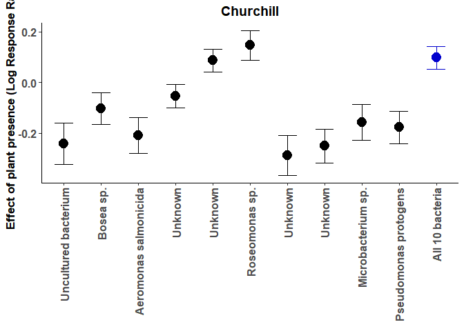<!-- -->

```r
# Then we can look at fitness regressions?
# Let's start by just graphing bacterial cell count against the growth rate of plants. This will ask the question "are the fitness estimates of bacteria and plants aligned? Are they broadly mutualistic?"

# Let's plot the raw regression first?
#Let's try plotting that with the full dataset, not the summary stats
regC <- ggplot(dfC,aes(y=logabs,x=Grt))+ geom_point()
regC <- regC + theme_classic() + ggtitle("Churchill") + theme(plot.title = element_text(size=14, face='bold', hjust = 0.5))
regC <- regC + stat_smooth(method='lm',fullrange=F, se=T, size=2)
regC <- regC + labs(x= "Duckweed growth (change in pixel count)") 
regC <- regC + labs(y= "Logged bacterial cell density (cells/µL)")
regC <- regC + theme(axis.text = element_text(face="bold", size=12))
regC <- regC + theme(axis.title = element_text(face="bold", size=13))
regC
```

```
## `geom_smooth()` using formula 'y ~ x'
```

```
## Warning: Removed 340 rows containing non-finite values (stat_smooth).
```

```
## Warning: Removed 340 rows containing missing values (geom_point).
```

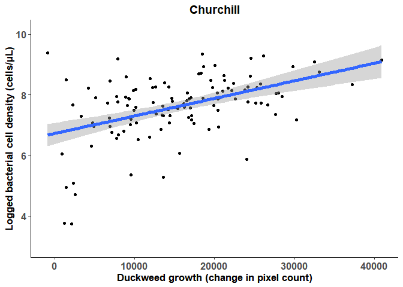<!-- -->

```r
# Let's plot the summary statistics. 

SumC$mean.abs<- Sum_Cabs$mean
SumC$se.abs<- Sum_Cabs$sem
  
regC2 <- ggplot(SumC,aes(x=mean,y=mean.abs,colour=bac))+geom_errorbar(aes(xmin=mean-sem,xmax=mean+sem)) +geom_point(size=4.5)
regC2 <- regC2 + geom_errorbar(aes(ymin=mean.abs-se.abs,ymax=mean.abs+se.abs))
regC2 <- regC2 + theme_classic() + ggtitle("Churchill") + theme(plot.title = element_text(size=14, face='bold', hjust = 0.5))
regC2 <- regC2 + scale_colour_manual(values=c("red3","#000000","#000000","#000000","#000000","#000000","#000000","#000000","#000000","#000000","#000000","blue3"))
regC2 <- regC2 + theme(legend.title=element_blank())
regC2 <- regC2 + theme(legend.position = "none")
regC2 <- regC2 + labs(x= "Duckweed growth (change in pixel count)") 
regC2 <- regC2 + labs(y= "Logged bacterial cell density (cells/µL)")
regC2 <- regC2 + theme(axis.text = element_text(face="bold", size=12))
regC2 <- regC2 + theme(axis.title = element_text(face="bold", size=13))
regC2
```

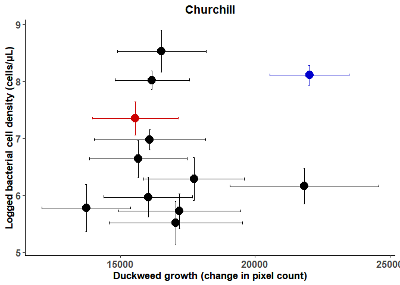<!-- -->

```r
# Let's try the LogRR's
regClRR <- ggplot(logC,aes(y=absLRR,x=LRR))+ geom_point()
regClRR <- regClRR + geom_errorbar(aes(ymin=absLRR-absSE,ymax=absLRR+absSE))
regClRR <- regClRR + geom_errorbar(aes(xmin=LRR-SE, xmax=LRR+SE))
regClRR <- regClRR + theme_classic() + ggtitle("Churchill") + theme(plot.title = element_text(size=14, face='bold', hjust = 0.5))
regClRR <- regClRR + labs(x= "Effect size of bacterial inoculation (Log Response Ratio)") 
regClRR <- regClRR + labs(y= "Effect size of plant presence (Log Response Ratio)")
regClRR <- regClRR + theme(axis.text = element_text(face="bold", size=12))
regClRR <- regClRR + theme(axis.title = element_text(face="bold", size=13))
regClRR
```

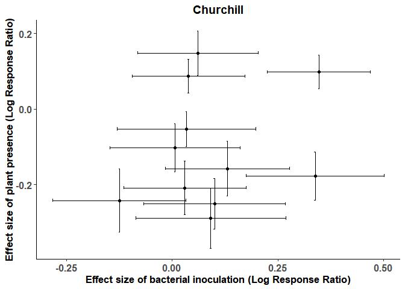<!-- -->

```r
# OK let's now regress the LogRRs

# Finally, let's plot fitness alignment (or estimate?) for each bacteria separately, and look at this?
# How about emtrends~ LogRR's (effects on plants)? Are more beneficial bacterial also more closely aligned?

# Let's ask that by plotting raw data for each bacteria

regC.bac <- ggplot(dfC,aes(y=logabs,x=Grt))+ geom_point()
regC.bac <- regC.bac + facet_wrap(~ bac)
regC.bac <- regC.bac + theme_classic() + ggtitle("Churchill") + theme(plot.title = element_text(size=14, face='bold', hjust = 0.5))
regC.bac <- regC.bac + stat_smooth(method='lm',fullrange=F, se=T, size=2)
regC.bac <- regC.bac + labs(x= "Duckweed growth (change in pixel count)") 
regC.bac <- regC.bac + labs(y= "Logged bacterial cell density (cells/µL)")
regC.bac <- regC.bac + theme(axis.text = element_text(face="bold", size=12))
regC.bac <- regC.bac + theme(axis.title = element_text(face="bold", size=13))
regC.bac
```

```
## `geom_smooth()` using formula 'y ~ x'
```

```
## Warning: Removed 340 rows containing non-finite values (stat_smooth).
## Removed 340 rows containing missing values (geom_point).
```

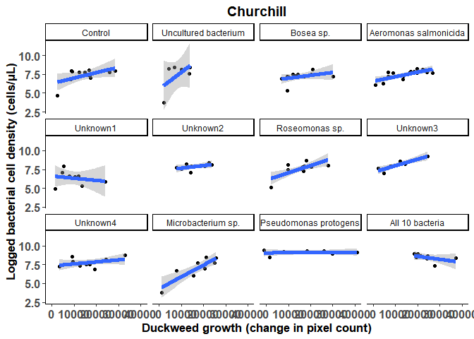<!-- -->

```r
bac.emtC <- emtrends(regC3, "bac", var = "logabs")
bac.emtC<-as.data.frame(bac.emtC)
bac.emtC
```

```
##  bac                   logabs.trend   SE df lower.CL upper.CL
##  Control                       3555 2300 93    -1012     8123
##  Uncultured bacterium          1709 1691 93    -1649     5067
##  Bosea sp.                     3015 3260 93    -3459     9489
##  Aeromonas salmonicida         9248 2956 93     3379    15117
##  Unknown1                     -2764 2795 93    -8314     2786
##  Unknown2                      5875 6250 93    -6536    18285
##  Roseomonas sp.                6008 2232 93     1575    10440
##  Unknown3                      9939 3799 93     2395    17483
##  Unknown4                      6016 3898 93    -1724    13757
##  Microbacterium sp.            4794 1637 93     1544     8044
##  Pseudomonas protogens         6103 9142 93   -12051    24256
##  All 10 bacteria              -6246 5176 93   -16524     4032
## 
## Results are averaged over the levels of: edge 
## Confidence level used: 0.95
```

```r
# Pairwise comparisons
pairs(bac.emtC)
```

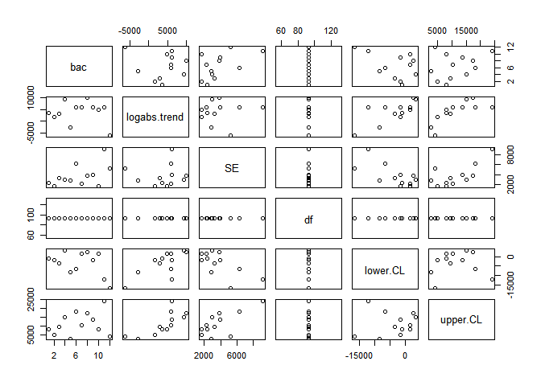<!-- -->

```r
#Let's add these estimates to our SumC
SumC$reg.mean<-bac.emtC$logabs.trend
SumC$reg.SE<-bac.emtC$SE

#Let's also add this information to logC
bac.trend<-bac.emtC$logabs[2:12]
SE.trend<-bac.emtC$SE[2:12]

logC$reg.mean<-bac.trend
logC$reg.SE<-SE.trend

logemtC <- ggplot(logC,aes(y=reg.mean,x=LRR))+ geom_point()
logemtC <- logemtC + geom_errorbar(aes(ymin=reg.mean-reg.SE,ymax=reg.mean+reg.SE))
logemtC <- logemtC + geom_errorbar(aes(xmin=LRR-SE, xmax=LRR+SE))
logemtC <- logemtC + theme_classic() + ggtitle("Churchill") + theme(plot.title = element_text(size=14, face='bold', hjust = 0.5))
logemtC <- logemtC + labs(x= "Effect size of bacterial inoculation (Log Response Ratio)") 
logemtC <- logemtC + labs(y= "Fitness regression")
logemtC <- logemtC + theme(axis.text = element_text(face="bold", size=12))
logemtC <- logemtC + theme(axis.title = element_text(face="bold", size=13))
logemtC
```

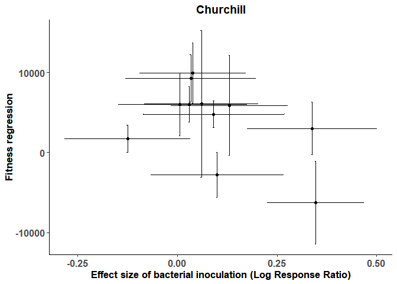<!-- -->

SECTION 5: Wellspring: Modelling.


```r
#How does bacterial inoculation affect growth?
modW_Grt<-lm(Grt~bac,data=dfW)
anova(modW_Grt)
```

```
## Analysis of Variance Table
## 
## Response: Grt
##            Df     Sum Sq   Mean Sq F value Pr(>F)
## bac        11 1.8065e+09 164229825  0.9197 0.5221
## Residuals 226 4.0356e+10 178567123
```

```r
summary(modW_Grt)
```

```
## 
## Call:
## lm(formula = Grt ~ bac, data = dfW)
## 
## Residuals:
##    Min     1Q Median     3Q    Max 
## -30170  -9439    763   8517  33505 
## 
## Coefficients:
##                               Estimate Std. Error t value Pr(>|t|)    
## (Intercept)                   23262.70    2988.04   7.785 2.48e-13 ***
## bacSphingomonas sp. 1          -158.91    4280.96  -0.037   0.9704    
## bacRhizobiales sp.              -90.75    4280.96  -0.021   0.9831    
## bacRhizobium sp. 1              728.15    4225.72   0.172   0.8633    
## bacRhizorhabdus phycospaerae   1201.10    4225.72   0.284   0.7765    
## bacUnknown1                    1363.15    4225.72   0.323   0.7473    
## bacPseudomonas protogens       2605.65    4225.72   0.617   0.5381    
## bacRhizorhabdus phycosphaerae  3808.95    4225.72   0.901   0.3683    
## bacRhizobium sp. 2             4873.25    4225.72   1.153   0.2500    
## bacSphingomonas sp. 2          5693.35    4225.72   1.347   0.1792    
## bacPseudomonas aeruginosa      7764.50    4225.72   1.837   0.0675 .  
## bacAll 10 bacteria             7179.10    4225.72   1.699   0.0907 .  
## ---
## Signif. codes:  0 '***' 0.001 '**' 0.01 '*' 0.05 '.' 0.1 ' ' 1
## 
## Residual standard error: 13360 on 226 degrees of freedom
##   (221 observations deleted due to missingness)
## Multiple R-squared:  0.04285,	Adjusted R-squared:  -0.003741 
## F-statistic: 0.9197 on 11 and 226 DF,  p-value: 0.5221
```

```r
#not significant, but all 10 bacteria and bac 2 are almost significantly different from the mean. 

#What if we look at initial and final pixel count variation?
modW_pix<-lm(pix1~bac+pix0,data=dfW)
Anova(modW_pix, type=3)
```

```
## Anova Table (Type III tests)
## 
## Response: pix1
##                 Sum Sq  Df  F value  Pr(>F)    
## (Intercept) 3.6943e+08   1   2.8936 0.09031 .  
## bac         1.2405e+09  11   0.8833 0.55746    
## pix0        1.5608e+10   1 122.2523 < 2e-16 ***
## Residuals   2.8726e+10 225                     
## ---
## Signif. codes:  0 '***' 0.001 '**' 0.01 '*' 0.05 '.' 0.1 ' ' 1
```

```r
summary(modW_pix)
```

```
## 
## Call:
## lm(formula = pix1 ~ bac + pix0, data = dfW)
## 
## Residuals:
##      Min       1Q   Median       3Q      Max 
## -26136.8  -6846.6   -108.6   7173.3  28062.7 
## 
## Coefficients:
##                                 Estimate Std. Error t value Pr(>|t|)    
## (Intercept)                    5353.5167  3147.1708   1.701   0.0903 .  
## bacSphingomonas sp. 1          1511.4336  3624.0657   0.417   0.6770    
## bacRhizobiales sp.            -1121.3467  3621.4476  -0.310   0.7571    
## bacRhizobium sp. 1             1202.3335  3573.4733   0.336   0.7368    
## bacRhizorhabdus phycospaerae    -73.8006  3575.6239  -0.021   0.9836    
## bacUnknown1                    1258.7224  3573.1447   0.352   0.7250    
## bacPseudomonas protogens       5090.4601  3582.6002   1.421   0.1567    
## bacRhizorhabdus phycosphaerae  4644.3712  3574.1999   1.299   0.1951    
## bacRhizobium sp. 2             4193.0506  3573.8386   1.173   0.2419    
## bacSphingomonas sp. 2          5694.6120  3573.1279   1.594   0.1124    
## bacPseudomonas aeruginosa      1929.1715  3625.0593   0.532   0.5951    
## bacAll 10 bacteria             5326.5347  3578.3962   1.489   0.1380    
## pix0                              7.3098     0.6611  11.057   <2e-16 ***
## ---
## Signif. codes:  0 '***' 0.001 '**' 0.01 '*' 0.05 '.' 0.1 ' ' 1
## 
## Residual standard error: 11300 on 225 degrees of freedom
##   (221 observations deleted due to missingness)
## Multiple R-squared:  0.381,	Adjusted R-squared:  0.348 
## F-statistic: 11.54 on 12 and 225 DF,  p-value: < 2.2e-16
```

```r
#No change — bacteria remains non-significant

# Let's add in edge effects.
modW_pixgrt<-lm(pix1~bac+pix0+edge,data=dfW)
Anova(modW_pixgrt, type=3)
```

```
## Anova Table (Type III tests)
## 
## Response: pix1
##                 Sum Sq  Df  F value  Pr(>F)    
## (Intercept) 8.9112e+07   1   0.7134 0.39922    
## bac         1.2934e+09  11   0.9413 0.50152    
## pix0        1.5359e+10   1 122.9569 < 2e-16 ***
## edge        7.4650e+08   1   5.9763 0.01527 *  
## Residuals   2.7980e+10 224                     
## ---
## Signif. codes:  0 '***' 0.001 '**' 0.01 '*' 0.05 '.' 0.1 ' ' 1
```

```r
summary(modW_pixgrt)
```

```
## 
## Call:
## lm(formula = pix1 ~ bac + pix0 + edge, data = dfW)
## 
## Residuals:
##      Min       1Q   Median       3Q      Max 
## -27218.7  -6422.7    891.9   6964.5  26713.4 
## 
## Coefficients:
##                                Estimate Std. Error t value Pr(>|t|)    
## (Intercept)                   2776.0136  3286.6401   0.845   0.3992    
## bacSphingomonas sp. 1         2174.9183  3594.9014   0.605   0.5458    
## bacRhizobiales sp.            -845.3889  3583.8304  -0.236   0.8137    
## bacRhizobium sp. 1            1393.3943  3535.4637   0.394   0.6939    
## bacRhizorhabdus phycospaerae  -453.1019  3540.1286  -0.128   0.8983    
## bacUnknown1                   1064.4678  3535.1678   0.301   0.7636    
## bacPseudomonas protogens      5264.1544  3544.3395   1.485   0.1389    
## bacRhizorhabdus phycosphaerae 4441.9988  3536.2875   1.256   0.2104    
## bacRhizobium sp. 2            4394.0822  3535.9174   1.243   0.2153    
## bacSphingomonas sp. 2         6280.0706  3542.3627   1.773   0.0776 .  
## bacPseudomonas aeruginosa     1589.2603  3588.3194   0.443   0.6583    
## bacAll 10 bacteria            4952.2229  3542.7793   1.398   0.1635    
## pix0                             7.2553     0.6543  11.089   <2e-16 ***
## edgeY                         3903.1299  1596.5997   2.445   0.0153 *  
## ---
## Signif. codes:  0 '***' 0.001 '**' 0.01 '*' 0.05 '.' 0.1 ' ' 1
## 
## Residual standard error: 11180 on 224 degrees of freedom
##   (221 observations deleted due to missingness)
## Multiple R-squared:  0.3971,	Adjusted R-squared:  0.3621 
## F-statistic: 11.35 on 13 and 224 DF,  p-value: < 2.2e-16
```

```r
#So edge is significant, nothing else changes.

#Let's try that as a random effect
lmer.grtW<-lmer(pix1~pix0 + bac +(1|edge),data=dfW)
```

```
## Warning: Some predictor variables are on very different scales: consider
## rescaling
```

```r
summary(lmer.grtW)
```

```
## Linear mixed model fit by REML ['lmerMod']
## Formula: pix1 ~ pix0 + bac + (1 | edge)
##    Data: dfW
## 
## REML criterion at convergence: 4890.3
## 
## Scaled residuals: 
##      Min       1Q   Median       3Q      Max 
## -2.41558 -0.56672  0.06995  0.62082  2.41038 
## 
## Random effects:
##  Groups   Name        Variance  Std.Dev.
##  edge     (Intercept)   6342646  2518   
##  Residual             124909802 11176   
## Number of obs: 238, groups:  edge, 2
## 
## Fixed effects:
##                                Estimate Std. Error t value
## (Intercept)                   4832.3149  3593.9218   1.345
## pix0                             7.2644     0.6542  11.104
## bacSphingomonas sp. 1         2063.8994  3593.1867   0.574
## bacRhizobiales sp.            -891.5641  3583.5329  -0.249
## bacRhizobium sp. 1            1361.4247  3535.3191   0.385
## bacRhizorhabdus phycospaerae  -389.6345  3539.5597  -0.110
## bacUnknown1                   1096.9719  3535.0184   0.310
## bacPseudomonas protogens      5235.0906  3544.2204   1.477
## bacRhizorhabdus phycosphaerae 4475.8612  3536.1253   1.266
## bacRhizobium sp. 2            4360.4442  3535.7574   1.233
## bacSphingomonas sp. 2         6182.1075  3541.0079   1.746
## bacPseudomonas aeruginosa     1646.1367  3587.8686   0.459
## bacAll 10 bacteria            5014.8554  3542.2257   1.416
```

```
## 
## Correlation matrix not shown by default, as p = 13 > 12.
## Use print(x, correlation=TRUE)  or
##     vcov(x)        if you need it
```

```
## fit warnings:
## Some predictor variables are on very different scales: consider rescaling
```

```r
Anova(lmer.grtW, type=3)
```

```
## Analysis of Deviance Table (Type III Wald chisquare tests)
## 
## Response: pix1
##                Chisq Df Pr(>Chisq)    
## (Intercept)   1.8079  1     0.1788    
## pix0        123.2902  1     <2e-16 ***
## bac          10.2562 11     0.5075    
## ---
## Signif. codes:  0 '***' 0.001 '**' 0.01 '*' 0.05 '.' 0.1 ' ' 1
```

```r
exactRLRT(lmer.grtW)
```

```
## 
## 	simulated finite sample distribution of RLRT.
## 	
## 	(p-value based on 10000 simulated values)
## 
## data:  
## RLRT = 3.1343, p-value = 0.0157
```

```r
#Yep! Edge matters.

#How does bacterial identity and the presence of plants affect cell density?
modW_abs<-lm(logabs~bac*plt+edge,data=dfW)
anova(modW_abs)
```

```
## Analysis of Variance Table
## 
## Response: logabs
##            Df  Sum Sq Mean Sq  F value    Pr(>F)    
## bac        11 170.153  15.468  18.2686 < 2.2e-16 ***
## plt         1 240.331 240.331 283.8360 < 2.2e-16 ***
## edge        1   8.312   8.312   9.8172  0.001994 ** 
## bac:plt    10  35.956   3.596   4.2465 2.337e-05 ***
## Residuals 196 165.958   0.847                       
## ---
## Signif. codes:  0 '***' 0.001 '**' 0.01 '*' 0.05 '.' 0.1 ' ' 1
```

```r
summary(modW_abs)
```

```
## 
## Call:
## lm(formula = logabs ~ bac * plt + edge, data = dfW)
## 
## Residuals:
##     Min      1Q  Median      3Q     Max 
## -3.8295 -0.4481  0.0101  0.5251  3.4732 
## 
## Coefficients: (1 not defined because of singularities)
##                                    Estimate Std. Error t value Pr(>|t|)    
## (Intercept)                          7.1795     0.5757  12.471  < 2e-16 ***
## bacSphingomonas sp. 1               -0.6253     0.6543  -0.956 0.340421    
## bacRhizobiales sp.                  -3.1637     0.6576  -4.811 2.99e-06 ***
## bacRhizobium sp. 1                  -1.5589     0.6491  -2.402 0.017257 *  
## bacRhizorhabdus phycospaerae        -2.3414     0.6259  -3.741 0.000241 ***
## bacUnknown1                         -1.6361     0.6616  -2.473 0.014255 *  
## bacPseudomonas protogens             0.2159     0.6767   0.319 0.750023    
## bacRhizorhabdus phycosphaerae       -2.2068     0.6660  -3.313 0.001098 ** 
## bacRhizobium sp. 2                  -1.8933     0.6543  -2.894 0.004241 ** 
## bacSphingomonas sp. 2               -1.1529     0.6476  -1.780 0.076591 .  
## bacPseudomonas aeruginosa           -1.5216     0.6508  -2.338 0.020399 *  
## bacAll 10 bacteria                   1.2602     0.5057   2.492 0.013534 *  
## pltY                                 0.5809     0.5020   1.157 0.248598    
## edgeY                               -0.3826     0.1380  -2.772 0.006108 ** 
## bacSphingomonas sp. 1:pltY           0.6685     0.6572   1.017 0.310312    
## bacRhizobiales sp.:pltY              2.0244     0.6871   2.946 0.003607 ** 
## bacRhizobium sp. 1:pltY              1.8640     0.6665   2.797 0.005675 ** 
## bacRhizorhabdus phycospaerae:pltY    2.1072     0.6332   3.328 0.001045 ** 
## bacUnknown1:pltY                     0.9042     0.6463   1.399 0.163405    
## bacPseudomonas protogens:pltY        0.3542     0.6738   0.526 0.599683    
## bacRhizorhabdus phycosphaerae:pltY   2.1085     0.6792   3.104 0.002190 ** 
## bacRhizobium sp. 2:pltY              2.6299     0.6439   4.085 6.43e-05 ***
## bacSphingomonas sp. 2:pltY           2.2520     0.6458   3.487 0.000603 ***
## bacPseudomonas aeruginosa:pltY       2.3538     0.6416   3.669 0.000314 ***
## bacAll 10 bacteria:pltY                  NA         NA      NA       NA    
## ---
## Signif. codes:  0 '***' 0.001 '**' 0.01 '*' 0.05 '.' 0.1 ' ' 1
## 
## Residual standard error: 0.9202 on 196 degrees of freedom
##   (239 observations deleted due to missingness)
## Multiple R-squared:  0.7326,	Adjusted R-squared:  0.7013 
## F-statistic: 23.35 on 23 and 196 DF,  p-value: < 2.2e-16
```

```r
#so bacterial identity, plant presence, and the interaction between them all matter here. Edge too!

regW<-lm(Grt~logabs+bac+edge,data=dfW)
Anova(regW, type = 3)
```

```
## Anova Table (Type III tests)
## 
## Response: Grt
##                 Sum Sq  Df F value    Pr(>F)    
## (Intercept) 4.1944e+08   1  2.9504 0.0889512 .  
## logabs      2.0325e+09   1 14.2969 0.0002658 ***
## bac         1.7007e+09  11  1.0876 0.3789782    
## edge        5.1534e+08   1  3.6250 0.0597919 .  
## Residuals   1.4216e+10 100                      
## ---
## Signif. codes:  0 '***' 0.001 '**' 0.01 '*' 0.05 '.' 0.1 ' ' 1
```

```r
summary(regW)
```

```
## 
## Call:
## lm(formula = Grt ~ logabs + bac + edge, data = dfW)
## 
## Residuals:
##      Min       1Q   Median       3Q      Max 
## -24047.7  -6740.9     13.4   7487.3  29157.8 
## 
## Coefficients:
##                               Estimate Std. Error t value Pr(>|t|)    
## (Intercept)                   -18837.8    10967.0  -1.718 0.088951 .  
## logabs                          4914.7     1299.8   3.781 0.000266 ***
## bacSphingomonas sp. 1           3808.6     5523.8   0.689 0.492112    
## bacRhizobiales sp.              2953.8     6070.9   0.487 0.627647    
## bacRhizobium sp. 1             -3270.1     5672.4  -0.577 0.565572    
## bacRhizorhabdus phycospaerae    1178.4     5490.1   0.215 0.830486    
## bacUnknown1                     9490.1     5106.7   1.858 0.066058 .  
## bacPseudomonas protogens       -4142.6     5275.2  -0.785 0.434137    
## bacRhizorhabdus phycosphaerae   3712.8     5674.5   0.654 0.514424    
## bacRhizobium sp. 2             -2987.1     5194.4  -0.575 0.566543    
## bacSphingomonas sp. 2           2000.1     5433.4   0.368 0.713573    
## bacPseudomonas aeruginosa       4875.8     5350.9   0.911 0.364378    
## bacAll 10 bacteria              -912.1     6782.2  -0.134 0.893294    
## edgeY                           4996.8     2624.5   1.904 0.059792 .  
## ---
## Signif. codes:  0 '***' 0.001 '**' 0.01 '*' 0.05 '.' 0.1 ' ' 1
## 
## Residual standard error: 11920 on 100 degrees of freedom
##   (345 observations deleted due to missingness)
## Multiple R-squared:  0.2178,	Adjusted R-squared:  0.1161 
## F-statistic: 2.141 on 13 and 100 DF,  p-value: 0.01771
```

```r
#significant correlation b/w logabs and growth, edge nearly significant. No bac!

regW2<-lm(pix1~logabs+pix0+bac+edge,data=dfW)
Anova(regW2, type = 3)
```

```
## Anova Table (Type III tests)
## 
## Response: pix1
##                 Sum Sq Df F value    Pr(>F)    
## (Intercept) 7.6110e+08  1  6.2986 0.0137050 *  
## logabs      1.4228e+09  1 11.7745 0.0008775 ***
## pix0        3.5600e+09  1 29.4615 4.065e-07 ***
## bac         1.1453e+09 11  0.8616 0.5799669    
## edge        5.7843e+08  1  4.7869 0.0310301 *  
## Residuals   1.1963e+10 99                      
## ---
## Signif. codes:  0 '***' 0.001 '**' 0.01 '*' 0.05 '.' 0.1 ' ' 1
```

```r
summary(regW2)
```

```
## 
## Call:
## lm(formula = pix1 ~ logabs + pix0 + bac + edge, data = dfW)
## 
## Residuals:
##    Min     1Q Median     3Q    Max 
## -23617  -6132  -1054   6275  26220 
## 
## Coefficients:
##                                 Estimate Std. Error t value Pr(>|t|)    
## (Intercept)                   -2.569e+04  1.023e+04  -2.510 0.013705 *  
## logabs                         4.156e+03  1.211e+03   3.431 0.000877 ***
## pix0                           4.892e+00  9.013e-01   5.428 4.06e-07 ***
## bacSphingomonas sp. 1          6.444e+03  5.129e+03   1.256 0.211955    
## bacRhizobiales sp.             3.844e+03  5.601e+03   0.686 0.494118    
## bacRhizobium sp. 1            -1.279e+03  5.250e+03  -0.244 0.808079    
## bacRhizorhabdus phycospaerae   5.604e+02  5.064e+03   0.111 0.912103    
## bacUnknown1                    9.085e+03  4.709e+03   1.929 0.056566 .  
## bacPseudomonas protogens       7.519e+01  4.961e+03   0.015 0.987936    
## bacRhizorhabdus phycosphaerae  5.380e+03  5.246e+03   1.026 0.307610    
## bacRhizobium sp. 2            -6.754e+02  4.819e+03  -0.140 0.888821    
## bacSphingomonas sp. 2          4.093e+03  5.033e+03   0.813 0.418018    
## bacPseudomonas aeruginosa      1.759e+03  4.986e+03   0.353 0.724956    
## bacAll 10 bacteria            -8.637e+02  6.253e+03  -0.138 0.890415    
## edgeY                          5.296e+03  2.421e+03   2.188 0.031030 *  
## ---
## Signif. codes:  0 '***' 0.001 '**' 0.01 '*' 0.05 '.' 0.1 ' ' 1
## 
## Residual standard error: 10990 on 99 degrees of freedom
##   (345 observations deleted due to missingness)
## Multiple R-squared:  0.3997,	Adjusted R-squared:  0.3148 
## F-statistic: 4.709 on 14 and 99 DF,  p-value: 1.614e-06
```

```r
#So regardless of how we measure growth rate, logged absolute count is correlated with duckweed fitness. This adds edge as a significant effect. 

#What about an interaction term? This will set up emmeans analysis too. 
regW3<-lm(Grt~logabs*bac+edge,data=dfW)
Anova(regW3, type = 3)
```

```
## Anova Table (Type III tests)
## 
## Response: Grt
##                 Sum Sq Df F value    Pr(>F)    
## (Intercept) 6.1115e+07  1  0.5377 0.4653072    
## logabs      1.6584e+08  1  1.4591 0.2302657    
## bac         4.2371e+09 11  3.3891 0.0005998 ***
## edge        3.6664e+08  1  3.2259 0.0758772 .  
## logabs:bac  4.1008e+09 11  3.2801 0.0008337 ***
## Residuals   1.0115e+10 89                      
## ---
## Signif. codes:  0 '***' 0.001 '**' 0.01 '*' 0.05 '.' 0.1 ' ' 1
```

```r
summary(regW3)
```

```
## 
## Call:
## lm(formula = Grt ~ logabs * bac + edge, data = dfW)
## 
## Residuals:
##    Min     1Q Median     3Q    Max 
## -21626  -6488   1015   5714  27830 
## 
## Coefficients:
##                                       Estimate Std. Error t value Pr(>|t|)    
## (Intercept)                           -28614.5    39022.0  -0.733 0.465307    
## logabs                                  6273.6     5193.6   1.208 0.230266    
## bacSphingomonas sp. 1                 152524.3    68473.1   2.228 0.028435 *  
## bacRhizobiales sp.                    -15859.9    45281.1  -0.350 0.726975    
## bacRhizobium sp. 1                    -13753.0    54454.6  -0.253 0.801191    
## bacRhizorhabdus phycospaerae            4460.7    41396.3   0.108 0.914431    
## bacUnknown1                            26063.8    49094.9   0.531 0.596820    
## bacPseudomonas protogens              -24737.0    78439.7  -0.315 0.753224    
## bacRhizorhabdus phycosphaerae          34729.2    45493.8   0.763 0.447253    
## bacRhizobium sp. 2                    -61176.4    53906.6  -1.135 0.259482    
## bacSphingomonas sp. 2                 245367.4    65819.2   3.728 0.000339 ***
## bacPseudomonas aeruginosa              47142.4    64258.2   0.734 0.465097    
## bacAll 10 bacteria                   -107974.3    87771.0  -1.230 0.221871    
## edgeY                                   4418.5     2460.1   1.796 0.075877 .  
## logabs:bacSphingomonas sp. 1          -19109.4     8867.6  -2.155 0.033865 *  
## logabs:bacRhizobiales sp.               3158.3     6278.1   0.503 0.616162    
## logabs:bacRhizobium sp. 1               1275.9     7088.9   0.180 0.857569    
## logabs:bacRhizorhabdus phycospaerae     -398.2     5505.5  -0.072 0.942498    
## logabs:bacUnknown1                     -2302.1     6797.8  -0.339 0.735662    
## logabs:bacPseudomonas protogens         2419.4     9854.8   0.246 0.806632    
## logabs:bacRhizorhabdus phycosphaerae   -4188.5     6066.1  -0.690 0.491691    
## logabs:bacRhizobium sp. 2               6934.2     6871.3   1.009 0.315641    
## logabs:bacSphingomonas sp. 2          -28222.8     8018.2  -3.520 0.000683 ***
## logabs:bacPseudomonas aeruginosa       -5235.8     8067.9  -0.649 0.518032    
## logabs:bacAll 10 bacteria              12234.2    10460.7   1.170 0.245311    
## ---
## Signif. codes:  0 '***' 0.001 '**' 0.01 '*' 0.05 '.' 0.1 ' ' 1
## 
## Residual standard error: 10660 on 89 degrees of freedom
##   (345 observations deleted due to missingness)
## Multiple R-squared:  0.4434,	Adjusted R-squared:  0.2933 
## F-statistic: 2.954 on 24 and 89 DF,  p-value: 0.0001164
```

```r
#Wait what? Now bac comes out as highly significant, so long as you include an interaction with the regression. (which is also significant)

regW4<-lm(pix1~logabs*bac + pix0+edge,data=dfW)
Anova(regW4, type = 3)
```

```
## Anova Table (Type III tests)
## 
## Response: pix1
##                 Sum Sq Df F value    Pr(>F)    
## (Intercept)  123516901  1  1.1570 0.2850344    
## logabs       198785116  1  1.8620 0.1758729    
## bac         2711505745 11  2.3090 0.0154237 *  
## pix0        1444398228  1 13.5296 0.0004038 ***
## edge         429048562  1  4.0189 0.0480678 *  
## logabs:bac  2568067272 11  2.1868 0.0220210 *  
## Residuals   9394764315 88                      
## ---
## Signif. codes:  0 '***' 0.001 '**' 0.01 '*' 0.05 '.' 0.1 ' ' 1
```

```r
summary(regW4)
```

```
## 
## Call:
## lm(formula = pix1 ~ logabs * bac + pix0 + edge, data = dfW)
## 
## Residuals:
##      Min       1Q   Median       3Q      Max 
## -23248.6  -5653.3    822.3   5938.7  24233.1 
## 
## Coefficients:
##                                        Estimate Std. Error t value Pr(>|t|)    
## (Intercept)                          -4.100e+04  3.812e+04  -1.076 0.285034    
## logabs                                6.876e+03  5.039e+03   1.365 0.175873    
## bacSphingomonas sp. 1                 1.461e+05  6.641e+04   2.200 0.030454 *  
## bacRhizobiales sp.                    1.603e+02  4.432e+04   0.004 0.997122    
## bacRhizobium sp. 1                    4.785e+03  5.326e+04   0.090 0.928619    
## bacRhizorhabdus phycospaerae          1.363e+04  4.028e+04   0.338 0.735875    
## bacUnknown1                           3.517e+04  4.771e+04   0.737 0.463013    
## bacPseudomonas protogens             -8.789e+03  7.627e+04  -0.115 0.908522    
## bacRhizorhabdus phycosphaerae         3.941e+04  4.413e+04   0.893 0.374262    
## bacRhizobium sp. 2                   -5.179e+04  5.237e+04  -0.989 0.325368    
## bacSphingomonas sp. 2                 2.117e+05  6.509e+04   3.252 0.001626 ** 
## bacPseudomonas aeruginosa             4.844e+04  6.228e+04   0.778 0.438773    
## bacAll 10 bacteria                   -6.661e+04  8.654e+04  -0.770 0.443554    
## pix0                                  3.405e+00  9.258e-01   3.678 0.000404 ***
## edgeY                                 4.788e+03  2.389e+03   2.005 0.048068 *  
## logabs:bacSphingomonas sp. 1         -1.811e+04  8.603e+03  -2.106 0.038097 *  
## logabs:bacRhizobiales sp.             9.281e+02  6.145e+03   0.151 0.880292    
## logabs:bacRhizobium sp. 1            -9.793e+02  6.925e+03  -0.141 0.887864    
## logabs:bacRhizorhabdus phycospaerae  -1.682e+03  5.359e+03  -0.314 0.754318    
## logabs:bacUnknown1                   -3.573e+03  6.606e+03  -0.541 0.590028    
## logabs:bacPseudomonas protogens       6.973e+02  9.574e+03   0.073 0.942108    
## logabs:bacRhizorhabdus phycosphaerae -4.667e+03  5.882e+03  -0.793 0.429672    
## logabs:bacRhizobium sp. 2             5.873e+03  6.672e+03   0.880 0.381163    
## logabs:bacSphingomonas sp. 2         -2.434e+04  7.914e+03  -3.075 0.002801 ** 
## logabs:bacPseudomonas aeruginosa     -5.729e+03  7.822e+03  -0.733 0.465807    
## logabs:bacAll 10 bacteria             7.301e+03  1.031e+04   0.708 0.480948    
## ---
## Signif. codes:  0 '***' 0.001 '**' 0.01 '*' 0.05 '.' 0.1 ' ' 1
## 
## Residual standard error: 10330 on 88 degrees of freedom
##   (345 observations deleted due to missingness)
## Multiple R-squared:  0.5286,	Adjusted R-squared:  0.3947 
## F-statistic: 3.947 on 25 and 88 DF,  p-value: 9.338e-07
```

```r
# So what do we make of this? (1) We see a correlation b/w duckweed and bacterial fitness UNTIL we incorporate and interaction. (2) If (but only if) we account for the interaction, we then see the effect of bacterial identity. (3) The interaction is also highly significant. (4) This suggests that the bacteria have very different correlations with DW fitness?
```

SECTION 6: Wellspring: Plotting.


```r
# Let's plot!
SumW<-subset(Sum_LRR,Sum_LRR$pop=="Wellspring")

#First, let's change the order of bacteria, ranked by effect. 
SumW$bac<- factor(SumW$bac, levels = c("Control","2","8","1","9","6","3","5","4","7","10","All10"))
levels(SumW$bac) <- c("Control","Sphingomonas sp. 1","Rhizobiales sp.","Rhizobium sp. 1","Rhizorhabdus phycospaerae","Unknown1","Pseudomonas protogens","Rhizorhabdus phycosphaerae","Rhizobium sp. 2","Sphingomonas sp. 2","Pseudomonas aeruginosa","All 10 bacteria")

dwW <- ggplot(SumW,aes(y=mean,x=bac,colour=bac))+geom_errorbar(aes(ymin=mean-sem,ymax=mean+sem),width=0.5)+geom_point(size=4.5)
dwW <- dwW + theme_classic() + ggtitle("Wellspring") + theme(plot.title = element_text(size=14, face='bold', hjust = 0.5))
dwW <- dwW + scale_colour_manual(values=c("red3","#000000","#000000","#000000","#000000","#000000","#000000","#000000","#000000","#000000","#000000","blue3"))
dwW <- dwW + theme(legend.title=element_blank())
dwW <- dwW + theme(legend.position = "none")
dwW <- dwW + labs(x= element_blank()) 
dwW <- dwW + labs(y= "Duckweed growth (change in pixel count)")
dwW <- dwW + geom_hline(yintercept=23262.70, linetype="dashed", color = "red3",size=1)
dwW <- dwW + theme(axis.text.x = element_text(angle = 90, hjust=1,vjust=0.5))
#dwW <- dwW + ylim(12000,40000)
dwW <- dwW + theme(axis.text = element_text(face="bold", size=12))
dwW <- dwW + theme(axis.title = element_text(face="bold", size=13))
dwW
```

<!-- -->

```r
#OK, we want to add a line based on additive interactive effects among bacteria
#Calculate the effect of each microbe on plant growth
base_grtW<-SumW[1,4]
SumW$bac_eff<-(SumW$mean - base_grtW)/10
add_predW<-sum(SumW$bac_eff[2:12]) +base_grtW

dwW <- dwW + geom_hline(yintercept=add_predW, linetype="dashed", color = "blue3",size=1)
dwW
```

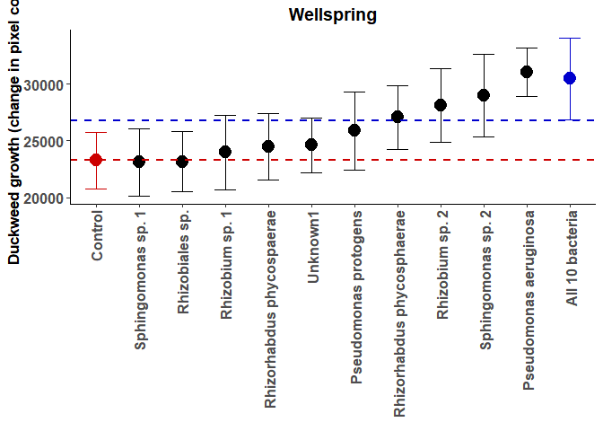<!-- -->

```r
#Alright, let's plot LogRRs.

logW_plt <- ggplot(logW,aes(y=LRR,x=bac,colour=bac))+geom_errorbar(aes(ymin=LRR-SE,ymax=LRR+SE),width=0.5)+geom_point(size=4.5)
logW_plt <- logW_plt + theme_classic() + ggtitle("Wellspring") + theme(plot.title = element_text(size=14, face='bold', hjust = 0.5))
logW_plt <- logW_plt + scale_colour_manual(values=c("#000000","#000000","#000000","#000000","#000000","#000000","#000000","#000000","#000000","#000000","blue3"))
logW_plt <- logW_plt + theme(legend.title=element_blank())
logW_plt <- logW_plt + theme(legend.position = "none")
logW_plt <- logW_plt + labs(x= element_blank()) 
logW_plt <- logW_plt + labs(y= "Effect size of bacterial inoculation (Log Response Ratio)")
logW_plt <- logW_plt + theme(axis.text.x = element_text(angle = 90, hjust=1,vjust=0.5))
#logW_plt <- logW_plt + ylim(12000,40000)
logW_plt <- logW_plt + theme(axis.text = element_text(face="bold", size=12))
logW_plt <- logW_plt + theme(axis.title = element_text(face="bold", size=13))
logW_plt <- logW_plt+ scale_x_discrete(labels=c("Control","Sphingomonas sp. 1","Rhizobiales sp.","Rhizobium sp. 1","Rhizorhabdus phycospaerae","Unknown1","Pseudomonas protogens","Rhizorhabdus phycosphaerae","Rhizobium sp. 2","Sphingomonas sp. 2","Pseudomonas aeruginosa","All 10 bacteria"))
logW_plt
```

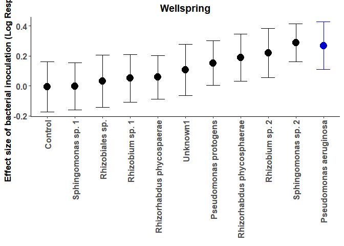<!-- -->

```r
# OK, let's look at bacteria.

# We need to generate some log rrs here too.
# We can add this to the logC dataframe

#Generate summary statistics.
melt_Wabs<-melt(dfW, id.vars=c("pop", "bac"), measure.vars= "logabs", na.rm = T)
Sum_Wabs<- ddply(melt_Wabs, c("bac","variable"), summarise,
      mean = mean(value), sd = sd(value), count=n(),
      sem = sd(value)/sqrt(length(value)))

for (i in 1:11){
  logW[i,6]<-log(Sum_Wabs[i+1,3]/Sum_Wabs[1,3])
  logW[i,7]<-Sum_Wabs[i+1,4]^2/(Sum_Wabs[i+1,5]*Sum_Wabs[i+1,3]^2) + Sum_Wabs[1,4]^2/(Sum_Wabs[1,5]*Sum_Wabs[1,3]^2)
}

names(logW)<-c('pop','bac','LRR','var','SE','absLRR','absvar')
logW$absSE<-sqrt(logW$absvar)

melt_W_abs<-melt(dfW, id.vars=c("bac","plt"), measure.vars= "logabs", na.rm = T)
Sum_W_abs<- ddply(melt_W_abs, c("bac","plt","variable"), summarise,
                mean = mean(value), sd = sd(value),
                sem = sd(value)/sqrt(length(value)))

absW <- ggplot(Sum_W_abs,aes(y=mean,x=bac,colour=bac,shape=plt))+geom_errorbar(aes(ymin=mean-sem,ymax=mean+sem),width=0.5, position=position_dodge(width=0.4)) +geom_point(position=position_dodge(width=0.4), size=4.5)
absW <- absW + theme_classic() + ggtitle("Wellspring") + theme(plot.title = element_text(size=14, face='bold', hjust = 0.5))
absW <- absW + scale_colour_manual(values=c("red3","#000000","#000000","#000000","#000000","#000000","#000000","#000000","#000000","#000000","#000000","blue3"))
absW <- absW + theme(legend.title=element_blank())
absW <- absW + guides(colour=FALSE)
```

```
## Warning: `guides(<scale> = FALSE)` is deprecated. Please use `guides(<scale> =
## "none")` instead.
```

```r
absW <- absW + scale_shape_discrete(name = "Treatment", labels = c("Bacteria only", "Plants & Bacteria"))
absW <- absW + theme(legend.position = c(0.7,0.9))
absW <- absW + labs(x= element_blank()) 
absW <- absW + labs(y= "Logged bacterial cell density (cells/µL)")
absW <- absW + theme(axis.text.x = element_text(angle = 90, hjust=1,vjust=0.5))
absW <- absW + ylim(3,9.5)
absW <- absW+ theme(axis.text = element_text(face="bold", size=12))
absW <- absW + theme(axis.title = element_text(face="bold", size=13))
absW
```

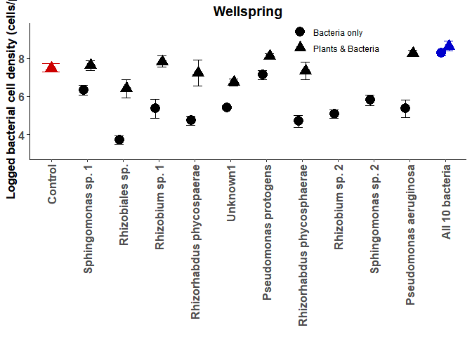<!-- -->

```r
#Let's collapse this to LogRR's? This plot would show the importance of plant presence to each bacteria

LRR_absW <- ggplot(logW,aes(y=absLRR,x=bac,colour=bac))+geom_errorbar(aes(ymin=absLRR-absSE,ymax=absLRR+absSE),width=0.5, position=position_dodge(width=0.4)) +geom_point(position=position_dodge(width=0.4), size=4.5)
LRR_absW <- LRR_absW + theme_classic() + ggtitle("Wellspring") + theme(plot.title = element_text(size=14, face='bold', hjust = 0.5))
LRR_absW <- LRR_absW + scale_colour_manual(values=c("#000000","#000000","#000000","#000000","#000000","#000000","#000000","#000000","#000000","#000000","blue3"))
LRR_absW <- LRR_absW + theme(legend.title=element_blank())
LRR_absW <- LRR_absW + guides(colour=FALSE)
```

```
## Warning: `guides(<scale> = FALSE)` is deprecated. Please use `guides(<scale> =
## "none")` instead.
```

```r
LRR_absW <- LRR_absW + theme(legend.title=element_blank())
LRR_absW <- LRR_absW + theme(legend.position = c(0.7,0.9))
LRR_absW <- LRR_absW + labs(x= element_blank()) 
LRR_absW <- LRR_absW + labs(y= "Effect size of plant presence (Log Response Ratio)")
LRR_absW <- LRR_absW + theme(axis.text.x = element_text(angle = 90, hjust=1,vjust=0.5))
#LRR_absW <- LRR_absW + ylim(3,9.5)
LRR_absW <- LRR_absW + theme(axis.text = element_text(face="bold", size=12))
LRR_absW <- LRR_absW + theme(axis.title = element_text(face="bold", size=13))
LRR_absW
```

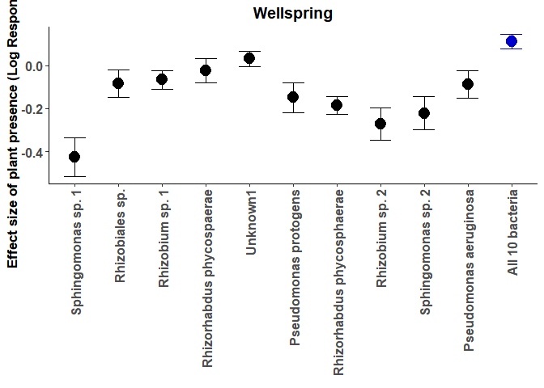<!-- -->

```r
# Then we can look at fitness regressions?
# Let's start by just graphing bacterial cell count against the growth rate of plants. This will ask the question "are the fitness estimates of bacteria and plants aligned? Are they broadly mutualistic?"

# Let's plot the raw regression first?
#Let's try plotting that with the full dataset, not the summary stats
regW <- ggplot(dfW,aes(y=logabs,x=Grt))+ geom_point()
regW <- regW + theme_classic() + ggtitle("Wellspring") + theme(plot.title = element_text(size=14, face='bold', hjust = 0.5))
regW <- regW + stat_smooth(method='lm',fullrange=F, se=T, size=2)
regW <- regW + labs(x= "Duckweed growth (change in pixel count)") 
regW <- regW + labs(y= "Logged bacterial cell density (cells/µL)")
regW <- regW + theme(axis.text = element_text(face="bold", size=12))
regW <- regW + theme(axis.title = element_text(face="bold", size=13))
regW
```

```
## `geom_smooth()` using formula 'y ~ x'
```

```
## Warning: Removed 345 rows containing non-finite values (stat_smooth).
```

```
## Warning: Removed 345 rows containing missing values (geom_point).
```

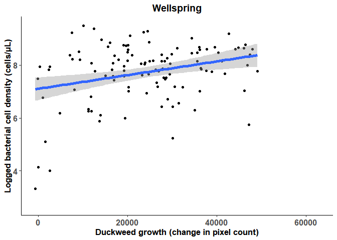<!-- -->

```r
# Let's plot the summary statistics. 

SumW$mean.abs<- Sum_Wabs$mean
SumW$se.abs<- Sum_Wabs$sem
  
regW2 <- ggplot(SumW,aes(x=mean,y=mean.abs,colour=bac))+geom_errorbar(aes(xmin=mean-sem,xmax=mean+sem)) +geom_point(size=4.5)
regW2 <- regW2 + geom_errorbar(aes(ymin=mean.abs-se.abs,ymax=mean.abs+se.abs))
regW2 <- regW2 + theme_classic() + ggtitle("Wellspring") + theme(plot.title = element_text(size=14, face='bold', hjust = 0.5))
regW2 <- regW2 + scale_colour_manual(values=c("red3","#000000","#000000","#000000","#000000","#000000","#000000","#000000","#000000","#000000","#000000","blue3"))
regW2 <- regW2 + theme(legend.title=element_blank())
regW2 <- regW2 + theme(legend.position = "none")
regW2 <- regW2 + labs(x= "Duckweed growth (change in pixel count)") 
regW2 <- regW2 + labs(y= "Logged bacterial cell density (cells/µL)")
regW2 <- regW2 + theme(axis.text = element_text(face="bold", size=12))
regW2 <- regW2 + theme(axis.title = element_text(face="bold", size=13))
regW2
```

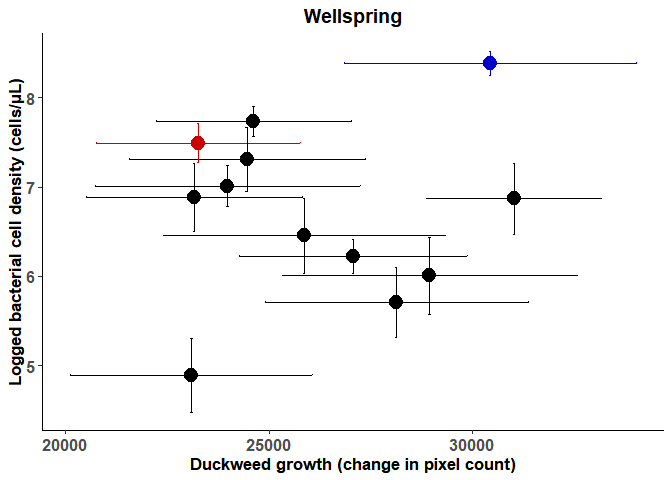<!-- -->

```r
# Let's try the LogRR's
regWlRR <- ggplot(logW,aes(y=absLRR,x=LRR))+ geom_point()
regWlRR <- regWlRR + geom_errorbar(aes(ymin=absLRR-absSE,ymax=absLRR+absSE))
regWlRR <- regWlRR + geom_errorbar(aes(xmin=LRR-SE, xmax=LRR+SE))
regWlRR <- regWlRR + theme_classic() + ggtitle("Wellspring") + theme(plot.title = element_text(size=14, face='bold', hjust = 0.5))
regWlRR <- regWlRR + labs(x= "Effect size of bacterial inoculation (Log Response Ratio)") 
regWlRR <- regWlRR + labs(y= "Effect size of plant presence (Log Response Ratio)")
regWlRR <- regWlRR + theme(axis.text = element_text(face="bold", size=12))
regWlRR <- regWlRR + theme(axis.title = element_text(face="bold", size=13))
regWlRR
```

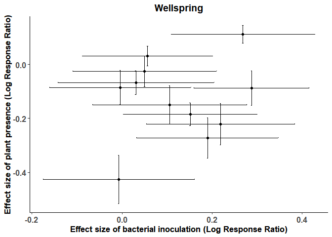<!-- -->

```r
# OK let's now regress the LogRRs

# Finally, let's plot fitness alignment (or estimate?) for each bacteria separately, and look at this?
# How about emtrends~ LogRR's (effects on plants)? Are more beneficial bacterial also more closely aligned?

# Let's ask that by plotting raw data for each bacteria

regW.bac <- ggplot(dfW,aes(y=logabs,x=Grt))+ geom_point()
regW.bac <- regW.bac + facet_wrap(~ bac)
regW.bac <- regW.bac + theme_classic() + ggtitle("Wellspring") + theme(plot.title = element_text(size=14, face='bold', hjust = 0.5))
regW.bac <- regW.bac + stat_smooth(method='lm',fullrange=F, se=T, size=2)
regW.bac <- regW.bac + labs(x= "Duckweed growth (change in pixel count)") 
regW.bac <- regW.bac + labs(y= "Logged bacterial cell density (cells/µL)")
regW.bac <- regW.bac + theme(axis.text = element_text(face="bold", size=12))
regW.bac <- regW.bac + theme(axis.title = element_text(face="bold", size=13))
regW.bac
```

```
## `geom_smooth()` using formula 'y ~ x'
```

```
## Warning: Removed 345 rows containing non-finite values (stat_smooth).
## Removed 345 rows containing missing values (geom_point).
```

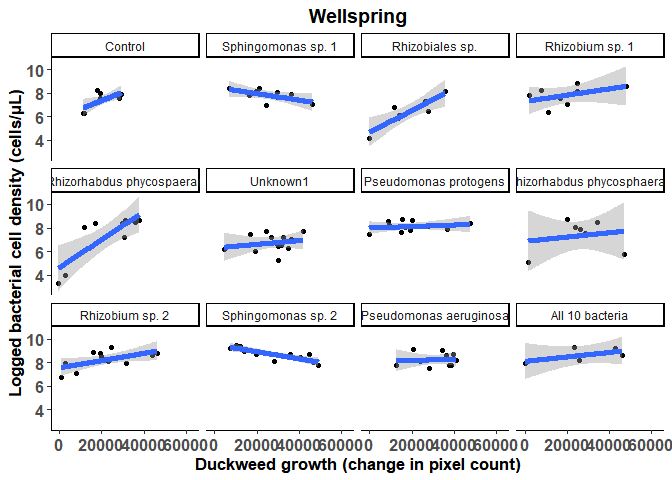<!-- -->

```r
bac.emtW <- emtrends(regW3, "bac", var = "logabs")
bac.emtW<-as.data.frame(bac.emtW)
bac.emtW
```

```
##  bac                        logabs.trend   SE df lower.CL upper.CL
##  Control                            6274 5194 89    -4046    16593
##  Sphingomonas sp. 1               -12836 7184 89   -27110     1438
##  Rhizobiales sp.                    9432 3491 89     2496    16368
##  Rhizobium sp. 1                    7550 4827 89    -2041    17140
##  Rhizorhabdus phycospaerae          5875 1817 89     2266     9485
##  Unknown1                           3971 4352 89    -4677    12620
##  Pseudomonas protogens              8693 8346 89    -7891    25277
##  Rhizorhabdus phycosphaerae         2085 3127 89    -4127     8298
##  Rhizobium sp. 2                   13208 4451 89     4364    22051
##  Sphingomonas sp. 2               -21949 6066 89   -34003    -9896
##  Pseudomonas aeruginosa             1038 6174 89   -11229    13305
##  All 10 bacteria                   18508 9080 89      465    36550
## 
## Results are averaged over the levels of: edge 
## Confidence level used: 0.95
```

```r
# Pairwise comparisons
pairs(bac.emtW)
```

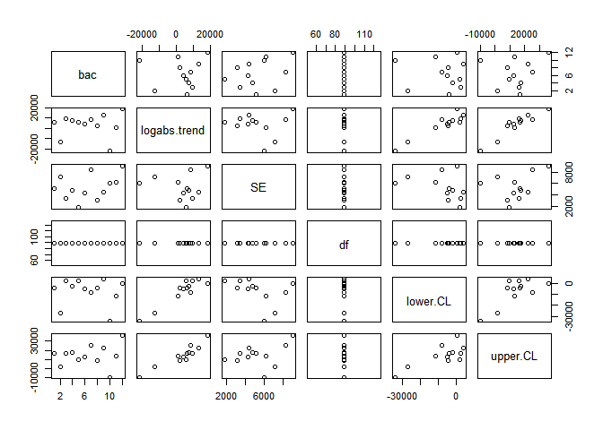<!-- -->

```r
#Let's add these estimates to our SumW
SumW$reg.mean<-bac.emtW$logabs.trend
SumW$reg.SE<-bac.emtW$SE

#Let's also add this information to logW
bac.trend<-bac.emtW$logabs[2:12]
SE.trend<-bac.emtW$SE[2:12]

logW$reg.mean<-bac.trend
logW$reg.SE<-SE.trend

logemtW <- ggplot(logW,aes(y=reg.mean,x=LRR))+ geom_point()
logemtW <- logemtW + geom_errorbar(aes(ymin=reg.mean-reg.SE,ymax=reg.mean+reg.SE))
logemtW <- logemtW + geom_errorbar(aes(xmin=LRR-SE, xmax=LRR+SE))
logemtW <- logemtW + theme_classic() + ggtitle("Wellspring") + theme(plot.title = element_text(size=14, face='bold', hjust = 0.5))
logemtW <- logemtW + labs(x= "Effect size of bacterial inoculation (Log Response Ratio)") 
logemtW <- logemtW + labs(y= "Fitness regression")
logemtW <- logemtW + theme(axis.text = element_text(face="bold", size=12))
logemtW <- logemtW + theme(axis.title = element_text(face="bold", size=13))
logemtW
```

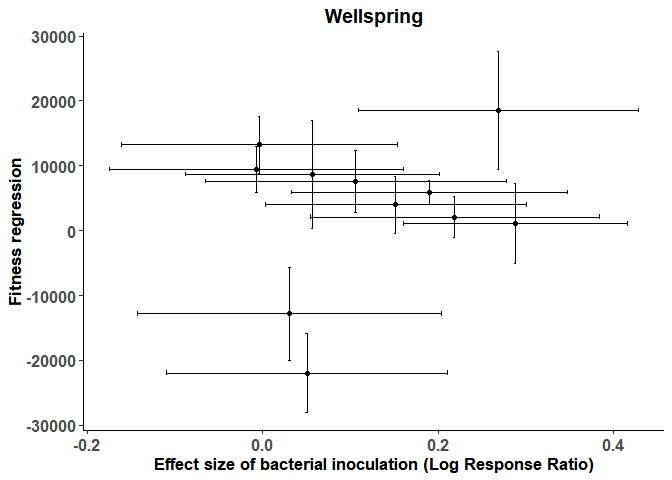<!-- -->
