Alright, let's look at the results of an earlier experiment. 3 populations, no bacterial fitness data, 10 bacteria and a complete mix treatment. 

SECTION 1: Upload packages


```r
library(ggplot2) # we need this for plotting
library(reshape2) # melting and stuff
library(plyr) # manipulating data frames
library(dplyr)
library(car) # type 3 anovas
library(cowplot) # make plot grids
library(grid)
library(gridExtra) # adjust and manipulate combined plots. 
```

SECTION 2: Upload data for the latest round of experiments


```r
setwd("C:/Users/jason/Dropbox/My PC (DESKTOP-IOO274E)/Desktop/Data/Lemna_singleinoculations/Lemna_single_inoculations")

df<-read.table('July2019CKW.txt', header=F, na.strings="", sep="\t")
names(df)<-c('pop','bac','id','frd0','pix0','per0','grn0','grnper0','frd1','pix1','per1','grn1','grnper1','notes','algae_lvl')
str(df)
```

```
## 'data.frame':	360 obs. of  15 variables:
##  $ pop      : chr  "Wellspring " "Wellspring " "Kelso" "Wellspring " ...
##  $ bac      : chr  "5" "4" "6" "All" ...
##  $ id       : int  1 2 3 4 5 6 7 8 9 10 ...
##  $ frd0     : int  2 2 2 1 2 1 2 2 2 1 ...
##  $ pix0     : int  1124 1422 923 976 1180 583 808 1097 971 650 ...
##  $ per0     : num  583 470 602 461 610 ...
##  $ grn0     : int  1052 1333 768 838 1002 459 685 1021 805 368 ...
##  $ grnper0  : num  456 758 509 450 541 ...
##  $ frd1     : int  1 2 1 5 2 2 1 4 1 1 ...
##  $ pix1     : int  685 4515 3670 8940 2120 1300 1888 8492 3243 1407 ...
##  $ per1     : num  156 314 423 530 252 ...
##  $ grn1     : int  660 3109 735 7203 1420 797 1053 4376 2666 526 ...
##  $ grnper1  : num  196 337 510 621 523 ...
##  $ notes    : chr  "Covered in algal film" "Algal dots" "Green tint" "Algal dots" ...
##  $ algae_lvl: chr  "High" "High" "Low" "High" ...
```

```r
#Fix the structure
df$pop<-as.factor(df$pop)
df$bac<-as.factor(df$bac)

# Add in edge (15 plates)
edge<-c(rep("Y",5), rep("N",2), rep("Y",2),rep("N",2), rep("Y",2), rep("N",2), rep("Y",2),rep("N",2), rep("Y",5))

edge2<-rep(edge,15)
df$edge<-edge2

df$edge <- as.factor(df$edge)

df$algae_lvl<-as.factor(df$algae_lvl)

#Let's generate some summary statistics. Things like greenness (health), growth (fitness), and aggregation.

df$Grt<-df$pix1 - df$pix0
df$Agg<-df$pix1/df$per1
df$Hlth<-df$grn1/df$pix1

#Check normality
ggplot(data=df, aes(x = Grt)) + geom_histogram(fill = "white", colour = "black")
```

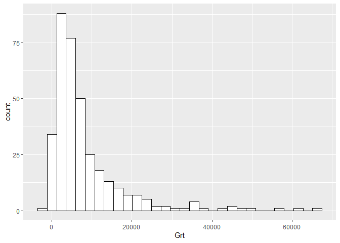<!-- -->

```r
# Looks pretty good

ggplot(data=df, aes(x = Agg)) + geom_histogram(fill = "white", colour = "black")
```

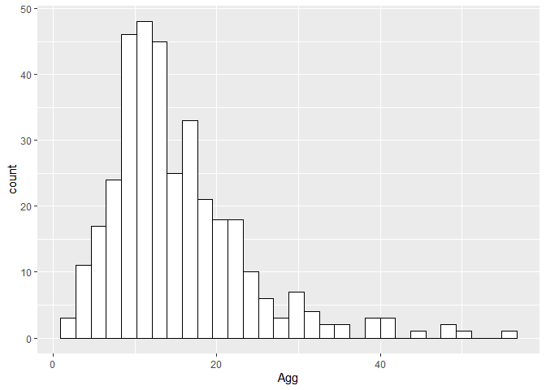<!-- -->

```r
# Looks pretty good

ggplot(data=df, aes(x = Hlth)) + geom_histogram(fill = "white", colour = "black")
```

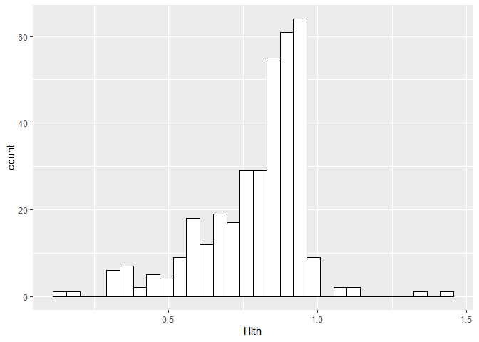<!-- -->

```r
# Looks pretty good

#OK, let's calculate LogRR's. That way we can compare to previous and subsequent experiments. 

#Generate summary statistics.
melt_LRR<-melt(df, id.vars=c("pop", "bac"), measure.vars= "Grt", na.rm = T)
Sum_LRR<- ddply(melt_LRR, c("pop", "bac","variable"), summarise,
      mean = mean(value), sd = sd(value), count=n(),
      sem = sd(value)/sqrt(length(value)))

LRR_grt<-data.frame(matrix(ncol=5, nrow=3*11))
names(LRR_grt)<-c('pop','bac','LRR','var','SE')

LRR_grt$pop<-c(rep('C', 11), rep('K',11), rep('W', 11))
LRR_grt$bac<-rep(c("1", "10", "2", "3", "4", "5","6","7","8","9","All"), 3)

#Reference for calculating LRR's: Hedges, L. V., Gurevitch, J., & Curtis, P. S. (1999). The meta-analysis of response ratios in experimental ecology. Ecology, 80(4), 1150-1156. Equation 1

for (i in 1:11){
  LRR_grt[i,3]<-log(Sum_LRR[i+1,4]/Sum_LRR[1,4])
  LRR_grt[i,4]<-Sum_LRR[i+1,5]^2/(Sum_LRR[i+1,6]*Sum_LRR[i+1,4]^2) + Sum_LRR[1,5]^2/(Sum_LRR[1,6]*Sum_LRR[1,4]^2)
}

for (i in 12:22){
  LRR_grt[i,3]<-log(Sum_LRR[i+2,4]/Sum_LRR[13,4])
  LRR_grt[i,4]<-Sum_LRR[i+2,5]^2/(Sum_LRR[i+2,6]*Sum_LRR[i+2,4]^2) + Sum_LRR[13,5]^2/(Sum_LRR[13,6]*Sum_LRR[13,4]^2)
}

for (i in 23:33){
  LRR_grt[i,3]<-log(Sum_LRR[i+3,4]/Sum_LRR[25,4])
  LRR_grt[i,4]<-Sum_LRR[i+3,5]^2/(Sum_LRR[i+3,6]*Sum_LRR[i+3,4]^2) + Sum_LRR[25,5]^2/(Sum_LRR[25,6]*Sum_LRR[25,4]^2)
}

LRR_grt$SE<-sqrt(LRR_grt$var)

#Let's create separate dataframes for each population
dfC<-subset(df, df$pop== "Churchill")
dfK<-subset(df, df$pop== "Kelso")
dfW<-subset(df, df$pop== "Wellspring ")

# Change factor order of bacteria to reflect their effects on duckweed growth.
#First, let's change the order of bacteria, ranked by effect. 
dfC$bac<- factor(dfC$bac, levels = c("0","7","8","5","6","10","4","9","2","1","3","All"))
# Assign names from sequencing
levels(dfC$bac) <- c("Control","Aeromonas sp. 1","Microbacterium sp.","Aeromonas sp. 2","Sediminibacterium sp.","Flavibacterium succinicans 1","Roseomonas sp.","Flavibacterium succinicans 2","Flectobacillus speluncae","Pseudomonas protogens","Cytophagaceae sp.","All 10 bacteria")

dfK$bac<- factor(dfK$bac, levels = c("0","8","6","7","3","9","2","5","1","4","10","All"))
levels(dfK$bac) <- c("Control","Pseudomonas fluorescens 1","Unknown1","Pseudomonas sp.","Unknown2","Pseudomonas intermedius","Flavobacterium sp. 1","Rhizobium sp.","Flavobacterium chilense","Pseudomonas fluorescens 2","Flavobacterium sp. 2","All 10 bacteria")

dfW$bac<- factor(dfW$bac, levels = c("0","8","5","3","2","4","6","9","7","1","10","All"))
levels(dfW$bac) <- c("Control","Agrobacterium sp.","Rhizobium sp. 1","Rhizobium rosettiformes","Rhizobium helianthi","Rhizobium sp. 2","Phenylobacterium panacis","Rhizobium sp. 3","Sphingomonas sp.","Rhizobium sp. 4","Sphingomonas wittichii","All 10 bacteria")

logC<-subset(LRR_grt, LRR_grt$pop== "C")
logC$bac<- as.factor(logC$bac)
logC$bac<- factor(logC$bac, levels = c("7","8","5","6","10","4","9","2","1","3","All"))
levels(logC$bac) <- c("Aeromonas sp. 1","Microbacterium sp.","Aeromonas sp. 2","Sediminibacterium sp.","Flavibacterium succinicans 1","Roseomonas sp.","Flavibacterium succinicans 2","Flectobacillus speluncae","Pseudomonas protogens","Cytophagaceae sp.","All 10 bacteria")

logK<-subset(LRR_grt, LRR_grt$pop== "K")
logK$bac<- as.factor(logK$bac)
logK$bac<- factor(logK$bac, levels = c("8","6","7","3","9","2","5","1","4","10","All"))
levels(logK$bac) <- c("Pseudomonas fluorescens 1","Unknown1","Pseudomonas sp.","Unknown2","Pseudomonas intermedius","Flavobacterium sp. 1","Rhizobium sp.","Flavobacterium chilense","Pseudomonas fluorescens 2","Flavobacterium sp. 2","All 10 bacteria")


logW<-subset(LRR_grt, LRR_grt$pop== "W")
logW$bac<- as.factor(logW$bac)
logW$bac<- factor(logW$bac, levels = c("8","5","3","2","4","6","9","7","1","10","All"))
levels(logW$bac) <- c("Agrobacterium sp.","Rhizobium sp. 1","Rhizobium rosettiformes","Rhizobium helianthi","Rhizobium sp. 2","Phenylobacterium panacis","Rhizobium sp. 3","Sphingomonas sp.","Rhizobium sp. 4","Sphingomonas wittichii","All 10 bacteria")
```

SECTION 3: Churchill: Plots & Modelling.


```r
#How does bacterial inoculation affect growth? Let's add algal level too. 
modC_Grt<-lm(Grt~bac+edge+algae_lvl,data=dfC)
Anova(modC_Grt,type=3)
```

```
## Anova Table (Type III tests)
## 
## Response: Grt
##                 Sum Sq  Df F value    Pr(>F)    
## (Intercept)  119791656   1  6.0423 0.0156030 *  
## bac          122232850  11  0.5605 0.8565823    
## edge         245519812   1 12.3840 0.0006415 ***
## algae_lvl      2865985   1  0.1446 0.7045566    
## Residuals   2081676561 105                      
## ---
## Signif. codes:  0 '***' 0.001 '**' 0.01 '*' 0.05 '.' 0.1 ' ' 1
```

```r
summary(modC_Grt)
```

```
## 
## Call:
## lm(formula = Grt ~ bac + edge + algae_lvl, data = dfC)
## 
## Residuals:
##     Min      1Q  Median      3Q     Max 
## -7917.5 -2758.8  -448.6  2778.3 13658.5 
## 
## Coefficients:
##                                 Estimate Std. Error t value Pr(>|t|)    
## (Intercept)                       4655.5     1893.9   2.458 0.015603 *  
## bacAeromonas sp. 1                -239.4     2009.2  -0.119 0.905374    
## bacMicrobacterium sp.             -105.3     1995.7  -0.053 0.958034    
## bacAeromonas sp. 2                -584.1     1995.7  -0.293 0.770326    
## bacSediminibacterium sp.           474.5     1995.7   0.238 0.812511    
## bacFlavibacterium succinicans 1   1208.2     1993.3   0.606 0.545720    
## bacRoseomonas sp.                 1523.1     1995.7   0.763 0.447039    
## bacFlavibacterium succinicans 2   1347.1     2050.7   0.657 0.512688    
## bacFlectobacillus speluncae       1755.8     1994.9   0.880 0.380790    
## bacPseudomonas protogens          2398.8     1998.2   1.201 0.232643    
## bacCytophagaceae sp.              2467.8     1995.7   1.237 0.218992    
## bacAll 10 bacteria                1803.2     2005.8   0.899 0.370715    
## edgeY                             3144.3      893.5   3.519 0.000642 ***
## algae_lvlNone                      458.9     1206.9   0.380 0.704557    
## ---
## Signif. codes:  0 '***' 0.001 '**' 0.01 '*' 0.05 '.' 0.1 ' ' 1
## 
## Residual standard error: 4453 on 105 degrees of freedom
##   (1 observation deleted due to missingness)
## Multiple R-squared:  0.1579,	Adjusted R-squared:  0.0536 
## F-statistic: 1.514 on 13 and 105 DF,  p-value: 0.1243
```

```r
#edge, but not bacteria is significant here.

#What about initial and final pixel count variation?
modC_pix<-lm(pix1~bac+pix0+edge+algae_lvl,data=dfC)
Anova(modC_pix, type=3)
```

```
## Anova Table (Type III tests)
## 
## Response: pix1
##                 Sum Sq  Df F value    Pr(>F)    
## (Intercept)   32911141   1  1.8021  0.182381    
## bac          134690979  11  0.6705  0.763361    
## pix0         960327715   1 52.5843 7.592e-11 ***
## edge         168075304   1  9.2032  0.003051 ** 
## algae_lvl      2690813   1  0.1473  0.701874    
## Residuals   1899312402 104                      
## ---
## Signif. codes:  0 '***' 0.001 '**' 0.01 '*' 0.05 '.' 0.1 ' ' 1
```

```r
summary(modC_pix)
```

```
## 
## Call:
## lm(formula = pix1 ~ bac + pix0 + edge + algae_lvl, data = dfC)
## 
## Residuals:
##     Min      1Q  Median      3Q     Max 
## -8746.3 -2454.3  -488.9  1910.4 12937.3 
## 
## Coefficients:
##                                  Estimate Std. Error t value Pr(>|t|)    
## (Intercept)                     2592.7707  1931.4086   1.342  0.18238    
## bacAeromonas sp. 1                36.7416  1930.3745   0.019  0.98485    
## bacMicrobacterium sp.             84.0626  1916.3151   0.044  0.96509    
## bacAeromonas sp. 2               220.9964  1932.2502   0.114  0.90916    
## bacSediminibacterium sp.         221.8551  1917.0466   0.116  0.90809    
## bacFlavibacterium succinicans 1 1390.4121  1913.9492   0.726  0.46919    
## bacRoseomonas sp.                979.9797  1923.0752   0.510  0.61142    
## bacFlavibacterium succinicans 2 1551.0577  1969.2273   0.788  0.43269    
## bacFlectobacillus speluncae     1903.4383  1915.2349   0.994  0.32261    
## bacPseudomonas protogens        2907.8966  1924.5447   1.511  0.13383    
## bacCytophagaceae sp.            3135.7788  1927.0061   1.627  0.10670    
## bacAll 10 bacteria              1735.0928  1925.2696   0.901  0.36955    
## pix0                               1.7723     0.2444   7.252 7.59e-11 ***
## edgeY                           2645.2531   871.9605   3.034  0.00305 ** 
## algae_lvlNone                    444.6478  1158.3931   0.384  0.70187    
## ---
## Signif. codes:  0 '***' 0.001 '**' 0.01 '*' 0.05 '.' 0.1 ' ' 1
## 
## Residual standard error: 4273 on 104 degrees of freedom
##   (1 observation deleted due to missingness)
## Multiple R-squared:  0.4407,	Adjusted R-squared:  0.3655 
## F-statistic: 5.854 on 14 and 104 DF,  p-value: 2.591e-08
```

```r
#Still just edge and pix0

#So there is really not that much going on in Churchill... let's plot!

SumC<-subset(Sum_LRR,Sum_LRR$pop=="Churchill")

#Let's change the order of bacteria, ranked by effect. 
SumC$bac<- factor(SumC$bac, levels = c("0","7","8","5","6","10","4","9","2","1","3","All"))
levels(SumC$bac) <- c("Control","Aeromonas sp. 1","Microbacterium sp.","Aeromonas sp. 2","Sediminibacterium sp.","Flavibacterium succinicans 1","Roseomonas sp.","Flavibacterium succinicans 2","Flectobacillus speluncae","Pseudomonas protogens","Cytophagaceae sp.","All 10 bacteria")


dwC <- ggplot(SumC,aes(y=mean,x=bac,colour=bac))+geom_errorbar(aes(ymin=mean-sem,ymax=mean+sem),width=0.5)+geom_point(size=4.5)
dwC <- dwC + theme_classic() + ggtitle("Churchill") + theme(plot.title = element_text(size=14, face='bold', hjust = 0.5))
dwC <- dwC + scale_colour_manual(values=c("red3","#000000","#000000","#000000","#000000","#000000","#000000","#000000","#000000","#000000","#000000","blue3"))
dwC <- dwC + theme(legend.title=element_blank())
dwC <- dwC + theme(legend.position = "none")
dwC <- dwC + labs(x= element_blank()) 
dwC <- dwC + labs(y= "Duckweed growth (change in pixel count)")
dwC <- dwC + geom_hline(yintercept=7223.6, linetype="dashed", color = "red3",size=1)
dwC <- dwC + theme(axis.text.x = element_text(angle = 90, hjust=1,vjust=0.5))
#dwC <- dwC + ylim(12000,40000)
#dwC <- dwC + theme(axis.text = element_text(face="bold", size=12))
dwC <- dwC + theme(axis.title = element_text(face="bold", size=12))
dwC
```

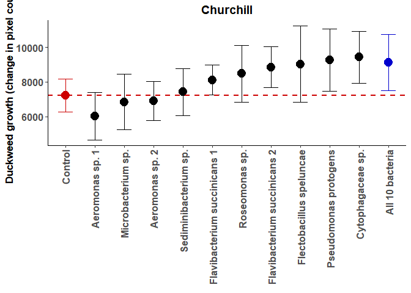<!-- -->

```r
#Let's add a line predicting additive effects. 
base_grtC<-SumC[1,4]
SumC$bac_eff<-(SumC$mean - base_grtC)/10
add_predC<-sum(SumC$bac_eff[2:12]) +base_grtC

dwC <- dwC + geom_hline(yintercept=add_predC, linetype="dashed", color = "blue3",size=1)
dwC
```

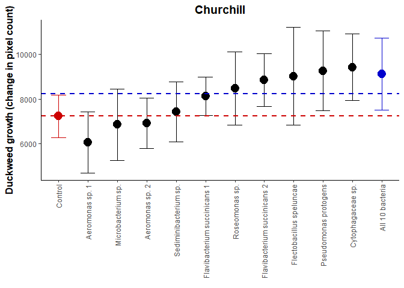<!-- -->

```r
#LogRRs

logC_plt <- ggplot(logC,aes(y=LRR,x=bac,colour=bac))+geom_errorbar(aes(ymin=LRR-SE,ymax=LRR+SE),width=0.5)+geom_point(size=4.5)
logC_plt <- logC_plt + theme_classic() + ggtitle("Churchill") + theme(plot.title = element_text(size=14, face='bold', hjust = 0.5))
logC_plt <- logC_plt + scale_colour_manual(values=c("#000000","#000000","#000000","#000000","#000000","#000000","#000000","#000000","#000000","#000000","blue3"))
logC_plt <- logC_plt + theme(legend.title=element_blank())
logC_plt <- logC_plt + theme(legend.position = "none")
logC_plt <- logC_plt + labs(x= element_blank()) 
logC_plt <- logC_plt + labs(y= "Effect size of bacterial inoculation (Log Response Ratio)")
logC_plt <- logC_plt + theme(axis.text.x = element_text(angle = 90, hjust=1,vjust=0.5))
#dwC <- dwC + ylim(12000,40000)
#logC_plt <- logC_plt + theme(axis.text = element_text(face="bold", size=12))
logC_plt <- logC_plt + theme(axis.title = element_text(face="bold", size=12))
logC_plt <- logC_plt + geom_hline(yintercept=0, linetype="dashed", color = "red3",size=1)
logC_plt <- logC_plt + ylim(-2.5,1.2)
logC_plt
```

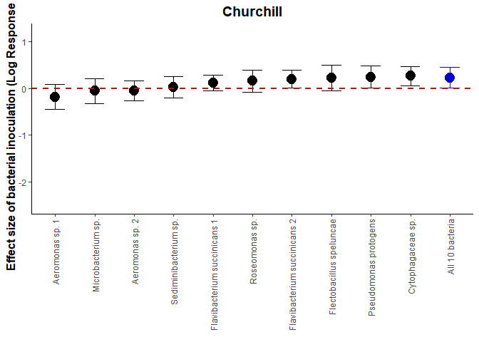<!-- -->

SECTION 4: Kelso: Plots & Modelling.


```r
#How does bacterial inoculation affect growth? Let's add algal level too. 
modK_Grt<-lm(Grt~bac+edge+algae_lvl,data=dfK)
Anova(modK_Grt,type=3)
```

```
## Anova Table (Type III tests)
## 
## Response: Grt
##                 Sum Sq  Df F value    Pr(>F)    
## (Intercept) 6.7403e+07   1  0.4384 0.5093552    
## bac         4.0857e+09  11  2.4159 0.0102194 *  
## edge        9.1119e+08   1  5.9267 0.0166164 *  
## algae_lvl   2.5207e+09   2  8.1977 0.0004943 ***
## Residuals   1.5989e+10 104                      
## ---
## Signif. codes:  0 '***' 0.001 '**' 0.01 '*' 0.05 '.' 0.1 ' ' 1
```

```r
summary(modK_Grt)
```

```
## 
## Call:
## lm(formula = Grt ~ bac + edge + algae_lvl, data = dfK)
## 
## Residuals:
##    Min     1Q Median     3Q    Max 
## -19564  -7905  -2438   4731  40317 
## 
## Coefficients:
##                              Estimate Std. Error t value Pr(>|t|)   
## (Intercept)                      3327       5025   0.662  0.50936   
## bacPseudomonas fluorescens 1   -10900       5565  -1.959  0.05281 . 
## bacUnknown1                     -9845       5860  -1.680  0.09594 . 
## bacPseudomonas sp.              -8237       5662  -1.455  0.14874   
## bacUnknown2                     -2348       5618  -0.418  0.67683   
## bacPseudomonas intermedius      -4152       5649  -0.735  0.46403   
## bacFlavobacterium sp. 1          3676       5562   0.661  0.51011   
## bacRhizobium sp.                 1139       5664   0.201  0.84099   
## bacFlavobacterium chilense       5926       5664   1.046  0.29781   
## bacPseudomonas fluorescens 2     5556       5616   0.989  0.32478   
## bacFlavobacterium sp. 2          5866       5727   1.024  0.30803   
## bacAll 10 bacteria              -5623       5586  -1.007  0.31647   
## edgeY                            6614       2717   2.434  0.01662 * 
## algae_lvlMed                    -3762       4680  -0.804  0.42334   
## algae_lvlNone                    9186       3335   2.754  0.00694 **
## ---
## Signif. codes:  0 '***' 0.001 '**' 0.01 '*' 0.05 '.' 0.1 ' ' 1
## 
## Residual standard error: 12400 on 104 degrees of freedom
##   (1 observation deleted due to missingness)
## Multiple R-squared:  0.3519,	Adjusted R-squared:  0.2647 
## F-statistic: 4.034 on 14 and 104 DF,  p-value: 1.54e-05
```

```r
#edge, algae, and bacteria are all significant here. 

#What about initial and final pixel count variation?
modK_pix<-lm(pix1~bac+pix0+edge+algae_lvl,data=dfK)
Anova(modK_pix, type=3)
```

```
## Anova Table (Type III tests)
## 
## Response: pix1
##                 Sum Sq  Df  F value    Pr(>F)    
## (Intercept) 2.2528e+08   1   2.5583 0.1127796    
## bac         3.6122e+09  11   3.7291 0.0001706 ***
## pix0        1.3579e+10   1 154.2028 < 2.2e-16 ***
## edge        1.1129e+09   1  12.6379 0.0005724 ***
## algae_lvl   1.0513e+09   2   5.9696 0.0035239 ** 
## Residuals   9.0701e+09 103                       
## ---
## Signif. codes:  0 '***' 0.001 '**' 0.01 '*' 0.05 '.' 0.1 ' ' 1
```

```r
summary(modK_pix)
```

```
## 
## Call:
## lm(formula = pix1 ~ bac + pix0 + edge + algae_lvl, data = dfK)
## 
## Residuals:
##      Min       1Q   Median       3Q      Max 
## -16986.8  -5632.4   -599.4   4791.0  28431.5 
## 
## Coefficients:
##                                Estimate Std. Error t value Pr(>|t|)    
## (Intercept)                  -6327.6015  3956.0652  -1.599 0.112780    
## bacPseudomonas fluorescens 1 -8950.1736  4217.2995  -2.122 0.036214 *  
## bacUnknown1                  -4470.6867  4475.9194  -0.999 0.320217    
## bacPseudomonas sp.           -1750.1724  4347.0979  -0.403 0.688072    
## bacUnknown2                  -1584.2553  4252.9238  -0.373 0.710279    
## bacPseudomonas intermedius   -1671.7400  4284.3035  -0.390 0.697194    
## bacFlavobacterium sp. 1       5599.3768  4215.1315   1.328 0.186982    
## bacRhizobium sp.              2065.5645  4287.9217   0.482 0.631029    
## bacFlavobacterium chilense    6929.4440  4287.6644   1.616 0.109124    
## bacPseudomonas fluorescens 2  9026.3569  4267.8301   2.115 0.036844 *  
## bacFlavobacterium sp. 2       8344.8455  4342.9348   1.921 0.057436 .  
## bacAll 10 bacteria           -6030.4257  4227.8067  -1.426 0.156785    
## pix0                             3.4945     0.2814  12.418  < 2e-16 ***
## edgeY                         7314.3349  2057.4849   3.555 0.000572 ***
## algae_lvlMed                 -2658.2855  3543.6991  -0.750 0.454878    
## algae_lvlNone                 5960.5603  2549.9323   2.338 0.021345 *  
## ---
## Signif. codes:  0 '***' 0.001 '**' 0.01 '*' 0.05 '.' 0.1 ' ' 1
## 
## Residual standard error: 9384 on 103 degrees of freedom
##   (1 observation deleted due to missingness)
## Multiple R-squared:  0.7206,	Adjusted R-squared:  0.6799 
## F-statistic: 17.71 on 15 and 103 DF,  p-value: < 2.2e-16
```

```r
#Still bac, edge, and algae (and pix0 obviously)

#So bacterial identity matters in Kelso

SumK<-subset(Sum_LRR,Sum_LRR$pop=="Kelso")

#Let's change the order of bacteria, ranked by effect. 
SumK$bac<- factor(SumK$bac, levels = c("0","8","6","7","3","9","2","5","1","4","10","All"))
levels(SumK$bac) <- c("Control","Pseudomonas fluorescens 1","Unknown1","Pseudomonas sp.","Unknown2","Pseudomonas intermedius","Flavobacterium sp. 1","Rhizobium sp.","Flavobacterium chilense","Pseudomonas fluorescens 2","Flavobacterium sp. 2","All 10 bacteria")

dwK <- ggplot(SumK,aes(y=mean,x=bac,colour=bac))+geom_errorbar(aes(ymin=mean-sem,ymax=mean+sem),width=0.5)+geom_point(size=4.5)
dwK <- dwK + theme_classic() + ggtitle("Kelso") + theme(plot.title = element_text(size=14, face='bold', hjust = 0.5))
dwK <- dwK + scale_colour_manual(values=c("red3","#000000","#000000","#000000","#000000","#000000","#000000","#000000","#000000","#000000","#000000","blue3"))
dwK <- dwK + theme(legend.title=element_blank())
dwK <- dwK + theme(legend.position = "none")
dwK <- dwK + labs(x= element_blank()) 
dwK <- dwK + labs(y= "Duckweed growth (change in pixel count)")
dwK <- dwK + geom_hline(yintercept=12082.6, linetype="dashed", color = "red3",size=1)
dwK <- dwK + theme(axis.text.x = element_text(angle = 90, hjust=1,vjust=0.5))
#dwK <- dwK + ylim(12000,40000)
#dwK <- dwK + theme(axis.text = element_text(face="bold", size=12))
#dwK <- dwK + theme(axis.title = element_text(face="bold", size=13))
dwK
```

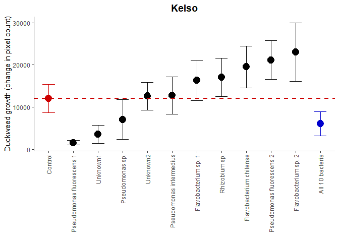<!-- -->

```r
#Let's add a line predicting additive effects. 
base_grtK<-SumK[1,4]
SumK$bac_eff<-(SumK$mean - base_grtK)/10
add_predK<-sum(SumK$bac_eff[2:12]) +base_grtK

dwK <- dwK + geom_hline(yintercept=add_predC, linetype="dashed", color = "blue3",size=1)
dwK
```

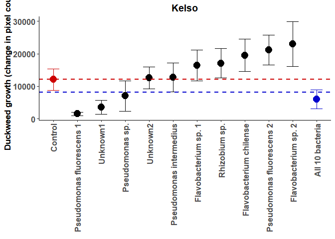<!-- -->

```r
#LogRRs

logK_plt <- ggplot(logK,aes(y=LRR,x=bac,colour=bac))+geom_errorbar(aes(ymin=LRR-SE,ymax=LRR+SE),width=0.5)+geom_point(size=4.5)
logK_plt <- logK_plt + theme_classic() + ggtitle("Kelso") + theme(plot.title = element_text(size=14, face='bold', hjust = 0.5))
logK_plt <- logK_plt + scale_colour_manual(values=c("#000000","#000000","#000000","#000000","#000000","#000000","#000000","#000000","#000000","#000000","blue3"))
logK_plt <- logK_plt + theme(legend.title=element_blank())
logK_plt <- logK_plt + theme(legend.position = "none")
logK_plt <- logK_plt + labs(x= element_blank()) 
logK_plt <- logK_plt + labs(y= "Effect size of bacterial inoculation (Log Response Ratio)")
logK_plt <- logK_plt + theme(axis.text.x = element_text(angle = 90, hjust=1,vjust=0.5))
#dwC <- dwC + ylim(12000,40000)
#logK_plt <- logK_plt + theme(axis.text = element_text(face="bold", size=12))
#logK_plt <- logK_plt + theme(axis.title = element_text(face="bold", size=13))
logK_plt <- logK_plt + geom_hline(yintercept=0, linetype="dashed", color = "red3",size=1)
logK_plt <- logK_plt + ylim(-2.5,1.2)
logK_plt
```

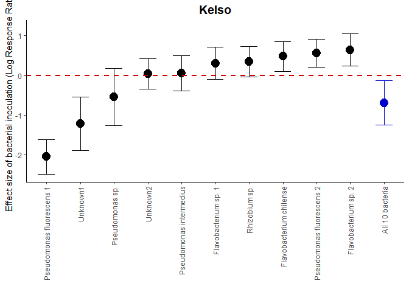<!-- -->

SECTION 5: Wellspring: Plots & Modelling.


```r
#How does bacterial inoculation affect growth? Let's add algal level too. 
modW_Grt<-lm(Grt~bac+edge+algae_lvl,data=dfW)
Anova(modW_Grt,type=3)
```

```
## Anova Table (Type III tests)
## 
## Response: Grt
##                Sum Sq  Df F value  Pr(>F)  
## (Intercept)  31074524   1  5.5103 0.02087 *
## bac         108459366  11  1.7484 0.07354 .
## edge         35965024   1  6.3775 0.01313 *
## algae_lvl     3536423   3  0.2090 0.88994  
## Residuals   563934619 100                  
## ---
## Signif. codes:  0 '***' 0.001 '**' 0.01 '*' 0.05 '.' 0.1 ' ' 1
```

```r
summary(modW_Grt)
```

```
## 
## Call:
## lm(formula = Grt ~ bac + edge + algae_lvl, data = dfW)
## 
## Residuals:
##     Min      1Q  Median      3Q     Max 
## -4674.5 -1553.9  -378.2  1348.3  8029.5 
## 
## Coefficients:
##                             Estimate Std. Error t value Pr(>|t|)  
## (Intercept)                   3670.5     1563.7   2.347   0.0209 *
## bacAgrobacterium sp.         -2649.3     1111.3  -2.384   0.0190 *
## bacRhizobium sp. 1           -1754.5     1136.7  -1.543   0.1259  
## bacRhizobium rosettiformes   -2173.8     1114.1  -1.951   0.0539 .
## bacRhizobium helianthi       -1394.8     1093.7  -1.275   0.2051  
## bacRhizobium sp. 2           -1030.2     1103.8  -0.933   0.3529  
## bacPhenylobacterium panacis   -535.1     1132.5  -0.472   0.6376  
## bacRhizobium sp. 3            -232.7     1099.0  -0.212   0.8327  
## bacSphingomonas sp.           -225.1     1107.4  -0.203   0.8394  
## bacRhizobium sp. 4            -102.0     1107.4  -0.092   0.9268  
## bacSphingomonas wittichii     1060.2     1098.2   0.965   0.3367  
## bacAll 10 bacteria            -704.6     1166.0  -0.604   0.5470  
## edgeY                         1321.6      523.3   2.525   0.0131 *
## algae_lvlLow                  -242.2     1317.8  -0.184   0.8545  
## algae_lvlMed                   156.5     1297.9   0.121   0.9043  
## algae_lvlNone                 -293.5     2750.7  -0.107   0.9152  
## ---
## Signif. codes:  0 '***' 0.001 '**' 0.01 '*' 0.05 '.' 0.1 ' ' 1
## 
## Residual standard error: 2375 on 100 degrees of freedom
##   (4 observations deleted due to missingness)
## Multiple R-squared:  0.2397,	Adjusted R-squared:  0.1257 
## F-statistic: 2.102 on 15 and 100 DF,  p-value: 0.01551
```

```r
#edge, but not bacteria is significant here. Bac 8 is significantly negative though!

#What about initial and final pixel count variation?
modW_pix<-lm(pix1~bac+pix0+edge+algae_lvl,data=dfW)
Anova(modW_pix, type=3)
```

```
## Anova Table (Type III tests)
## 
## Response: pix1
##                Sum Sq Df  F value  Pr(>F)    
## (Intercept)  19525011  1   4.2452 0.04198 *  
## bac          77766028 11   1.5371 0.13025    
## pix0        613861459  1 133.4692 < 2e-16 ***
## edge         12029311  1   2.6155 0.10901    
## algae_lvl    10309253  3   0.7472 0.52653    
## Residuals   455328222 99                     
## ---
## Signif. codes:  0 '***' 0.001 '**' 0.01 '*' 0.05 '.' 0.1 ' ' 1
```

```r
summary(modW_pix)
```

```
## 
## Call:
## lm(formula = pix1 ~ bac + pix0 + edge + algae_lvl, data = dfW)
## 
## Residuals:
##     Min      1Q  Median      3Q     Max 
## -4212.3 -1172.5  -258.5   994.2  8708.0 
## 
## Coefficients:
##                               Estimate Std. Error t value Pr(>|t|)    
## (Intercept)                  2926.5899  1420.4008   2.060    0.042 *  
## bacAgrobacterium sp.        -1513.8065  1030.4203  -1.469    0.145    
## bacRhizobium sp. 1          -1184.9354  1033.1984  -1.147    0.254    
## bacRhizobium rosettiformes  -1674.5646  1011.4040  -1.656    0.101    
## bacRhizobium helianthi       -668.3249   998.9633  -0.669    0.505    
## bacRhizobium sp. 2           -682.3706   999.3511  -0.683    0.496    
## bacPhenylobacterium panacis  -598.4238  1022.8529  -0.585    0.560    
## bacRhizobium sp. 3            -86.9970   992.9483  -0.088    0.930    
## bacSphingomonas sp.          -239.3434  1000.0981  -0.239    0.811    
## bacRhizobium sp. 4            975.4285  1024.3751   0.952    0.343    
## bacSphingomonas wittichii    1208.7159   992.2111   1.218    0.226    
## bacAll 10 bacteria           -162.7057  1058.9045  -0.154    0.878    
## pix0                            1.7260     0.1494  11.553   <2e-16 ***
## edgeY                         784.8918   485.3266   1.617    0.109    
## algae_lvlLow                -1326.0360  1210.8038  -1.095    0.276    
## algae_lvlMed                 -744.1042  1186.6696  -0.627    0.532    
## algae_lvlNone                -711.2787  2485.6472  -0.286    0.775    
## ---
## Signif. codes:  0 '***' 0.001 '**' 0.01 '*' 0.05 '.' 0.1 ' ' 1
## 
## Residual standard error: 2145 on 99 degrees of freedom
##   (4 observations deleted due to missingness)
## Multiple R-squared:  0.6732,	Adjusted R-squared:  0.6203 
## F-statistic: 12.74 on 16 and 99 DF,  p-value: < 2.2e-16
```

```r
#Just pix0

#So there is really not that much going on in Wellspring... let's plot!

SumW<-subset(Sum_LRR,Sum_LRR$pop=="Wellspring ")

#Let's change the order of bacteria, ranked by effect. 
SumW$bac<- factor(SumW$bac, levels = c("0","8","5","3","2","4","6","9","7","1","10","All"))
levels(SumW$bac) <- c("Control","Agrobacterium sp.","Rhizobium sp. 1","Rhizobium rosettiformes","Rhizobium helianthi","Rhizobium sp. 2","Phenylobacterium panacis","Rhizobium sp. 3","Sphingomonas sp.","Rhizobium sp. 4","Sphingomonas wittichii","All 10 bacteria")


dwW <- ggplot(SumW,aes(y=mean,x=bac,colour=bac))+geom_errorbar(aes(ymin=mean-sem,ymax=mean+sem),width=0.5)+geom_point(size=4.5)
dwW <- dwW + theme_classic() + ggtitle("Wellspring") + theme(plot.title = element_text(size=14, face='bold', hjust = 0.5))
dwW <- dwW + scale_colour_manual(values=c("red3","#000000","#000000","#000000","#000000","#000000","#000000","#000000","#000000","#000000","#000000","blue3"))
dwW <- dwW + theme(legend.title=element_blank())
dwW <- dwW + theme(legend.position = "none")
dwW <- dwW + labs(x= element_blank()) 
dwW <- dwW + labs(y= "Duckweed growth (change in pixel count)")
dwW <- dwW + geom_hline(yintercept=4192.889, linetype="dashed", color = "red3",size=1)
dwW <- dwW + theme(axis.text.x = element_text(angle = 90, hjust=1,vjust=0.5))
#dwC <- dwC + ylim(12000,40000)
#dwW <- dwW + theme(axis.text = element_text(face="bold", size=12))
#dwW <- dwW + theme(axis.title = element_text(face="bold", size=13))
dwW
```

<!-- -->

```r
#Let's add a line predicting additive effects. 
base_grtW<-SumW[1,4]
SumW$bac_eff<-(SumW$mean - base_grtW)/10
add_predW<-sum(SumW$bac_eff[2:12]) +base_grtW

dwW <- dwW + geom_hline(yintercept=add_predW, linetype="dashed", color = "blue3",size=1)
dwW
```

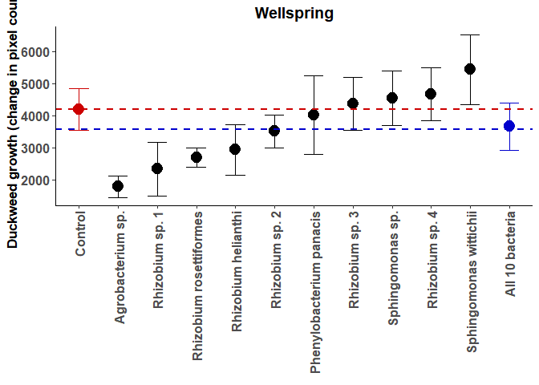<!-- -->

```r
#LogRRs

logW_plt <- ggplot(logW,aes(y=LRR,x=bac,colour=bac))+geom_errorbar(aes(ymin=LRR-SE,ymax=LRR+SE),width=0.5)+geom_point(size=4.5)
logW_plt <- logW_plt + theme_classic() + ggtitle("Wellspring") + theme(plot.title = element_text(size=14, face='bold', hjust = 0.5))
logW_plt <- logW_plt + scale_colour_manual(values=c("#000000","#000000","#000000","#000000","#000000","#000000","#000000","#000000","#000000","#000000","blue3"))
logW_plt <- logW_plt + theme(legend.title=element_blank())
logW_plt <- logW_plt + theme(legend.position = "none")
logW_plt <- logW_plt + labs(x= element_blank()) 
logW_plt <- logW_plt + labs(y= "Effect size of bacterial inoculation (Log Response Ratio)")
logW_plt <- logW_plt + theme(axis.text.x = element_text(angle = 90, hjust=1,vjust=0.5))
logW_plt <- logW_plt + geom_hline(yintercept=0, linetype="dashed", color = "red3",size=1)
#dwC <- dwC + ylim(12000,40000)
#logW_plt <- logW_plt + theme(axis.text = element_text(face="bold", size=12))
#logW_plt <- logW_plt + theme(axis.title = element_text(face="bold", size=13))
logW_plt <- logW_plt + ylim(-2.5,1.2)
logW_plt
```

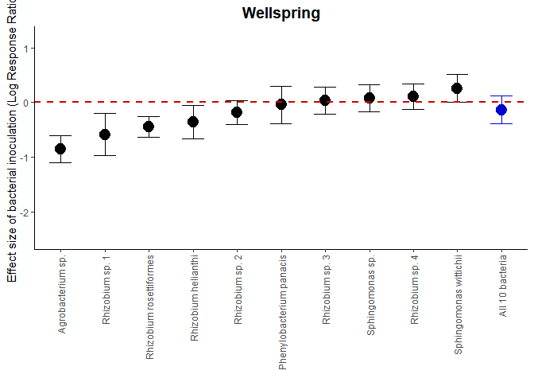<!-- -->

Section 6: Summary figure generation


```r
#Let's start by compiling the 3 raw data figures (dwC-dwW)

#Things to do: (1) take off y-axis labels (will grob), (2) check text size, (3) check range of data
dwK<-dwK+labs(y= element_blank())
dwW<-dwW+labs(y= element_blank())

#Try changing the bac labels to 45?
dwC <- dwC + theme(axis.text.x = element_text(angle = 45, hjust=1,vjust=1))
dwK <- dwK + theme(axis.text.x = element_text(angle = 45, hjust=1,vjust=1))
dwW <- dwW + theme(axis.text.x = element_text(angle = 45, hjust=1,vjust=1))

dwC <- dwC + theme(axis.text = element_text(size=11))
dwK <- dwK + theme(axis.text = element_text(size=11))
dwW <- dwW + theme(axis.text = element_text(size=11))

plot_dw<-plot_grid(dwC, dwK, dwW, ncol=3,nrow=1, align='h')

x.grob_dwCKW <- textGrob(expression(bold("Bacterial strain")), gp=gpar(fontsize=12))

grid.arrange(arrangeGrob(plot_dw, bottom = x.grob_dwCKW))
```

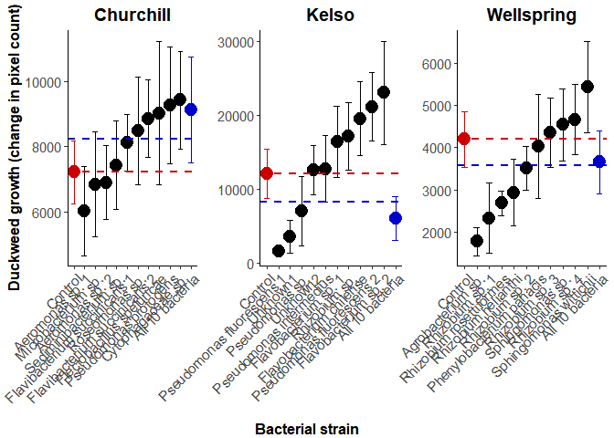<!-- -->

```r
#OK, now let's compile the LogRR figures. 
logK_plt<-logK_plt+labs(y= element_blank())
logW_plt<-logW_plt+labs(y= element_blank())

#Try changing the bac labels to 45?
logC_plt<-logC_plt + theme(axis.text.x = element_text(angle = 45, hjust=1,vjust=1))
logK_plt<-logK_plt + theme(axis.text.x = element_text(angle = 45, hjust=1,vjust=1))
logW_plt<-logW_plt+ theme(axis.text.x = element_text(angle = 45, hjust=1,vjust=1))

logC_plt<-logC_plt + theme(axis.text = element_text(size=11))
logK_plt<-logK_plt + theme(axis.text = element_text(size=11))
logW_plt<-logW_plt + theme(axis.text = element_text(size=11))

plot_LRR<-plot_grid(logC_plt, logK_plt, logW_plt, ncol=3,nrow=1, align='h')

grid.arrange(arrangeGrob(plot_LRR, bottom = x.grob_dwCKW))
```

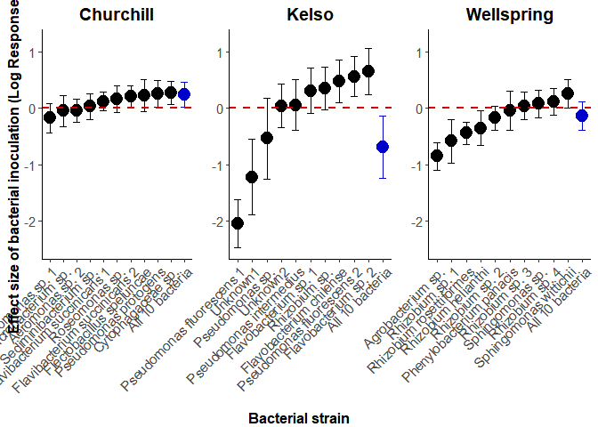<!-- -->

